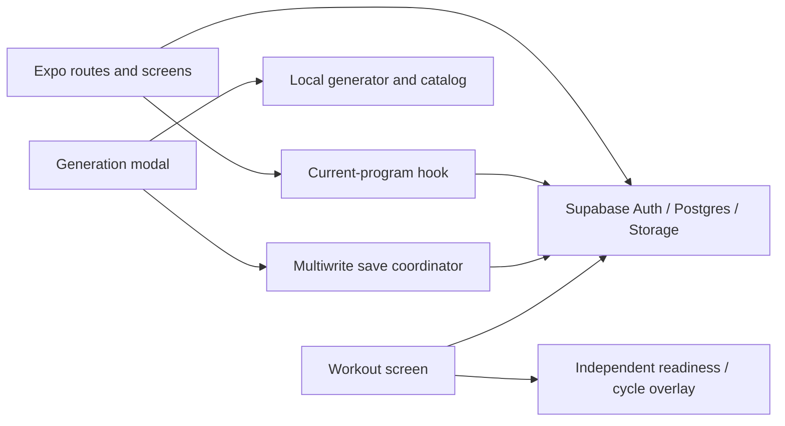
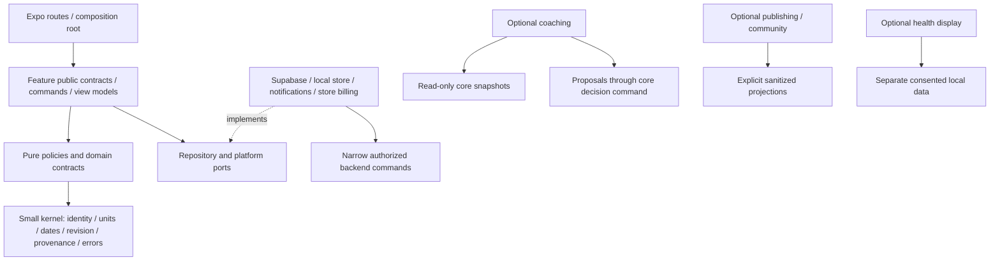

# AdaptivPush master implementation plan

## Navigation and ownership

This is the canonical implementation contract for AdaptivPush. It translates [approved decisions D-01–D-14](/reports/plans/ADAPTIVPUSH-PLANNING-DECISION-RECORD-2026-09-08.md) into bounded product and engineering behavior. The approved record owns product decisions and supersedes conflicting historical proposals. This plan does not authorize implementation during the consolidation review.

Supporting owners: [execution register](/dev-doc/plans/active/ADAPTIVPUSH-EXECUTION-REGISTER.md) for AP slice status/dependencies/gates; [implementation status](/dev-doc/plans/active/ADAPTIVPUSH-IMPLEMENTATION-STATUS.md) for current code facts; [database plan](/dev-doc/plans/active/ADAPTIVPUSH-DATABASE-PLAN.md) for schema/authority/backfills; [traceability](/dev-doc/plans/active/ADAPTIVPUSH-TRACEABILITY.md) for individual requirement dispositions and acceptance scenarios; [research translation](/dev-doc/plans/active/ADAPTIVPUSH-RESEARCH-TRANSLATION.md) for evidence scope/calibration; [inventory](/dev-doc/plans/active/ADAPTIVPUSH-DOCUMENT-INVENTORY.md) for archival provenance. Other documents summarize and link; they do not redefine these responsibilities.

## 1. Product, scope, and evidence labels

AdaptivPush helps people make measurable long-term progress through progressive overload while fitting their goals, schedule, equipment, performance, preferences and subjective context. It combines planning, training records, and explained adaptive proposals. Consistency, recoverability, user agency and reliable records take precedence over novelty or daily engagement pressure.

The base product must remain usable without a wearable, subscription, public identity, social network or adaptive engine. Preserve Expo and Supabase; extract modules incrementally with the first vertical consumer. No wholesale rewrite, microservices, database-table batch, deployment, or application code change is part of this documentation pass.

| Label | Use |
|---|---|
| CODE | Source-observed implementation, with file/symbol and inspection date. Working code does not mean runtime verified. |
| HIST | Prior dated execution or audit result. Preserve original scope; do not present it as a current measurement. |
| E | Research-supported principle with strength, population, scope and caveats from the research owner. It does not validate an algorithm's exact cutoff. |
| D | Approved product decision, identified by D number. |
| H | Versioned provisional heuristic or engineering operational default derived for implementation; test and calibrate. |
| REQUIRES INSPECTION | Unknown external state, unverified source, threshold calibration, platform/operational choice or fact requiring evidence. Never silently convert to implemented or approved. |

All detailed technical shapes in this plan are implementation design under D-11/12, not claims that these entities already exist. Exact fitness numbers in retained sources remain H under D-10. This plan does not create clinical guidance, a medical diagnosis, a claim of ownership over routines, or verified legal/platform compliance.

## 2. Complete capability and downgrade contract

| Capability | Free usable path | Paid/optional boundary | Downgrade or unavailable-service behavior |
|---|---|---|---|
| Account and control | Auth, profile, real recovery, privacy/export/delete, support access and safety | No subscription requirement | Retain owned data and actual status; requests do not vanish with subscription |
| Program creation | Standard goal/experience/days/time/broad-equipment generation; manual editor, optional name, saved program use | Advanced split alternatives, focus/volume/preference/progression controls and detailed regeneration | Saved outputs, active prescriptions and rationale remain available; use free standard/manual creation |
| Equipment | One active broad equipment profile; manual substitution and exact actual-load entry | Multiple detailed locations; machine inventory/configuration, discrete loads, precision generation/progression and automatic recalibration | Preserve profile/history ownership and view/export; choose broad active fallback, use attainable manual load; no synthetic history conversion |
| Scheduling | Dated workout/rest, manual one-time and recurring changes, swaps/skips/carries/pauses, adherence | Automatic schedule recovery is premium convenience | Accepted schedule and all manual control remain; no new premium solver proposals |
| Workout/history | Durable capture, partial/full completion, history, PR/descriptive metrics, basic conservative progression | Richer longitudinal interpretation and precision automation | Records and previous accepted explanations stay; generic increment disclosure and manual adjustment |
| Readiness | Neutral one-tap/deeper capture, pain/illness safety pathway, manual decisions, optional symptom capture | Rich contextual/longitudinal proposal generation may be premium | Never remove accepted prescription or rewrite previous decision; retain neutral capture and original/manual plan |
| Presentation | Essential/Guided/Advanced disclosure, explain-why, free accessible light/dark/system and retained palettes | Paid first-party themes are separate ownership | Depth independent of price; cosmetic ownership independent of coaching subscription |
| Publishing/install | Approved reusable artifact preview, unlisted link/code, private pinned install and continued training | Advanced authoring tools retain their own access checks; no review required | Installed copies and history stay usable; service outage prevents new resolution/distribution only |
| Health | Manual parity regardless device/permission/subscription | Optional display adapter, local by default, separate cloud consent | Unknown/stale status; no derived workout sets or coaching influence; disconnect/delete controls |
| Public/community | Optional discovery, profiles, saves, reviews, follows, posts/reactions/comments only after operations gate | Separately released modules, never core dependency | Hide unavailable public surfaces; private training unaffected |

Deferred: selective installed-version merging; third-party theme authoring/submissions/payouts/creator commerce; public surfaces without demonstrated staffing/capacity; health-driven prescription changes; opaque personalized ML; coach marketplace; broad nutrition/clinical rehabilitation products; sport-specific competition preparation beyond separately reviewed goal extensions; unsupplied platform health parity. Basic warm-up/recovery education is retained with evidence scope. A rest timer is a distinct optional enhancement, not the already implemented elapsed workout timer.

Access resolution is `supported build/schema AND rollout enabled AND required consent AND verified capability`, with ownership/read access checked separately. Depth controls disclosure, never authorizes unsafe behavior, purchase rights, sensitive consent or public sharing. No automatic downgrade changes to future already-accepted artifacts. If exact precision cannot run, explain uncertainty and offer hold/rep/manual load.

## 3. Current and target architecture

CODE: routes/screens call Supabase directly, `hooks/useCurrentProgram.ts` combines reads, swaps, progression, date advancement and archiving, `utils/programGenerator.ts` builds programs, and `utils/saveProgramToDb.ts` orchestrates multiple writes. Theme/auth use local storage, but a durable workout outbox is not implemented. The status document gives exact source evidence and defects.

Target (arrows mean allowed calls/imports):

| Capsule | Owns and exports | Allowed consumers/dependency boundary |
|---|---|---|
| Kernel | Branded IDs, local dates/timezone, units, revisions, operation IDs, provenance, typed errors | No React, Supabase, entitlement, fitness policy or route imports |
| Catalog/equipment | Stable exercise IDs, metadata, load semantics, instance/configuration snapshots | Programs/generation/progression read contracts; ordinary clients cannot curate shared catalog |
| Programs/generation | Private instances, immutable prescriptions, generation pipeline, install/archive commands | Scheduling/workouts/publishing consume snapshots; no feed or health dependency |
| Scheduling/consistency | Occurrence identity, original/current placement, revision command, fulfillment/adherence selectors | Today, workouts, notification adapter, recovery solver; solver cannot write tables directly |
| Workouts/history/progression | Frozen accepted prescription, actual sets, durable finalization, comparison cohorts and free progression | Coaching/analytics read authorized snapshots; no load changes during a read |
| Profile/readiness | Optional preference/observation capture with provenance and consent | Coaching can consume snapshots but cannot alter original observations |
| Coaching | Proposal producers, longitudinal insight and deload policy | Read core contracts; apply only via owning decision/schedule/program command |
| Publishing | Sanitizer, immutable public versions, share resolution and private install source | Uses private installer; never exposes a private object by spreading all fields |
| Community/reviews | Explicit audience/projections, eligibility, moderation-aware queries | Depends on published contracts and minimal eligibility receipts, never raw health/readiness |
| Health | OS adapter, display consent, deduplication, local summaries; optional cloud adapter | Initially no coaching/program/schedule write dependency |
| Cosmetics/entitlements | Token runtime/catalog/packages and separately trusted capability verification | Cosmetic application cannot mutate training; billing adapter cannot decide program semantics |
| Account/privacy/support | Identity recovery, request fulfillment, deletion coordination, service receipts | Narrow backend authority; accountable operational owner and audit |

New modules are proposed under `features/<capsule>/`; existing hook remains a compatibility facade while each consumer is extracted. Do not create every directory upfront. Shared UI primitives are introduced with their screen consumer, preserving current theme/palette behavior. No central catch-all types file or giant service layer.

## 4. Stable domain contracts and invariants

| Contract | Minimum fields and invariant |
|---|---|
| `ProfileSnapshot` / `TrainingGoalProfile` | Owner/revision/as-of, units/timezone, primary/secondary goals, ordered focus, horizon, availability/time/equipment, experience/RPE familiarity and optional considerations; unknown is distinct from false |
| `CatalogExercise` | Canonical ID/source/version, aliases and retired mapping, pattern/muscle/skill/stability/equipment metadata; a local slug or prescription-row ID is not an exercise UUID |
| `EquipmentLocation` / `EquipmentInstance` / `EquipmentConfiguration` | Owner and location, stable machine identity, versioned setup, selected load semantics/values/unit; private by default, historical configuration immutable |
| `ProgramTemplate` | Reusable ordered roles/slots, relative workout/rest pattern, progression/warm-up/rest policy, rationale/instructions; no author actual weights or private context |
| `PublishedProgramVersion` | Template identity, version/hash, sanitized artifact, schema/catalog policy compatibility, attribution; immutable content, separate mutable distribution/moderation status |
| `UserProgramInstance` | Owner, origin/pinned version, active prescription/schedule revision, lifecycle/checkpoint; installation creates private ownership without copying publisher history |
| `WorkoutPrescription` | Immutable revision, program/cycle/day, stable ordered slots/sets, exercise and equipment semantics, reps/load/effort/rest/optional/warm-up/phase, policy provenance |
| `ProgramSchedule` / `ScheduledDay` | Schedule revision/timezone/effective interval; stable occurrence, original/current local date, cycle identity, workout/rest kind, resolution, fulfillment link. The packet's `scheduled_days` and register's occurrence language refer to one model; database owner selects physical naming |
| `WorkoutDraft` / `CompletedWorkout` | Owner/operation ID, frozen prescription, actual exercise/set IDs, units/loading semantics, start/end/timezone, partial/full classification and receipt; planned, accepted and actual remain distinct |
| `ReadinessSnapshot` | Raw inputs/scales/source/capture time, missingness, symptoms and consent; derived summary never overwrites raw response or implies medical status |
| `Recommendation` | ID/producer/policy, input refs/watermark, target/base revision, proposed diff/alternatives, rationale/evidence strength/confidence, expiry and decision/application state |
| `ScheduleDeviation` / `ScheduleRecoveryProposal` | Original/actual change, actor/reason/scope, old/new revision; fixed work, proposed moves, conflicts, unplaced work and assumptions |
| `AdaptationEvent` | Original/proposed/accepted/applied/actual references, actor/time/decision and source policy; audit cannot be reconstructed solely from mutable before/after fields |
| `HealthActivitySnapshot` | Source record/revision, interval/type/value/unit, duplicate group/attribution/freshness, consent scope; imported workout summary is not prescribed set completion |
| `Entitlement` | Verified provider/source, capability or asset, account, effective/expiry/grace/revocation and verification freshness; never client-editable metadata authority |
| `Insight` / `ConsistencyPeriod` | Source window, schedule/policy revision and watermark, coverage/uncertainty, derivation and source links; recomputable projection, not truth owner |

Commands return a structured success receipt or typed `invalid_input`, `unauthenticated`, `forbidden`, `unsupported_schema`, `stale_revision`, `unavailable`, `pending`, or `conflict` result. Validate ownership and parent lineage, not merely user-ID equality. A program/day/session belonging to the same user can still be an invalid combination. Set/exercise/configuration identity must survive generation, swap, actual capture, finalization, history and progression.

## 5. Persistence, offline, concurrency, timezone and deletion

1. Construct/validate a complete artifact before activation. Atomic backend commands finalize workouts and install/replace programs. Side effects such as PR projections, notifications and analytics consume a durable receipt; their failure cannot invalidate saved work.
2. Allocate operation and stable draft/set IDs before a write. Reuse operation ID on timeout/retry. Unique owner/operation receipts make response loss safe. A deliberately repeated installation uses a new operation ID. Server clock governs eligibility elapsed duration; original capture/local date remains available for reporting.
3. Include expected revision on every schedule/prescription/decision mutation. Concurrent devices get an explicit conflict and preview; never silent last-write-wins for accepted schedules or logged sets. Merge independent draft fields only under specified ownership and with unchanged base identity; otherwise retain both candidates for user reconciliation.
4. Store immutable prescription/configuration snapshots with actual observations. Freeze the accepted prescription at workout start. Corrections append or supersede with actor/reason; do not rewrite old workout meaning or source versions.
5. Persist private drafts and outbox operations locally before acknowledging local save. State is `draft -> queued -> sending -> acknowledged`, with `retryable`, `auth_required`, `conflict`, or `rejected` branches. Only server receipt means synchronized. Order dependent operations by references; cancellation/tombstones prevent stale queued uploads after revocation/deletion.
6. Cached training, basic progression, manual schedules and records must be useful offline. Publishing/new installation/purchases/moderation need server validation; show drafts. Isolate caches by account; signout/account switch cannot replay another user's queue. Offer explicit preservation/recovery of unsynced work without exposing it to a new account.
7. Occurrences use local calendar date plus named schedule timezone, distinct from UTC event instants. Moving timezone requires explicit keep-dates or re-place-future-work preview; completed/in-progress original dates remain. DST alters instants/reminder scheduling, not cycle/day identity. Changing a week boundary updates calendar reporting only.
8. Add versioned schema/read adapters and nullable links before enforcing constraints. Backfill recoverable facts only; record inference/unknown provenance. Legacy `start_date` and approximate archive week remain readable. Do not replay historical SQL blindly or turn unknown past schedules/decisions into fabricated originals.
9. Operational rollback disables new producer/writer, preserves accepted artifacts/drafts and compatible reads, reconciles receipts and forward-fixes. Do not restore insecure catalog writes, hidden readiness escalation, false completion or missed-work debt.
10. Account deletion coordinates private DB/storage/cache/provider state and public distribution; remove identity and retain only reviewed minimum lawful anonymized provenance. Existing safe lawful private installations retain reusable routines without deleted-account identity. Exact retention/export expiration/takedown duties require qualified review before launch; do not invent a duration.

The database plan owns physical tables/columns/indexes/checks/RLS/backfill/rollback. All 28 packet tables are individually dispositioned there; they are not a migration batch.

## 6. End-to-end journeys and recovery

| Journey | Successful path | Failure/recovery and acceptance boundary |
|---|---|---|
| Start free | Auth -> goal/days/time/experience/broad equipment -> feasible plan preview -> install -> dated Today | Sensitive questions optional; interrupted onboarding resumes; duplicate submit one install; failed replacement retains prior program; unavailable exact load allows manual calibration |
| Train today | Resolve dated workout/rest -> optional readiness -> accept or keep plan -> frozen draft -> log actual -> finalize receipt -> history/adherence/progression | Rest never advances to unfinished work; stale route shows unavailable target; late check-in cannot reset sets; restart recovers draft; partial completion explicit |
| Change schedule | Select occurrence and scope -> preview fixed/moving/unplaced work -> explicit revision command -> updated Today/reminders | Cross-device conflict preserves original; infeasible arrangements explained; missed work remains unresolved until a move/skip/carry/replace choice |
| Change exercise/location | Choose temporary or future scope -> candidate compatibility/load calibration -> preserve original/entered work -> apply future revision | No old-machine load copied as comparable; missing canonical ID leaves visible draft; previous actual sets stay attached to original exercise |
| Understand progress | Open raw history -> comparable trend -> explanation/source/policy -> manual or optional proposal | Mixed legacy/new sources union without duplicates; query failure is unavailable, not zero/no history; sparse context holds or requests more data |
| Upgrade/downgrade | See specific paid convenience -> verified purchase -> capability enabled -> restore on device | Provider replay unique; downgrade preserves owned outputs, actual logs and cosmetics; no editable metadata grant |
| Share/install | Publisher sanitization preview -> immutable unlisted version -> link/app or web preview -> recipient calibration/date -> private pinned install | Invalid/revoked/quarantined/incompatible links distinct; response replay one install; unpublishing stops distribution, installed private history preserved |
| Health opt-in | Supported adapter -> OS authorization -> local display -> separately optional cloud consent | Denial/stale/missing distinct; no silent cloud upload or coaching interpretation; revocation cancels queued reads/uploads and offers deletion |
| Privacy/support | Authenticated request -> server receipt -> visible processing -> fulfillment or actionable failure | Metadata-only request is not completion; exports owner-only/expiring; failed deletion retries with audit; named support queue required |

Today prioritizes today's explicit action, neutral recovery/rest, then optional explanation. Plan shows prescription, volume/time constraints, schedule/rest and version context. History distinguishes raw records from interpretation. Profile settings must control real behavior. Shared loading/error/conflict states, gentle language and reachable manual controls apply at every step. Preserve avatar/haptics and current navigation where useful; public avatar delivery must not imply sensitive assets are public.

## 7. Generation pipeline and goal-specific behavior

Pure generation accepts injected profile/catalog/equipment/policy snapshots, deterministic seed/tie-breaker and time context; it imports no UI, Supabase, global randomness, subscription or health APIs. Access checks choose eligible controls before invocation. The output is a preview, never an immediate partially installed plan.

| Stage | Rule and output | Override/recovery |
|---|---|---|
| 1 Interpret constraints | Separate hard availability/equipment/movement restrictions from preferences, ordered goals/horizon and unknown inputs | Show interpreted summary; never infer medical clearance or load from demographics alone |
| 2 Recommend frequency | Sustainable exposure within declared available days; E frequency distributes work and supports practice | H exact day defaults; offer feasible alternatives, no compulsory minimum beyond availability |
| 3 Recommend split | Rank full-body, upper/lower or hybrid/PPL by frequency, overlap, priority and time | No universal superior split claim; user alternative triggers revalidation |
| 4 Allocate volume | Direct sets and explicitly estimated indirect exposure per muscle, modest starting target/coverage and focus maintenance | H exact targets; explain unmet goals under time/recovery constraints, no opaque SFR/MRV score |
| 5 Structure day | Required/optional slots and goal-priority ordering before concrete exercise choice | Preserve essential movement practice; warm-ups distinct from hard work |
| 6 Select categories | Movement patterns and primary/secondary coverage, nonredundant roles | Conflicting restrictions expose missing coverage, not unsafe substitution |
| 7 Select exercises | Hard compatibility filters then stability/goal/comfort/preferences/skill/fatigue/time ranking | Stable catalog IDs; deterministic ties; no random weekly churn |
| 8 Prescribe | Sets/reps/load semantics/effort/rest/warm-up/progression policy appropriate to goal and familiarity | Starting load calibration; no fabricated 1RM or required RPE for novices |
| 9 Place rest | Explicit relative workout/rest pattern and recipient dated placement | Declared availability respected; insufficient recovery fit shown as concern, never guaranteed safety |
| 10 Estimate duration | Warm-up + set execution + rests + transitions; trim optional/redundant work first | Duration is a disclosed target; hard user limit respected or infeasibility shown; override may accept longer duration |
| 11 Preserve stability | Keep primary exercises long enough for comparison, review accessory variation when justified | H review windows not automatic replacement; discomfort/equipment can override continuity |
| 12 Explain fit | Inputs used/missing, constraint compromises, rationale, policy/catalog/evidence refs and coverage confidence | Evidence strength distinct from personal fit confidence |
| 13 Apply overrides | Recompute affected downstream stages and preserve explicit choices | Invalid preference gets explanation/alternatives rather than silent discard |
| 14 Install/version | Validate full artifact then AP-03 atomic installation and AP-04 schedule | Error/replay never leaves broken active program; old history and accepted context retained |

| Goal/input | Structure and prescription impact | Stability/progression/recovery impact |
|---|---|---|
| Strength | More specific practice of priority lifts, heavy work when suitable, longer rest, accessories support primary targets | Stable primary roles, conservative attainable load/rep progression, protect technical quality; optional percentage/top-set approaches require qualified policy/advanced review |
| Hypertrophy | Balanced direct/indirect muscle exposure, practical rep ranges/effort, enough rest for productive sets; focus volume competes with time | Double progression as initial H default; add sets only after performance/recovery review; exercise stability with purposeful accessories |
| General fitness / beginner confidence | Simple broad patterns, manageable frequency/time, lower complexity and explainable effort cues | Consistency and movement competence before aggressive load change; sparse history asks for calibration |
| Mixed strength/hypertrophy | Explicit primary strength slots plus growth-oriented accessories, ordered tradeoffs | Separate slot progression policies; no incompatible heavy/volume goal silently selected |
| Muscular endurance | Goal-appropriate higher-repetition or duration work and explicit density/time tradeoffs | Progress comparable reps/duration with recovery guard; do not shorten needed recovery merely to meet a timer |
| Fat loss/recomposition | Retain strength/muscle and feasible workload under declared context | Performance maintenance, no inferred diet or automatic load collapse |
| Athletic context | Respect declared sport timing and skill/power intent where supported | Ask for missing constraints, manage fatigue before sport; specialized competition peaking requires separate review |
| Focus muscles | Reallocate moderate exposure/order while retaining whole-body maintenance | Exact focus volume H; report opportunity costs and fatigue/time conflicts |
| Time/frequency/equipment | Change split feasibility, optional slots, rest/time estimate and eligible exercise set | No arbitrary shortening of required rest to pretend feasibility; sparse equipment permits effective simple plans |
| Experience/RPE familiarity | Complexity, practice volume, effort terminology and calibration confidence | Unknown RPE not a failed target; teach progressively, keep raw entered assessment |
| Movement considerations/preferences | Hard exclusions and comfort constraints, then preference among suitable options | No diagnosis; preserve continuity when comfortable; pain pathway separate |
| Horizon/adherence/recovery | Realistic goal priority, workload distribution and proposed review dates | Low adherence/sparse performance reduces confidence; no automatic debt or punitive progression |

Examples are implementation fixtures, not personal prescriptions: (a) two otherwise identical four-day users choosing strength vs growth should see primary lift specificity/longer rests vs distributed muscle-volume priorities; (b) a two-day 30-minute beginner with broad home equipment receives simpler full-body coverage and visible optional omissions, not a six-day specialization plan; (c) a mixed-goal experienced user prioritizing glutes sees goal-specific primary slots and moderated accessory reallocation with retained upper-body maintenance; (d) a frequent traveler retains plan/history, changes dated availability and selects manual loads until optional precise equipment recalibration is accepted. Fixture numbers and outcomes must be versioned under D-10.

Structure generation, specific exercise selection, pre-install substitution, one-session swap, future-program replacement and full regeneration are separate commands. Schedule changes move occurrences, never rewrite exercise identity. Full regeneration creates a new artifact and explicit activation, not deletion of old history.

## 8. Equipment, loading semantics, selection and comparability

One broad active profile is free; multiple detailed locations and future precise automation are premium. Actual observation always supports exact entered weight independently of entitlement. Preserve detailed records and export/view after downgrade.

Model location -> equipment instance -> versioned configuration -> attainable load options. An instance identifies the particular machine/bar/stack/dumbbell collection; a configuration describes cable ratio/attachment, unilateral/bilateral setup, assistance, seat/lever setting where relevant, bar mass, plates and increments. Catalog exercise is a movement identity, not machine identity. Historical observations retain configuration snapshots even if equipment is renamed, changed, or removed.

| Loading mode | Required representation and comparison |
|---|---|
| Barbell/plate loaded | External total with known bar mass and plates per side; microplates and symmetric loading constraints; available inventory limits next attainable total |
| Dumbbells | Explicit per-hand or combined input, paired/unilateral meaning and discrete available pairs; retain original unit/value alongside canonical comparison |
| Selectorized machine/cable | Enumerated stack selections and machine/configuration ID; ratio and attachments only when known; nominal number not equivalent across machines |
| Assisted movement | Positive assistance magnitude plus direction where less assistance may be harder; never ordinary heavier-is-better arithmetic |
| Bodyweight | Bodyweight mode and external added/assistance separately; unknown body mass stays unknown; zero external load is valid |
| Bands/other | Named resistance/configuration or ordinal mode, no fabricated kilograms; progression via comparable reps/execution or explicit recalibration |

Use exact decimal/rational semantics or declared rounding at system boundaries; units carry type information. Preserve user-entered original unit/value and loading basis. Sort/deduplicate discrete options; validate finite nonnegative values where appropriate and correct direction for assistance. A generic next step is labeled generic and manually overridable. No impossible stack or dumbbell selection may be prescribed by precision automation.

Comparison key includes exercise, equipment instance/configuration when material, load mode/side basis, execution/ROM convention and relevant slot purpose/phase. A new machine starts a new calibration cohort; optional cross-machine estimates are explicitly uncertain and never rewrite past records. Deleting a profile cannot erase actual history or force private data into public publication.

Selection first filters equipment/exclusions/skill/comfort/available loads; then ranks movement purpose, primary/secondary muscles, stability, goal, phase, recent exposure, preference, fatigue and time. Preserve a suitable exercise for measurable progression. Replace for unavailable equipment, discomfort, user preference, plateau review, or explicit program changes; do not use a rotation date as an order. Active-session swap keeps entered sets on their original exercise and creates a new unlogged slot/calibration; future swap revises future slots only.

## 9. Workouts, history, and progression state machines

Workout: `planned -> in_progress(durable frozen draft) -> pending_finalize -> finalized(full|partial)`; errors branch to retry/auth/conflict with draft preserved. Abandon/cancel is explicit and does not mark a occurrence completed. A finalized receipt triggers fulfillment/PR/progression once. Later correction preserves audit and recalculates derived projections. Invalid route never silently substitutes another session.

History unions supported legacy and new records by stable source identity and deduplicates confirmed duplicates. Do not choose all-new once any new row exists, fabricate missing sets, or represent query failure as empty history. Descriptive load/reps/volume/PR views remain free, identify incomparable cohorts and partial coverage, and preserve original unit semantics.

Progression: `collect comparable finalized evidence -> evaluate coverage/phase -> increase|hold|reduce|request data -> explained next-target proposal -> accepted/policy-authorized future revision -> one application receipt`. Any progression policy authorization must be explicit and recorded; it cannot imply approval of readiness escalation. Reads never mutate next-week prescriptions.

| Situation/role | Initial behavior contract |
|---|---|
| Primary/secondary compounds | Prefer technique/target rep/effort completion and stable identity; full required-work accounting before increase; heavy jumps conservative |
| Accessory/isolation | Rep-range progression before attainable load; optional set progression only within reviewed time/volume/recovery budget |
| Machine/dumbbell/barbell | Next real available step for premium precision; disclosed generic step/manual choice free; large jump can hold/build reps rather than force overshoot |
| Bodyweight/assisted/band | Match direction and execution context; improve comparable reps/ROM/control or reduce assistance where valid; do not manufacture load conversions |
| Partial or skipped targets | Preserve actual work; cannot classify all successful because all *logged* sets succeeded; hold/request data or contextual proposal |
| Mixed set misses | Keep set identity; compare against accepted prescription and explicit effort, not a universal automatic minus-five-percent rule |
| Sparse/low-adherence history | State coverage and hold/ask; no failure label or automatic extra volume |
| Deload/recovery | Phase prescription takes precedence over ordinary progression; lighter work is not regression or a new max |
| Substitution/configuration change | New comparison context/calibration; history remains with original exercise/equipment |

Exact success counts, load/rep bounds, permitted reductions and plateaus are versioned H. Required fixtures: one-of-four success, warm-up exclusion, missing RPE, zero vs unknown, mixed units, partial work, sparse history, repeated replay, future deload, changed machine, and user correction. The traceability map owns individual AC scenarios.

## 10. Readiness, symptoms and user agency

Capture raw subjective context independently of proposal generation. One-tap low/normal/high plus optional sleep, stress, soreness, motivation, life load, pain/illness and symptom detail must work without premium. Retain legacy scale and source; new policy cannot silently reinterpret old scores.

Recommendation state: `proposed -> accepted|modified|rejected|deferred|expired`; accepted uses base-revision check -> `applied` or `stale/conflict`. Modified creates explicit accepted diff. Applied references the frozen prescription; actual outcome is separate. UI dismissal never means acceptance. Home and Workout read the same ID/decision. Rejection persists across navigation/restart; new evidence may justify a distinct explained proposal, not relabel old rejection. Failed decision persistence remains pending and never appears applied.

| Context | Proposed behavior / fallback |
|---|---|
| No check-in / normal | Preserve original prescription, optional neutral capture; no invented readiness |
| Low readiness | Consider optional volume reduction, then lower complexity, then load if warranted; explain affected slots and alternatives |
| High readiness | Original plan remains; only bounded explicit opt-in challenge after phase/context check; never silently raise sets/reps/load/RPE |
| Pain or illness | Distinct safety pathway with appropriate expert-reviewed wording and options to stop/modify/rest or seek appropriate help; never bury signal in aggregate score |
| Poor sleep alone | Consider recent performance/life context and ask minimum detail; not a mandatory score-to-load multiplier |
| High soreness alone | Consider affected movement/muscles and function; preserve comfortable alternatives, no rule equating soreness with growth |
| High stress/life load | Lower-demand/shorter optional session proposal, explicit manual choice; no moralizing |
| Several low days / conflicting performance | Trend review with coverage and alternate explanations; no diagnosis or instant universal deload |
| Deload already planned | Preserve lower-stress phase; do not apply compounded reductions or high-readiness cancellation |
| Subjective vs health conflict | Initially health is display-only; reported pain/illness/current assessment cannot be overridden by imported data |
| Late check-in while logging | New amendment proposal only; preserve entered sets and accepted start snapshot |

Optional cycle support is hidden until enabled, private and symptom-first. Phase/calendar is uncertain context, not an independent multiplier across generation/progression/day-of layers. Irregular cycles or unknown dates do not fabricate phases; symptoms still usable. Disabling future interpretation does not falsify previous observations; offer private-data deletion. Scope of safety advice and return-to-training wording needs qualified review; exact numeric bands are H, not clinical thresholds.

## 11. Longitudinal insights, plateau and deload

Use comparable finalized performance, adherence, phase and optional subjective context to explain trends; source window, watermark and missingness remain visible. Raw records/descriptive trends free; richer longitudinal interpretation premium. A single difficult workout or uncertain RPE is not a plateau. Repeated misses may reflect technique, equipment change, time, illness, low adherence or unsuitable expectations; offer contextual review before load/set escalation.

Deload lifecycle: `monitoring -> proposed -> accepted|modified|postponed|rejected|expired -> scheduled -> active -> completed -> reassessed`. Accepted schedule/prescription revision is required before active. Postponement records date/context; rejection persists. Reactive suggestions default; scheduled deload is explicit option. Avoid forced every-fourth-week policy and calendar-based assumptions. Prefer lower volume while retaining suitable movement practice; exact reductions/duration H. Phase guards prevent ordinary progression overwriting recovery prescriptions. Reassessment uses subsequent comparable outcomes, not automatic return to a predetermined escalation curve.

Insights explain source coverage and uncertainty separately from evidence strength; suppress unsupported interpretation rather than confidence theater. Warm-up guidance can be integrated with required work; cooldown/mobility/recovery education must not promise essential recovery or diagnosis. Evidence keys and source caveats power explanations, FAQ and Recovery Library consistently. Missing key/version shows honest fallback and preserves training.

## 12. Schedule, rest, deviations, recovery and consistency

Occurrence state: `planned(workout|rest) -> in_progress -> fulfilled(full|accepted_reduced|partial)`; future work may become `moved`, `skipped`, `replaced`, `paused` or `unresolved` through explicit revision. Rest is respected as rest, not an empty workout and not numerator credit. Keep original placement/cycle identity and record current placement/resolution separately. Completed/in-progress work fixed; same occurrence cannot be fulfilled twice.

| Case | Fixed information | Explicit change and reporting |
|---|---|---|
| On-time completion / planned rest | Original date/cycle/prescription or rest kind | Link one fulfillment or respect rest; no automatic next-workout substitution |
| Early/late/different day | Actual session, original occurrence and cycle identity | User identifies occurrence fulfilled; preserve deviation and unresolved displaced work |
| One or many missed workouts | Missed originals and completed work | Offer move/carry/skip/replace/leave unresolved; no backlog debt or volume compression |
| One-time swap | Both occurrence IDs/prescription histories | Atomic two-way placement diff, recovery concerns shown |
| Permanent reorder | Earlier schedule versions/history | New recurrence effective interval and future occurrences; no completed-date rewrite |
| Workout to rest / rest to workout | Original kind and reasons | Explicit replacement with intended occurrence linkage; adherence uses approved revision |
| Week boundary / timezone change | Program-cycle identity and capture instants | Calendar report may move week; explicit date/timezone policy, DST fixtures |
| Travel/reduced availability/pause | Fixed actual work and original intent | Temporary interval, feasible future placements or unplaced list; pause no punitive backlog |
| Deload/recovery conflict | Accepted phase and completed prescription | Preserve recovery intent or explicit user amendment; no false safety guarantee |

Premium solver consumes schedule, muscle/primary-pattern overlap, recent workload, phase, future availability, actual completion and current context. Output contains base revision, fixed work, proposed moves/rest, concerns, alternatives and unplaced work. User accepts/modifies/rejects; infeasible means explained alternatives, not silently removed rest or overbooked sessions. Manual controls stay free and use the same revision command. Recovery spacing is a versioned caution heuristic, never a guarantee.

Weekly adherence reports eligible scheduled workout occurrences vs explicit full/accepted-reduced fulfillment, with partial/unresolved/pending shown separately. Planned rest is respected outside workout numerator. Weeks-on-plan streak is optional/subordinate/hideable. Accepted pauses preserve without increment; rest/deload may count as adherence without being a new training-volume achievement. Retrospective approved changes retain original provenance and recalculate by policy/revision/watermark. Unknown offline activity remains pending, not failure. No shame, daily workout compulsion, public medical-exemption rewards or unsafe leaderboard.

Notifications consume current approved occurrence revision, permissions/timezone/quiet hours and user settings; cancel superseded reminders. Rest gets calm optional copy. Unsupported email/SMS delivery never appears operational.

## 13. Publishing, private installation, versions and rights

Publication state: `private draft -> sanitized preview -> validating -> immutable unlisted version`; distribution separately `resolvable -> unpublished/revoked/quarantined`. Author edits create new immutable content/version/hash; they never change installed private instances. Allow-list only reusable exercises, relative prescriptions, rest/workout pattern, progression policy, rationale/instructions, attribution and compatibility. Explicitly exclude personal loads, performance, symptoms, readiness/health/private notes and private generation inputs.

Opaque HTTPS link/code resolves online with revocation, expiry, rate limits and visibility checks. Preview identifies version/author, goal/equipment/time/schedule/rest/progression and compatibility. App association opens installed app; otherwise safe web preview/download handoff. Preview and installation do not expose private rows. A recipient calibrates personal loads and dates, then atomic install creates pinned private instance. Duplicate operation returns receipt, deliberate repeat gets new identity.

Update notice -> diff preview -> separate installation or explicit replacement of future planning. Preserve prior program, completed/in-progress prescriptions and history. Selective merge deferred until stable slot/customization/conflict semantics. Existing private copies train offline and survive unpublishing where lawful/safe; new resolution/install stops. Quarantine/legal/safety cases use separate distribution and notice process, not rewriting private workout history.

D-09B/C: AdaptivPush claims no ownership over published programs and does not treat functional routines/methods as platform IP. Service permission is limited to storage/display/transmission/preview/installation, not ownership transfer. Expressive content may have publisher/third-party rights; final terms and retention/takedown handling require qualified review. Deleted publisher profile/private account removed, new distribution stopped, direct identifiers minimized; retain only minimum approved anonymized provenance for lawful installations/integrity/obligations.

## 14. Discovery, reviews, social and moderation

Unlisted distribution precedes public discovery. Profiles, discovery, saves, reviews, feeds/follows, activity posts, reactions and comments are independent capsules/flags. Each public surface needs report/block as applicable, staffed severity queue, urgent quarantine, audit, support/contact/appeal and demonstrable capacity before release. Assign a named internal owner; automation assists, never substitutes accountability. Disable or delay surface when capacity insufficient. Public outage cannot block core training.

Review state: `ineligible -> eligible -> draft -> submitted -> visible|pending_moderation|rejected -> edited|deleted|quarantined`. Server eligibility requires installation, two completed prescribed sessions on separate calendar days, and seven elapsed days from installation. D-07 is a transparent versioned launch heuristic, not expertise or efficacy. One active review per reviewer/program identity, exact version recorded; author cannot self-review. Edited eligibility/source corrections must recompute honestly. Public aggregate derives from eligible visible rows, preserving counts/distribution; private usage evidence never published. Offline edits remain drafts.

Activity sharing requires explicit sanitized preview/audience, distinct from publishing a reusable routine. Private defaults, granular fields and independent unshare/delete. Parent visibility, blocks and moderation enforced server-side for direct API calls too. Typed comment targets/replies maintain parent consistency; tombstones retain safe thread structure. Delete public projection without deleting personal training history. No automatic symptom/health/location inclusion or leaderboards that reward unsafe training. Creator commerce and selective program merging remain deferred.

## 15. Health display and consent lifecycle

Consent state separates platform authorization (may be unknown/partial) from in-app display, cloud storage and any future interpretation purpose. Initial state: disconnected; explicit connection -> local display enabled -> optional cloud consent; revoke/disconnect -> reads/uploads canceled -> user-controlled cached/cloud deletion. Enabling adapter does not imply cloud or coaching consent. Legacy `healthkit_enabled` is not a consent backfill.

Initial payloads are attributed steps, relevant distance and workout summaries; no prescription/progression/schedule effect. Device-local by default; cloud table creation/use belongs only to separately consented AP-12 packet. Preserve source IDs/revisions/intervals and dedup phone/watch overlap; ambiguous matches shown for user resolution. Unknown/stale/revoked/partial data distinct from zero. Imported strength workout never invents sets or qualifies as prescribed fulfillment without supported proof.

Native Expo/platform dependency and permission behavior require a bounded compatibility spike and device evidence. Manual parity on unsupported devices is mandatory. Sensitive caches/account switches/deletion and cancellation of queued upload after revocation are acceptance gates. Later interpretation requires new reviewed policy and separate consent, outside initial scope.

## 16. Themes, purchases and entitlements

Theme lifecycle: `catalog -> preview -> purchase_pending -> verified_owned -> download -> validated -> applied`; preview/cancel leaves saved theme unchanged. Failed purchase/download/validation retains prior safe appearance. First-party declarative semantic tokens and approved assets only; no executable payload, arbitrary remote style code or training permissions. Validate token completeness/types/contrast, large fonts, supported versions and asset/hash integrity before apply. Free system/light/dark/palettes remain.

Entitlement lifecycle: `unknown -> pending_verification -> active -> grace|expired|refunded|revoked`; restoration re-verifies trusted provider/account state. Backend handles unique provider event/transaction identities and replay. Client metadata can express preference, never grant rights. Cache verified access with explicit freshness policy; no fictitious offline purchase. Product/region/storefront rules require review before launch. Named internal support queue handles exceptions; storefront support alone is insufficient.

Cosmetic ownership independent of coaching; compatible cached owned themes available offline. Refund/revocation/incompatible package calmly falls back to accessible default. Downgrade does not delete configuration, personal history or accepted outputs. Billing/health/community errors cannot interrupt workout capture.

## 17. Security, privacy, support and operational truth

User-owned rows require authenticated ownership plus correct parent lineage; shared catalog curation, publication validation/install/finalize, moderation, purchases and privacy fulfillment use narrowly privileged backend commands. Service credentials never enter client code/logs. Validate all JSON/schema versions, arrays/numerical bounds/units/typed targets. RLS enabled is not equivalent to secure effective grants; AP-01 must inspect grants, role inheritance, functions/API exposure and catalog writers together.

Requests use `draft -> submitted receipt -> queued -> processing -> completed|failed_retryable|rejected`, with timestamps and meaningful user status. Auth recovery has valid/expired/used/invalid link and interrupted-flow states. Support delivery, export and deletion must be real, not auth-metadata timestamp markers. Private exports use owner-checked expiring access separate from public avatars/assets. Errors and telemetry omit secrets, raw symptoms, health data, private payloads, link capabilities and payment receipts.

Observe operation success/failure/replay, pending age/conflicts, incomplete records, fallback/schema versions, catalog mapping failure, proposal lifecycle and moderation/request queue latency. Explain coverage; never instrument user rejection as noncompliance. Assign operational owners/response targets/retention only with actual accountable review, not invented names. Before release: restore rehearsal, incident/rollback drill, data fulfillment, accessibility and support proof. Retire development controls and temporary application identity in signed builds.

## 18. Delivery contract, risks and definition of done

Release order is D-13 and the AP register: AP-01 authority/provenance; AP-02/03 durable records; AP-04/05 free schedule/progression; AP-06/07 advanced generation/equipment precision; AP-08/09/10 coaching; AP-11 unlisted distribution; independent AP-12/13 adapters/cosmetics; AP-14/15 operationally gated public/community. Relevant AP-16 account/privacy/purchase/accessibility/release obligations close with each consumer, not at the end. Pure contract/test work may run in safe parallel lanes; shared hook/screen writes need coordination.

Every slice is done only when its user-visible outcome, failure/retry/rejection states, free/downgrade/offline/privacy/accessibility behavior, migration compatibility and rollback pass the smallest meaningful local gate and required actual integration/device gate. Record exact environment/commit/schema/policy/fixture results and limitations, link AC-TR acceptance and evidence, then update status. Planned tests are not executable existing tests: the baseline only provides app lint and TypeScript tools, with no application test script. No new runtime/security/database/device verification was performed here.

| Risk / REQUIRES INSPECTION | Owner and required evidence |
|---|---|
| Effective catalog grants, core RLS/function/lineage consistency | AP-01 read-only inventory followed by authorized isolated role/transaction tests; no exploitability claim from permissive policy text alone |
| Ledger/dashboard drift, migration 001 incompatibility, backup/restore | AP-01 supported baseline and successful restoration before production mutation |
| Partial writes, ambiguous IDs, mixed legacy history and archive checkpoints | AP-02/03/05 full fault matrix, conservative unknown provenance and old/new readers |
| Actual Quick Setup/Profile/Generate and missing-schema fallback | AP-01 Expo-capable device/simulator proof; historical service-level results insufficient |
| Fitness thresholds and source bibliography | AP-05–10 deterministic counterexamples, user/outcome calibration and qualified safety/source review; research strength separate from confidence |
| Equipment exact schema/load comparisons | AP-07 observed payload/workflow design and roundtrip fixtures; no assumed cross-machine equivalence |
| Store/platform/HealthKit/deep links | AP-11–13/16 current official-policy and native build verification during implementation |
| Legal terms, deletion/retention/takedown and staffing | AP-11/14–16 qualified review and named operations/capacity drill before relevant launch |
| Integration workflow | `integrator` absent from current worktree inventory; configure or explicitly approve alternative before integration claims |

Immediate next implementation slice after review: AP-01.1 inspect current catalog writers/effective grants/migration ledger/restore capability and record evidence gaps. Stop this consolidation at user review; do not begin implementation, deploy, migrate, or publish from this document.
