# adaptivpush architecture

> last updated: 2026-04-30
>
> scope: current Expo mobile client, supporting scripts, and backend integrations inferred from the repository

## overview

AdaptivPush is an Expo Router mobile app for generating, running, and adapting strength-training programs. The client owns most orchestration logic: routing, UI state, program generation, readiness overlays, workout logging, and profile/preferences screens. Supabase provides authentication, relational data storage, user metadata, and storage-backed asset delivery.

Two architectural ideas shape most of the codebase:

1. `hooks/useCurrentProgram.ts` is the main orchestration layer for active-program state.
2. Readiness is a display-time overlay for workouts, while progression uses logged performance as the persistence baseline.

## technology stack

| layer              | implementation                                                             |
| ------------------ | -------------------------------------------------------------------------- |
| client runtime     | Expo 54, React Native 0.81, React 19                                       |
| navigation         | Expo Router 6 with root stack plus tab groups                              |
| language           | TypeScript 5.9                                                             |
| backend services   | Supabase Auth, Postgres, Storage                                           |
| client persistence | AsyncStorage for session and theme settings                                |
| notifications      | Expo Notifications                                                         |
| styling/theming    | custom theme context plus constants palettes/themes                        |
| exercise content   | local catalog in `lib/exerciseDatabase.ts` plus Supabase `exercises` table |
| tooling            | ESLint via `expo lint`, TypeScript, tsx-based seed scripts                 |

## repository shape

```text
AdaptivPush/
|-- app/                 Expo Router screens and layouts
|   |-- (auth)/          login, join, forgot-password
|   |-- (qsetup)/        quick setup onboarding
|   |-- (tabs)/          home, plan, history, profile
|   |-- next-workout.tsx workout execution screen
|   |-- create-program.tsx manual program builder
|   |-- archived-programs.tsx and supporting detail screens
|-- components/          reusable workout, history, modal, and UI components
|-- constants/           themes, palettes, colors
|-- contexts/            ThemeContext provider
|-- hooks/               active-program orchestration
|-- lib/                 local exercise catalog
|-- scripts/             exercise and image seeding utilities
|-- types/               shared TypeScript contracts
|-- utils/               Supabase client and business logic helpers
|-- reports/             project docs, including this file
```

## system context

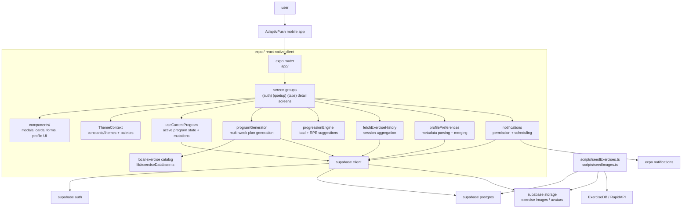

## route architecture

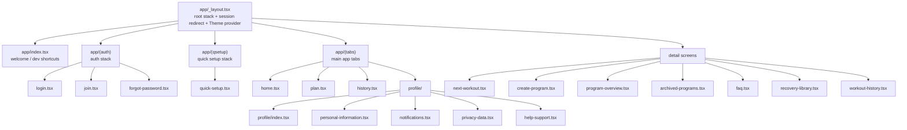

## runtime module architecture

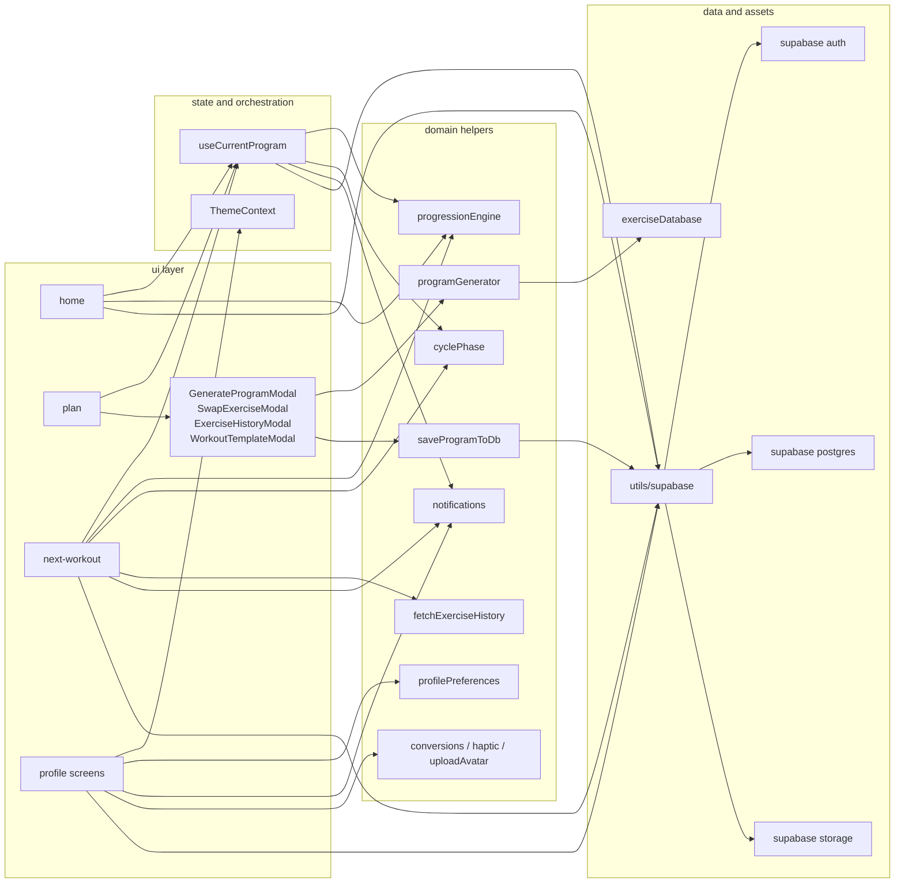

## active program lifecycle

`useCurrentProgram` is the central coordinator for loading and mutating active program state. It loads the latest active program, computes the current week from `start_date`, fetches that week’s `program_days` and `program_day_exercises`, joins exercise metadata, and exposes mutation helpers such as swap, program ending, blank-program creation, dev-program creation, progression application, and week advancement.

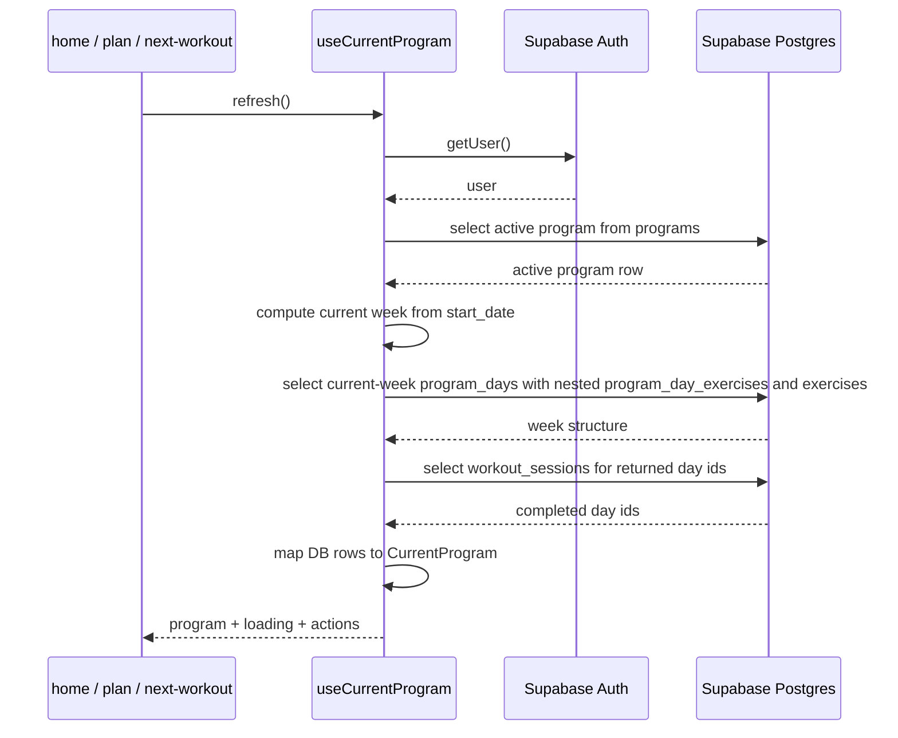

## onboarding and authentication flow

Authentication is handled by Supabase Auth. Signup writes auth identity first, then quick setup updates `user_profile`, then the user typically creates or generates a program. The root layout checks for an existing session and redirects authenticated users straight into the tab app.

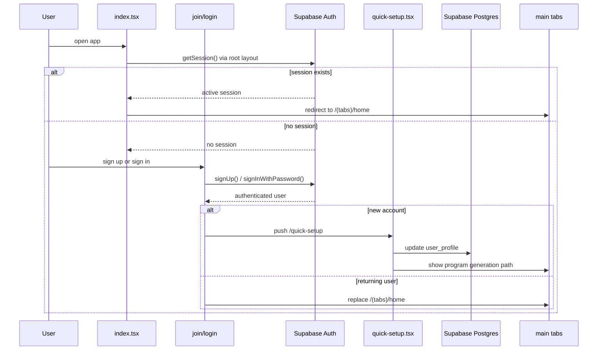

## program generation flow

The generated-program path uses local domain logic rather than a remote planner. Inputs come from UI plus profile-derived weight and experience, with optional menstrual-cycle phase adjustments.

## high-level data flow diagram

This diagram presents the app in a more traditional data-flow style: external entities sit at the edges, numbered processes occupy the middle, and persistent data stores sit below. It is intended to make the movement of profile data, readiness data, workout logs, and progression updates easier to read than the sequence diagrams alone.

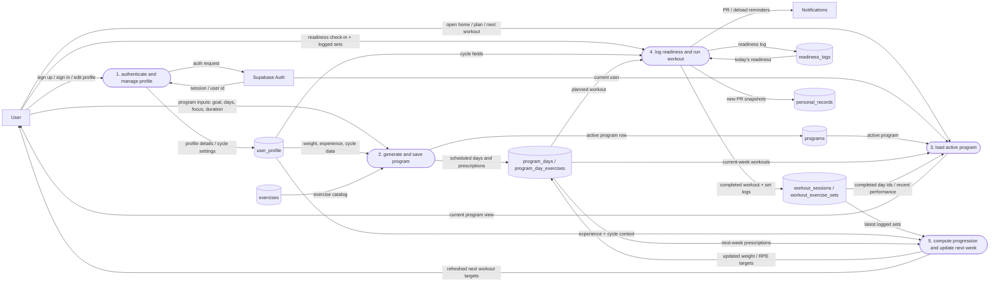

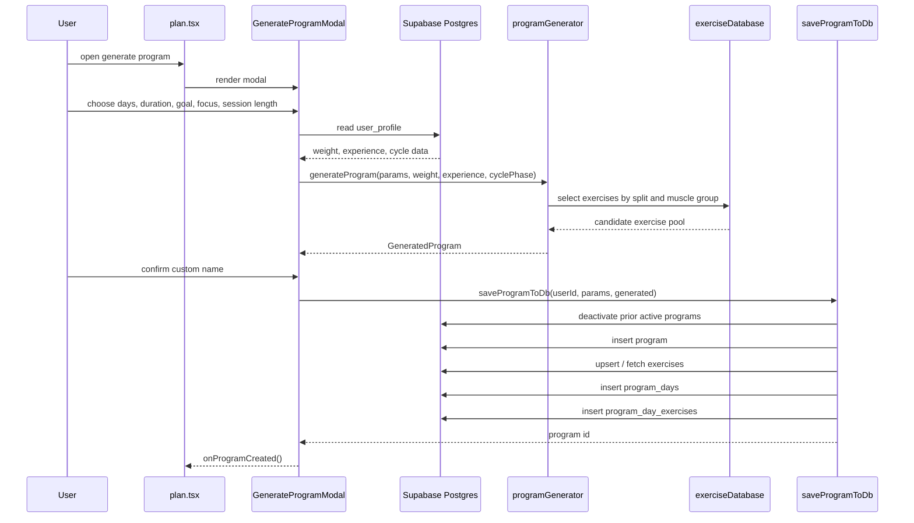

## workout execution and progression flow

The workout screen builds an execution view from the current program, overlays readiness and cycle modifiers for display, records completed sets to the workout tables, and triggers PR celebrations plus weekly progression updates when appropriate.

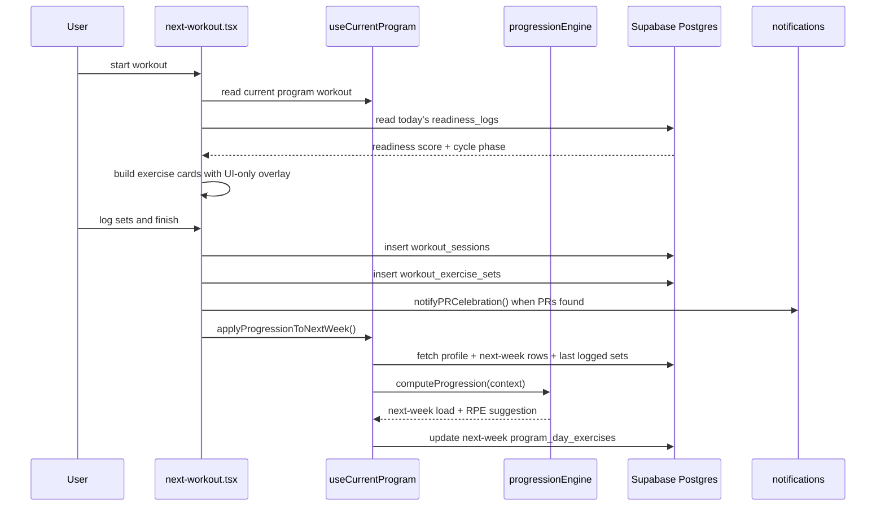

## readiness and cycle adjustment model

The current code treats readiness differently in two places:

1. `home.tsx` saves daily readiness check-ins to `readiness_logs`.
2. `next-workout.tsx` applies readiness and cycle modifiers when rendering workout sets.

`useCurrentProgram.applyReadinessAdjustmentOnly()` is intentionally a no-op kept for API compatibility. The active program rows are not mutated for readiness alone.

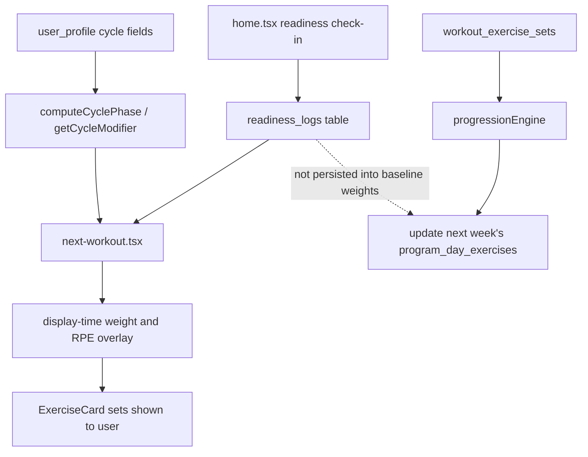

## persistence architecture

Supabase Postgres stores the training domain, while Supabase Auth metadata stores preference-like settings that do not need their own tables in this client. The schema below is aligned to the database diagram supplied for this repository and reflects the current relational model more accurately than the earlier draft.

| table                   | role                                                                 | notable columns in current schema                                                                                                                                                                                                                                                                      |
| ----------------------- | -------------------------------------------------------------------- | ------------------------------------------------------------------------------------------------------------------------------------------------------------------------------------------------------------------------------------------------------------------------------------------------------ |
| `user_profile`          | user demographics, planning defaults, cycle data, avatar state       | `full_name`, `date_of_birth`, `sex_assigned_at_birth`, `gender_identity`, `weight_lb`, `weight_kg`, `weight_unit_preference`, `experience_level`, `days_per_week`, `training_goal`, `cycle_enabled`, `healthkit_enabled`, `onboarded`, `last_period_start_date`, `avg_cycle_length_days`, `avatar_url` |
| `programs`              | top-level program records                                            | `name`, `goal`, `duration_weeks`, `start_date`, `is_active`, `days_per_week`, `swap_interval_weeks`, `last_active_week`                                                                                                                                                                                |
| `program_days`          | scheduled days inside a program week                                 | `week_number`, `day_index`, `order_in_week`, `workout_name`, `estimated_duration_min`, `is_rest_day`, `is_deload_week`                                                                                                                                                                                 |
| `program_day_exercises` | exercise prescriptions for each scheduled day                        | `position`, `set_count`, `rep_range_min`, `rep_range_max`, `target_rpe`, `suggested_weight_lb`, `per_set_weights_lb`, `notes`                                                                                                                                                                          |
| `exercises`             | canonical exercise catalog used at runtime                           | `name`, `primary_muscle`, `equipment`, `target_muscle`, `secondary_muscles`, `instructions`, `image_url`                                                                                                                                                                                               |
| `readiness_logs`        | daily check-in data and derived readiness score                      | `log_date`, `sleep_score`, `sleep_hours`, `soreness`, `stress`, `motivation`, `readiness_score`, `cycle_phase`                                                                                                                                                                                         |
| `workout_sessions`      | completed workout summaries                                          | `program_day_id`, `workout_name`, `started_at`, `ended_at`, `duration_min`, `total_volume_lb`, `pr_count`, `checkin_id`, `light_day_applied`, `notes`                                                                                                                                                  |
| `workout_exercise_sets` | set-by-set logging for a workout session                             | `session_id`, `exercise_id`, `set_number`, `reps`, `weight_lb`, `rpe`                                                                                                                                                                                                                                  |
| `personal_records`      | persisted PR snapshots used by workout history and profile summaries | `user_id`, `exercise_id`, `weight_lb`, `reps`, `one_rep_max_lb`, `achieved_at`, `session_id`                                                                                                                                                                                                           |

Notable implementation details from the schema: `workout_sessions.checkin_id` links a session back to a readiness log, `program_day_exercises.per_set_weights_lb` is stored as `jsonb`, and `personal_records.exercise_id` is currently typed as `text` rather than `uuid`.

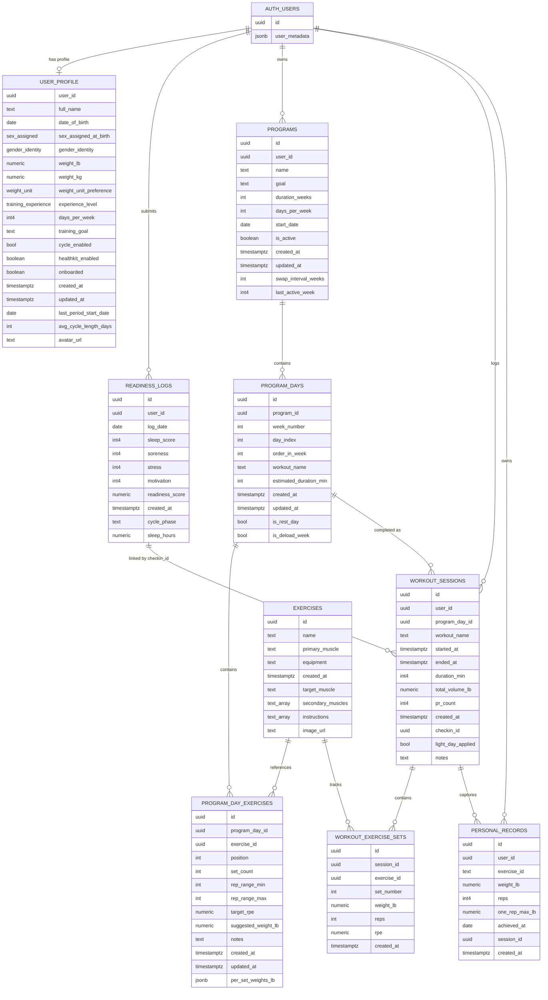

## preferences and profile architecture

Profile state is split deliberately:

| storage location           | examples                                                                                                  | used by                                                        |
| -------------------------- | --------------------------------------------------------------------------------------------------------- | -------------------------------------------------------------- |
| `user_profile` table       | full name, body metrics, experience level, days/week, training goal, cycle fields, onboarding, avatar URL | quick setup, generation, progression, profile forms, avatar UI |
| `auth.users.user_metadata` | notification preferences, privacy preferences, support request timestamps, names/phone                    | profile screens, notifications, privacy/help flows             |
| AsyncStorage               | theme appearance, color palette, Supabase auth persistence                                                | theme provider, Supabase client auth                           |

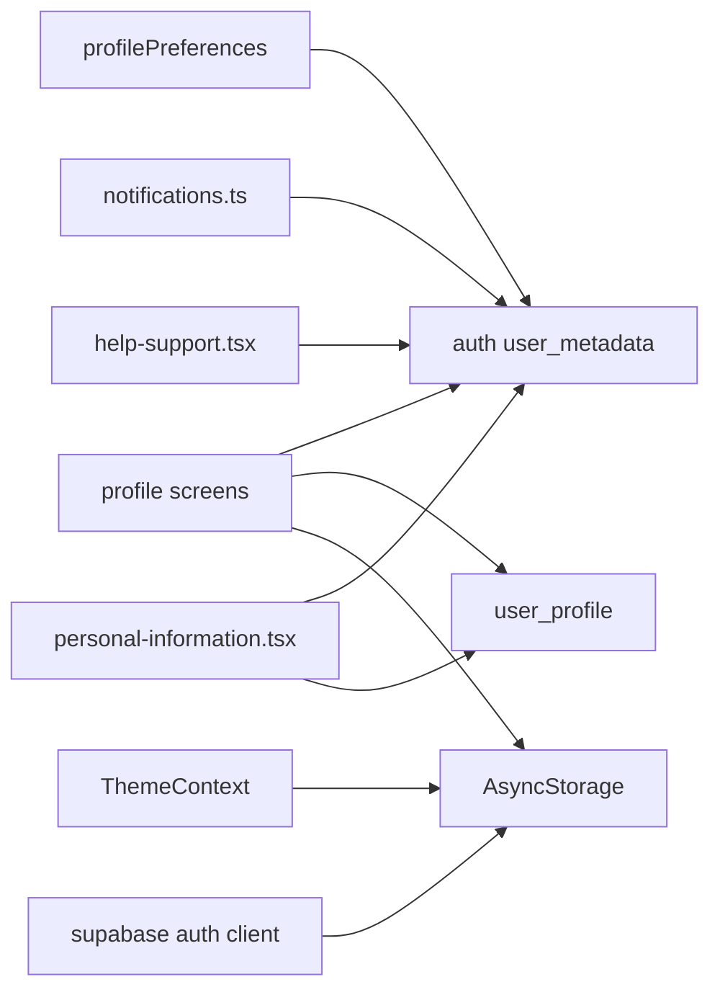

## notifications and asset delivery

Notifications are scheduled client-side through Expo Notifications and gated by metadata preferences and platform permission status. Assets come from Supabase Storage, populated by seed scripts and avatar upload utilities.

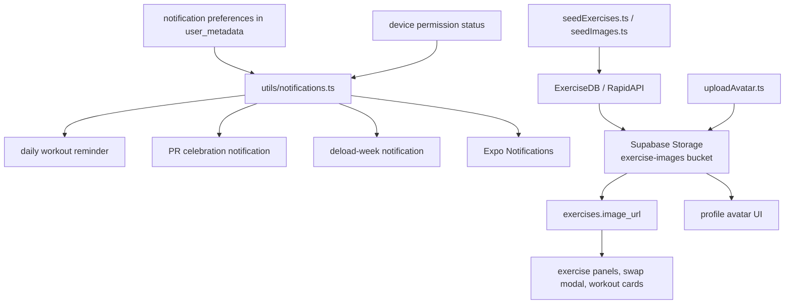

## key source files

| file                            | responsibility                                                          |
| ------------------------------- | ----------------------------------------------------------------------- |
| `app/_layout.tsx`               | root provider composition, notification handler, session-based redirect |
| `app/(tabs)/home.tsx`           | home dashboard, readiness input, next workout summary                   |
| `app/(tabs)/plan.tsx`           | active plan view, generation entry point, archive access                |
| `app/next-workout.tsx`          | workout execution, logging, swap/history access, PR notifications       |
| `app/create-program.tsx`        | manual week-1 program builder                                           |
| `hooks/useCurrentProgram.ts`    | active program loading, swaps, week advancement, dev helpers            |
| `utils/programGenerator.ts`     | split selection and generated plan construction                         |
| `utils/saveProgramToDb.ts`      | generated-program persistence workflow                                  |
| `utils/progressionEngine.ts`    | performance plus readiness-based progression calculations               |
| `utils/notifications.ts`        | permission checks and local notification scheduling                     |
| `utils/profilePreferences.ts`   | metadata parsing and merging                                            |
| `utils/fetchExerciseHistory.ts` | exercise history aggregation from set rows                              |
| `lib/exerciseDatabase.ts`       | local exercise definitions used during generation                       |
| `scripts/seedExercises.ts`      | exercise catalog + image seeding bootstrap                              |
| `scripts/seedImages.ts`         | storage/image backfill for existing exercise rows                       |

## current architectural decisions

1. The app is client-heavy: generation, progression orchestration, and preference handling live in the mobile app rather than server functions.
2. Active program state is rebuilt from Supabase on refresh instead of being managed in a dedicated client store.
3. Readiness affects workout display and progression context differently: display overlays are immediate, while persisted baselines come from logged performance and scheduled progression updates.
4. User preference data is intentionally split between relational profile rows and auth metadata objects.
5. The exercise catalog exists in both a local static source for generation and a Supabase table for runtime joins, history, and media-backed display.

## known constraints and follow-up areas

1. Some profile and support flows store requests in auth metadata rather than dedicated relational tables, which simplifies the client but limits queryability.
2. The app contains dev-only shortcuts and helper paths (`Dev Skip`, `createDevTestProgram`) that are useful during development but are not a production navigation model.
3. Workout-history code supports multiple possible table shapes (`workout_sessions` or `workout_history`), which suggests schema drift tolerance in the client.
4. Health integration is still placeholder-driven from the app side; quick setup only toggles local/profile fields today.
