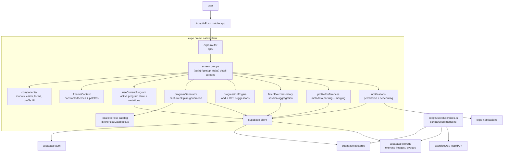
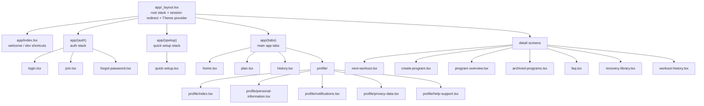
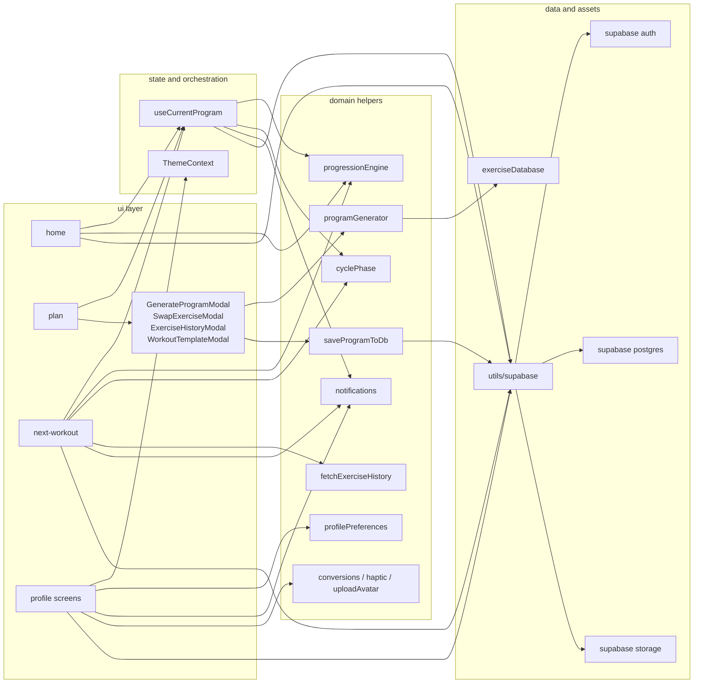
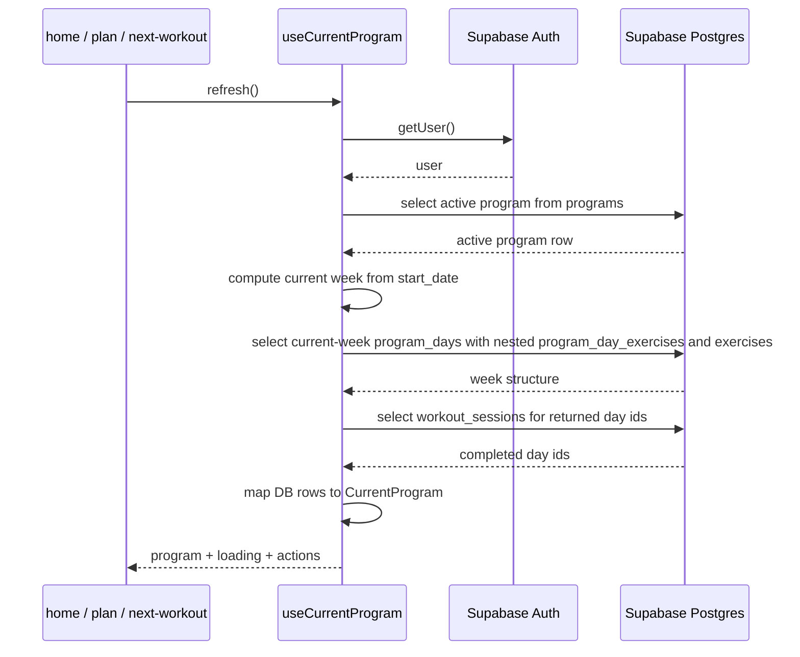
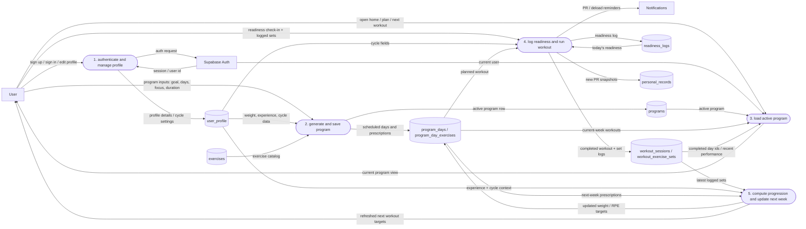
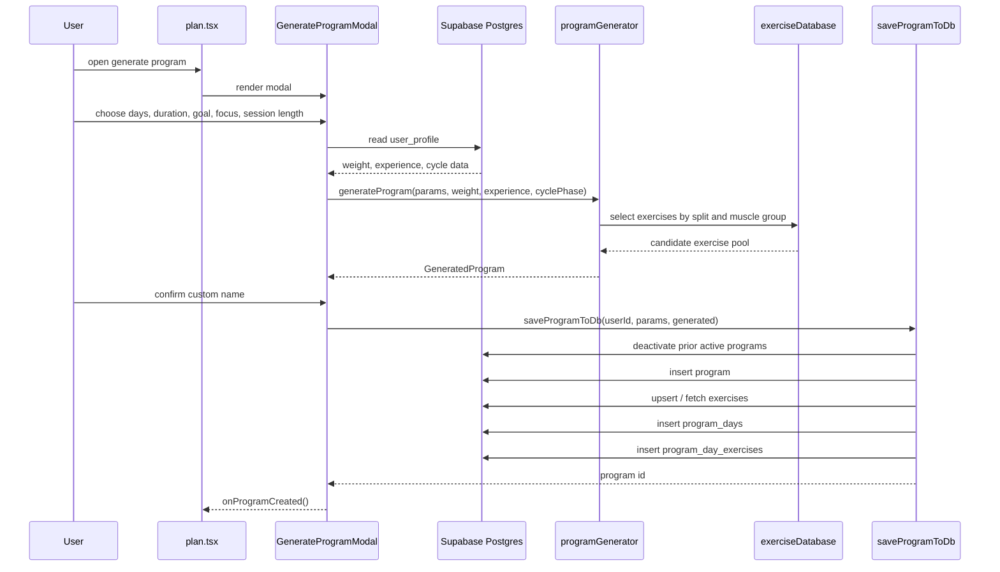
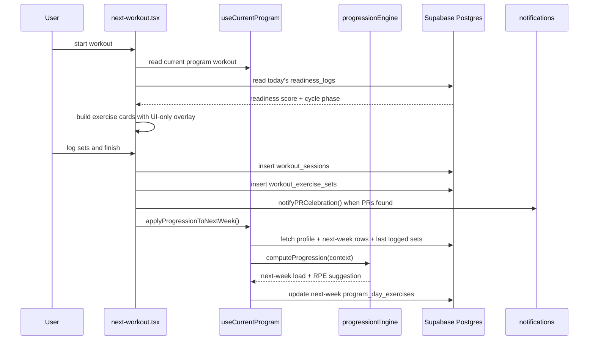
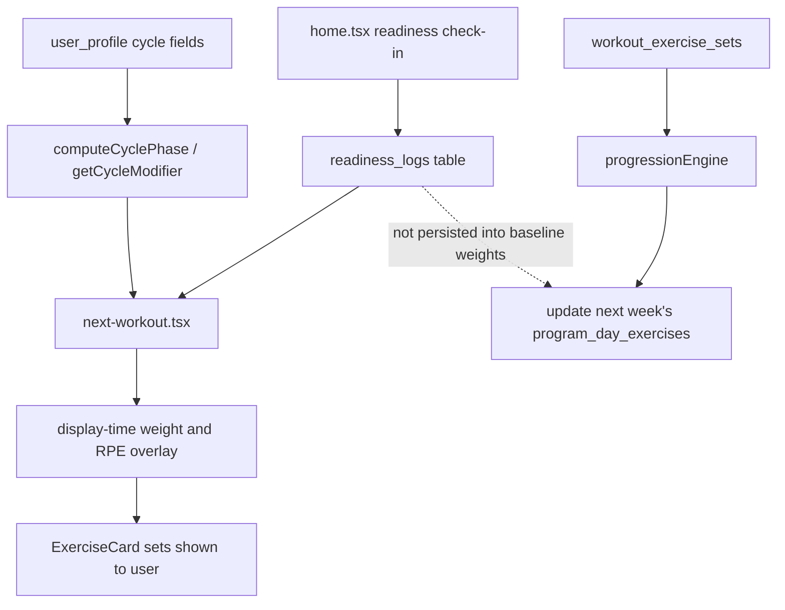
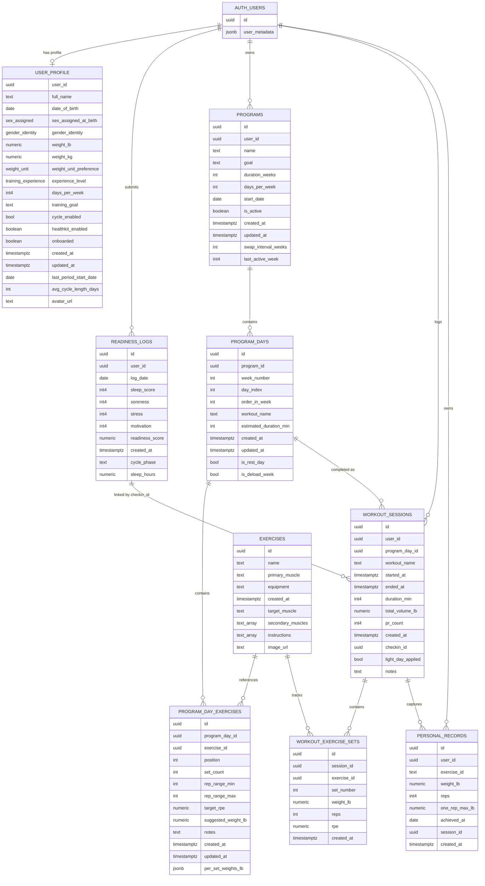
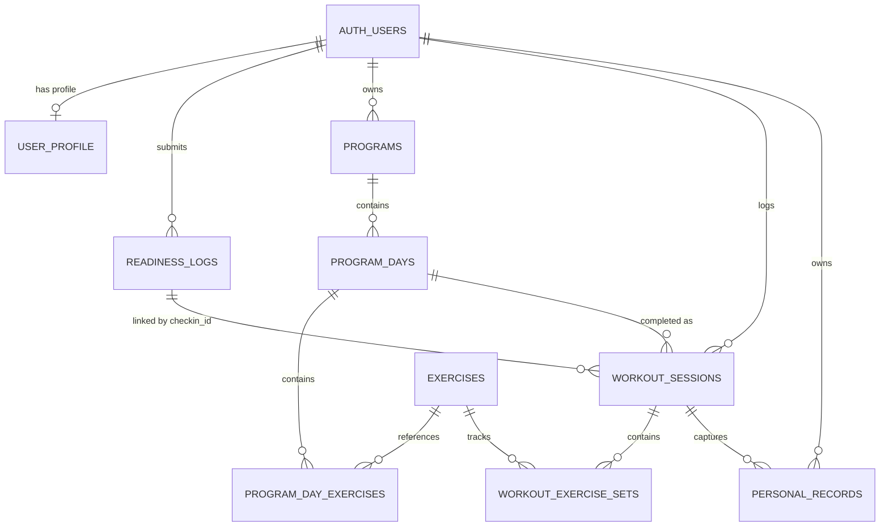

# AdaptivPush Final Report

Adaptive Workout Program Logger and Generator  
Team Leader: Daniella Schlichting  
Members: Nicole McCormack, Miskath Rahman  
New York Institute of Technology  
Department of Computer Science  
Senior Project II | CSCI-457

## Table of Contents

Table of Contents 2  
Abstract 4  
1. Introduction 4  
1.1 Original Proposal Summary 4  
1.2 Delivered Project Summary 5  
1.3 Technology Stack and Architecture 6  
1.4 Development Process and Git History 6  
1.5 Schedule Adherence: Proposed vs Actual 7  
1.6 App Walkthrough Overview 8  
2. Team Members and Roles 8  
4. Background and Significance 10  
4.1 Limits of Static Workout Plans 10  
4.2 Auto-Regulation and RPE 10  
4.3 Recovery, Readiness, and Daily Performance 11  
4.4 Female Training Considerations and Cycle Awareness 11  
4.5 Why Mobile Was the Right Platform 11  
5. Architecture and Repository Organization 12  
5.1 System Architecture 12  
5.2 Route and Module Architecture 13  
5.3 Repository Structure and Table of Contents 14  
6. Database Design and Data Flow 15  
6.1 Schema Overview 15  
6.2 Data Flow 16  
6.3 Entity-Relationship Diagram 18  
7. Functionality and Implementation 20  
7.1 Authentication and Session Management 20  
7.2 Onboarding and User Profile Collection 20  
7.3 Program Generation 20  
7.4 Active Program Orchestration 21  
7.5 Workout Execution and Logging 21  
7.6 Progression Engine 21  
7.7 Readiness Check-in System 22  
7.8 Exercise Swapping 22  
7.9 History, Personal Records, and Archiving 22  
7.10 Cycle-Aware Adjustments 22  
7.11 Notifications, Theming, and Profile Personalization 23  
8. Security and Data Privacy 23  
9. Libraries, Tools, and Platform Choices 24  
10. User Interface Design 24  
10.1 Authentication Screens 25  
10.2 Quick Setup 25  
10.3 Home Screen 25  
10.4 Next Workout Screen 25  
10.5 Program and Plan Views 25  
10.6 History and Personal Records 26  
10.7 Profile and Settings 26  
11. Results, Scope Changes, and Limitations 26  
11.1 What Matched the Proposal 26  
11.2 What Changed During Development 26  
11.3 Limitations 27  
11.4 Future Work 28  
11.5 Learning Outcomes 28  
12. Conclusion 28  
13. References 28  
Appendices 29  
Appendix A: Schema Export or Schema Screenshots 29  
Appendix B: Architecture Diagrams 30  
Appendix C: Repository Structure Snapshot 30  
Appendix D: Selected Weekly Sprint Reports 30  
Appendix E: Code Excerpts 30  
Appendix F: Extra UI Screenshots 30

## Abstract

AdaptivPush was built as an adaptive mobile strength-training application that generated, logged, and updated workout programs based on user profile data, performance feedback, and daily readiness. The project addressed a common problem in fitness technology: many apps either work as workout logs or provide static training plans, but they do not consistently connect user performance, fatigue, and long-term progression in one workflow. AdaptivPush was designed to close that gap by giving users a structured program while still allowing the plan to respond to what actually happened during training.

The delivered system was implemented as a client-heavy Expo and React Native application using TypeScript, Expo Router, Supabase Auth, Supabase Postgres, Supabase Storage, AsyncStorage, and Expo Notifications. Users could create an account, complete onboarding, generate or create a training program, view the active plan, complete readiness check-ins, run the next workout, log sets, review workout history, track personal records, archive programs, manage profile settings, and personalize the interface through themes, palettes, haptics, notifications, and profile photo upload. Supabase provided authentication, relational persistence, and storage-backed assets, while the mobile client owned most orchestration logic.

The final implementation met the core promise of the original proposal: it demonstrated a complete mobile system for adaptive workout programming. The most important scope change was that direct Apple Health / HealthKit integration was not completed in the final MVP. Instead, the app shipped manual cycle tracking and profile-driven cycle-aware logic, which preserved the project's goal of cycle-aware training while reducing the technical risk of native health-data integration. Overall, AdaptivPush showed that a modern mobile app backed by a Backend-as-a-Service platform could deliver personalized training logic, persistent workout history, and adaptive recommendations without requiring a separately hosted custom API server.

## 1. Introduction

### 1.1 Original Proposal Summary

The original proposal presented AdaptivPush as a strength-training mobile app designed to help users build consistency, avoid plateaus, and train more effectively through personalized and adaptive workout programming. The proposal argued that many people struggle with generic routines because those routines do not account for individual goals, experience level, recovery status, performance feedback, or fatigue across training cycles. AdaptivPush was proposed as a system that would generate structured programs and then adjust training targets as the user logged workouts.

The main proposed goals included secure account creation, onboarding data collection, multi-week program generation, a clear daily workout experience, workout logging, exercise swapping, workout history, adaptive progression, and plan-management features such as archiving or transitioning after a completed training block. The proposal also emphasized two features that made the idea more personalized than a basic workout logger: readiness-aware adjustments and cycle-aware training for users who opted in. The original design expected a React Native and TypeScript mobile client connected to Supabase and PostgreSQL, with Apple Health / HealthKit considered as a source for health and menstrual-cycle data.

By the end of development, the project met the central idea of the proposal. The final app generated and stored training programs, supported workout execution and logging, tracked history and personal records, and updated future training targets through progression logic. The biggest change was that HealthKit was deferred. Instead of automatic Apple Health integration, the final MVP used manual cycle tracking and profile-driven cycle-aware logic. This change reduced integration complexity while keeping the main adaptive training concept intact.

### 1.2 Delivered Project Summary

The final product was a working mobile MVP for generating, managing, logging, and adapting strength-training programs. The delivered app included authentication, session-aware routing, onboarding through quick setup, persistent user profiles, generated multi-week programs, active plan management, workout execution, detailed set logging, progression updates, readiness check-ins, workout history, personal record tracking, program archiving, notifications, theming, profile personalization, and manual cycle-aware adjustments.

A typical user flow began with account creation or login. New users completed the quick setup process, where the app collected profile and training information that supported program generation. The user could then generate a training block or create a program manually. Once a program was active, the home screen summarized the current plan and allowed the user to complete a readiness check-in. The next-workout screen displayed prescribed exercises, sets, rep ranges, target RPE, and suggested weight information. After the workout, the app stored the completed session and set-level data, updated history and personal records, and applied progression logic to future training targets when appropriate.

The final MVP became more than a simple logging tool. It included a complete user-facing loop: profile setup, plan generation, workout execution, set logging, feedback, future progression, and historical review. The project also included polish features such as light/dark appearance support, color palettes, haptic feedback, notification preferences, profile subpages, avatar upload, FAQ content, a recovery library, and archived program screens. These additions helped the final app feel closer to a complete product rather than only a proof of concept.

### 1.3 Technology Stack and Architecture

The final implementation used Expo 54, React Native 0.81, React 19, TypeScript 5.9, and Expo Router for the mobile client. Supabase provided Auth, Postgres, and Storage, while AsyncStorage supported local persistence for sessions and theme settings. Expo Notifications supported local notification flows. The system was client-heavy: routing, UI state, program generation, readiness overlays, workout logging, profile settings, and much of the business logic lived in the mobile app, while Supabase provided managed backend services.

| Layer | Final implementation |
| --- | --- |
| Client runtime | Expo 54, React Native 0.81, React 19 |
| Navigation | Expo Router 6 with root stack, auth stack, quick setup stack, tabs, and detail screens |
| Language | TypeScript 5.9 |
| Backend services | Supabase Auth, Supabase Postgres, Supabase Storage |
| Local persistence | AsyncStorage for session persistence and theme settings |
| Notifications | Expo Notifications |
| Styling/theming | Custom theme context with palettes and constants |
| Exercise content | Local catalog in lib/exerciseDatabase.ts plus Supabase exercises table |

The most important architectural decision was the use of hooks/useCurrentProgram.ts as the main active-program orchestration layer. This hook loaded the active program, computed the current week, fetched related program days and exercises, joined exercise metadata, checked completed sessions, and exposed mutations for swaps, program ending, progression application, and week advancement. This allowed the home, plan, and workout screens to rely on a consistent source of active-program state instead of duplicating loading logic across screens.

Another important distinction was how readiness and progression were handled. Readiness was used as a display-time workout overlay, meaning that low readiness could change what the user saw for the current workout experience. However, the app did not permanently rewrite the baseline program only because a user had one tired day. Long-term progression was based on logged workout performance, which gave the app a more stable baseline for adjusting future targets.

### 1.4 Development Process and Git History

The team followed an iterative development process across the semester. The project used GitHub as the shared version-control and integration platform, with feature work merged into the main branch through pull requests. The confirmed repository history included 129 commits and 36 merged pull requests. The first commit was on January 14, 2026, and the latest merge on main was on April 28, 2026.

The repository history showed that implementation happened through focused feature delivery instead of one large final integration phase. Major areas such as authentication, onboarding, program generation, readiness, progression, workout logging, profile flows, notifications, theme personalization, archiving, and final documentation were developed and refined over time. This workflow helped the team divide work across screens and features while still integrating the pieces into one application.

The proposal originally described an Agile/Kanban approach with visible work phases and short iterations. The final project followed the spirit of that plan through feature branches, pull requests, review, and incremental completion of the core user flow. Near the end of the project, the team also created supporting documentation, including the architecture document, the repository table of contents, and the final report outline, so the delivered system could be explained clearly.

### 1.5 Schedule Adherence: Proposed vs Actual

The final schedule broadly followed the proposal roadmap, although some priorities changed as the implementation became more realistic. The proposed flow moved from setup and authentication into onboarding, program generation, workout logging, progression, cycle adaptation, readiness, testing, and final delivery. The final project completed most of those areas, but direct HealthKit integration and advanced analytics were deferred.

| Proposal milestone | Planned timing | Actual outcome | Status |
| --- | --- | --- | --- |
| Planning, research, and proposal | Fall semester | Completed as proposed and used as the foundation for the final report. | Met |
| Auth and onboarding foundation | Early spring | Completed with Supabase Auth, auth routing, quick setup, and persistent user profile data. | Met |
| Program generation and plan flow | Mid spring | Completed with generated multi-week programs, plan overview, active program state, and later refinements. | Met |
| Workout logging and progression | Mid spring | Completed and expanded with detailed set logging, workout sessions, progression updates, personal records, and history. | Met |
| Readiness survey | Stretch / later feature | Shipped and became part of the core home and workout flow. | Exceeded |
| Cycle-aware adjustments | Planned with HealthKit integration | Manual cycle tracking and profile-driven cycle-aware logic shipped; automatic Apple Health / HealthKit sync was deferred. | Partial |
| Analytics and advanced health integrations | Late stretch goals | Advanced health sync and richer analytics were not fully completed in the final MVP. | Deferred |
| Final polish | End of semester | Completed with themes, haptics, notifications, FAQ, recovery library, profile photo upload, and archiving. | Met |

The largest shift was the health integration pathway. The proposal expected read-only HealthKit data for menstrual-cycle information, but the final app handled cycle-aware training through manual cycle fields in the user profile and profile-driven cycle-phase logic. This was a practical scope reduction, because native health-data integration introduced extra platform and permission complexity. The final system still delivered the student project's central adaptive workout idea while keeping future HealthKit support open as an enhancement.

### 1.6 App Walkthrough Overview

The final app walkthrough followed the main user journey from account creation to workout adaptation. First, a user created an account or logged in through the authentication screens. Next, the user completed quick setup, where the app collected the profile and training information needed for personalization. After onboarding, the user created or generated a training program. Once a program was active, the home screen showed the next workout and readiness check-in entry points.

During the workout, the next-workout screen displayed the planned exercises and allowed the user to enter actual weight, reps, and RPE for each set. The user could finish the workout, and the app saved the completed session and individual set rows. The app then used that logged performance to support history, personal records, and progression updates. The same cycle could repeat across future workouts and weeks.

[Insert Screenshot: Login Screen]  
[Insert Screenshot: Quick Setup Flow]  
[Insert Screenshot: Home Screen with Readiness Check-In]  
[Insert Screenshot: Next Workout Screen]  
[Insert Screenshot: Program Overview]  
[Insert Screenshot: Workout History]  
[Insert Screenshot: Profile Settings]

## 2. Team Members and Roles

The project was completed by a three-person team. The proposal divided responsibilities across screens, adaptive logic, account/profile flows, workout logging, history, and polish features. As development continued, some tasks naturally shifted based on feature dependencies and integration needs, but the final roles remained consistent with the overall proposal: Daniella led the project and core logic, Nicole contributed strongly to app setup, authentication, navigation, plan flows, and archiving, and Miskath contributed to profile, history, and account-related areas.

| Team member | Role in proposal | Final contribution summary |
| --- | --- | --- |
| Daniella Schlichting | Team leader; workout generation, progression logic, adaptive/cycle/readiness logic, code review, integration. | Led project direction and documentation; worked on architecture, Supabase schema/integration, program generation, progression, readiness, next-workout flow, personal records, FAQ/recovery, cycle-aware logic, theming, profile polish, PR review, and final report preparation. |
| Nicole McCormack | Authentication, workout logging UI, program archiving/restoring, history, readiness interface, application structure. | Contributed to Expo app setup, setup documentation, authentication flows, navigation/back-button and shared UI work, plan/create-program flow, weekly completion and archiving work, bug fixes, and interface polish. |
| Miskath Rahman | Onboarding profile screen, current workout targets, static mini-workouts, FAQs, cycle-data explanation, shared design components, health permission screen. | Contributed to profile and workout-history areas, login/backend/profile integration, readiness settings in profile, profile subpages, and persistent profile/account experience with live Supabase wiring. |

Daniella Schlichting served as team leader and took responsibility for much of the system architecture, Supabase integration, generator/progression behavior, readiness flow, next-workout workflow, cycle-aware logic, polish features, pull request review, and final documentation. Nicole McCormack contributed to setup and user-facing flows such as authentication, navigation support, plan and program screens, archiving, and interface polish. Miskath Rahman contributed to profile and workout-history work, backend/profile integration, readiness settings in profile, profile subpages, and the persistent account experience.

## 3. Project Objectives and Proposal Alignment

The final project achieved the core proposal idea: it produced an adaptive workout app that generated programs, logged workout performance, and used that data to guide future training. The final app also included readiness and cycle-aware features, although the implementation details changed from the original HealthKit-based plan. The table below summarizes the relationship between proposed objectives and delivered outcomes.

| Proposal objective | Delivered outcome |
| --- | --- |
| Secure account system | Delivered through Supabase Auth and session-aware routing. |
| Personalized onboarding | Delivered through the quick setup flow and persistent user_profile data. |
| Generated multi-week programs | Delivered through local generator logic and Supabase-backed program/program-day structures. |
| Workout logging | Delivered through the Next Workout flow, workout_sessions, and workout_exercise_sets. |
| Adaptive progression | Delivered through performance-based progression updates for future program targets. |
| Exercise swapping | Delivered through swap flows and reusable exercise components/modals. |
| Readiness-aware training | Delivered as readiness check-ins and display-time workout overlays. |
| Cycle-aware training | Delivered in manual/profile-driven form using cycle fields and cycle-phase logic. |
| Analytics / advanced health sync | Partially delivered through history and PR tracking; advanced HealthKit/Apple Health automation was deferred. |

Overall, the delivered app aligned well with the proposal. The features most central to the project were completed: secure accounts, onboarding, program generation, active plan management, workout logging, performance-based progression, readiness check-ins, and history. The main deviation was that health-platform integration was reduced from an automated Apple Health / HealthKit pathway to a manual cycle-tracking workflow. This was still aligned with the proposal's user-centered goal because it allowed cycle-aware adjustments to exist in the MVP without depending on a native health-data pipeline.

## 4. Background and Significance

AdaptivPush was built around a real problem in strength training: users need structure, but the structure cannot be completely static forever. Many people start training with motivation, but they can lose consistency when a plan is confusing, too generic, or unable to respond to fatigue and performance changes. The proposal connected this problem to research on periodized strength training, recovery, auto-regulation, mobile health technology, and menstrual-cycle considerations.

### 4.1 Limits of Static Workout Plans

Generic workout plans are simple to distribute, but they do not always match an individual user's experience level, goals, recovery, equipment access, or recent performance. A plan that is too aggressive can push a user toward fatigue or frustration, while a plan that is too easy can slow progress and motivation. The proposal emphasized periodization, which divides training into organized blocks so progress and recovery can be managed over time. Williams et al. (2017) supported the importance of comparing periodized and non-periodized resistance training for strength development.

AdaptivPush used this background by generating multi-week programs instead of single isolated workouts. In the final app, programs were stored as top-level program records, scheduled program days, and planned exercises. This structure allowed the system to treat training as a block that could progress week by week instead of as a disconnected collection of daily workouts.

### 4.2 Auto-Regulation and RPE

Auto-regulation means adjusting training based on the athlete's current performance or perceived effort rather than forcing every workout to follow a fixed load no matter what. The proposal highlighted Rate of Perceived Exertion (RPE) as a practical way to capture how difficult a set felt. Zhang et al. (2021) supported the value of auto-regulation methods compared with fixed-loading methods in maximum strength training.

The final app connected this idea to its workout logging and progression engine. During workouts, users could log sets with weight, reps, and RPE. Those values gave the app concrete performance data that could inform future suggestions. Instead of changing future training from guesswork, the system had a recorded baseline from completed sessions.

### 4.3 Recovery, Readiness, and Daily Performance

Recovery and readiness matter because performance is affected by sleep, soreness, motivation, and stress. The proposal cited research showing that psychological stress can impair recovery from strenuous exercise over a 96-hour period (Stults-Kolehmainen et al., 2014). This supported the idea that a workout app should not only ask what the user lifted, but also consider whether the user was prepared for the session that day.

AdaptivPush implemented a simplified readiness model appropriate for a student MVP. The home screen allowed users to complete readiness check-ins, and the system stored data such as sleep, soreness, stress, motivation, readiness score, and cycle phase in readiness_logs. The workout screen then used readiness as a display-time overlay. This distinction was important because one bad day should not automatically rewrite the long-term program baseline, but it can still justify showing a lighter or adjusted target for the current workout.

### 4.4 Female Training Considerations and Cycle Awareness

The proposal also emphasized that training readiness can vary across menstrual-cycle phases. Magnusson et al. (2024) reported that the early follicular phase can be unfavorable for maximal strength, which supported the project's goal of including cycle-aware logic for users who choose to provide that information. This was one of the ways AdaptivPush attempted to be more personalized than a generic workout planner.

The final implementation shipped manual cycle tracking instead of automatic HealthKit synchronization. Users could enter or maintain profile-driven cycle information, and the app could derive cycle phase from stored dates and settings. This cycle context influenced workout recommendations and generation-related logic. The final report states this honestly: cycle-aware training existed in the MVP, but automatic Apple Health / HealthKit sync remained future work.

### 4.5 Why Mobile Was the Right Platform

A mobile platform was the right choice because workout decisions happen in real time, usually in the gym. Users need to view target sets, enter weights and reps, check exercise details, and adjust workouts while training. The proposal cited mobile health research showing why smartphones are practical for health and fitness engagement, including the widespread use of mobile devices and the challenges of keeping users engaged with health apps (Amagai et al., 2022).

Mobile also made sense for notifications, haptics, camera/photo-based profile personalization, and quick access to workout history. The final app used Expo and React Native to deliver this experience in a mobile-first form while using Supabase as the managed backend. This matched the proposal's goal of building an accessible app rather than a desktop-only system.

## 5. Architecture and Repository Organization

The architecture of AdaptivPush centered on a mobile client connected directly to Supabase services. There was no custom API server in the delivered MVP. Instead, the client managed the application workflow and communicated with Supabase for authentication, data storage, and assets. This approach was appropriate for the team's timeline because it allowed the project to have real persistence and authentication without building and deploying a separate backend service.

### 5.1 System Architecture

The system context diagram shows the user interacting with the AdaptivPush mobile app. Inside the client, Expo Router handled the screen structure, reusable components supported modals and workout cards, ThemeContext handled appearance, useCurrentProgram coordinated active-program state, and domain utilities handled generation, progression, exercise history, profile preferences, notifications, and conversions. Supabase Auth, Postgres, and Storage provided the backend services.

Figure 1. System Context Diagram (Mermaid source)



This architecture made the app client-heavy. Program generation, readiness overlays, workout logging, and progression orchestration lived primarily in the mobile codebase. Supabase provided the persistence and identity layer, while seed scripts supported exercise and image data. This design was different from a traditional three-tier system with a custom application server, but it was realistic for a mobile MVP and aligned with the proposal's plan to use Supabase directly from the client.

### 5.2 Route and Module Architecture

Expo Router organized the app around file-based routing. The app/(auth) group contained login, join, and forgot-password screens. The app/(qsetup) group handled quick setup onboarding. The app/(tabs) group contained the main home, plan, history, and profile areas. Detail screens such as next-workout.tsx, create-program.tsx, program-overview.tsx, archived-programs.tsx, faq.tsx, recovery-library.tsx, and workout-history.tsx supported deeper workflows outside the main tabs.

Figure 2. Route Architecture (Mermaid source)



The runtime module architecture separated UI screens from state/orchestration helpers and domain utilities. UI screens such as home, plan, next-workout, and profile screens used shared components and modals. The useCurrentProgram hook coordinated active-program state, while utilities such as programGenerator, saveProgramToDb, progressionEngine, cyclePhase, profilePreferences, fetchExerciseHistory, notifications, haptic helpers, and uploadAvatar implemented specific business or platform behavior.

Figure 3. Runtime Module Architecture (Mermaid source)



This modular structure helped keep the project manageable. Screens handled presentation and user interaction, hooks coordinated shared state, utilities encapsulated domain logic, and Supabase provided data and assets. The main risk of this structure was that complex logic remained inside the client, so careful organization and documentation were important.

### 5.3 Repository Structure and Table of Contents

The repository table of contents provided a structured inventory of the codebase. The app folder contained Expo Router screens and layouts; components contained reusable UI and modals; constants contained themes, palettes, and color definitions; contexts contained ThemeContext; hooks contained useCurrentProgram; lib contained the local exercise database; scripts contained exercise and image seeding utilities; types contained shared TypeScript contracts; utils contained Supabase and business helpers; and reports contained project documentation.

| Folder | Purpose in project |
| --- | --- |
| app/ | Screens and layouts for auth, onboarding, tabs, profile, workout, program overview, archive, FAQ, recovery, and history flows. |
| components/ | Reusable UI components such as ExerciseCard, NextWorkoutCard, GenerateProgramModal, SwapExerciseModal, ExerciseHistoryModal, and WorkoutTemplateModal. |
| constants/ | Theme, palette, and color constants. |
| contexts/ | ThemeContext provider for appearance and palette behavior. |
| hooks/ | useCurrentProgram and related hooks. |
| lib/ | Local exercise catalog used by generation. |
| scripts/ | Exercise and image seeding utilities. |
| types/ | Database, program, and progression TypeScript contracts. |
| utils/ | Supabase client, program generator, save-to-database logic, progression engine, cycle phase helper, history fetcher, notifications, preferences, conversions, haptics, and avatar upload. |
| reports/ | Architecture document, final report outline, weekly reports, implementation plans, TODOs, and migrations. |

The project documentation improved late in development. The architecture document and repository table of contents made it possible to explain the final app based on actual files and flows rather than only the original proposal. This was especially important because the final implementation evolved from the proposal in areas such as HealthKit and readiness behavior.

## 6. Database Design and Data Flow

Supabase Postgres stored the training domain, while Supabase Auth handled user identities and metadata. The database model represented the relationship between users, profiles, programs, program days, planned exercises, completed sessions, logged sets, readiness check-ins, and personal records. The schema used relational tables because training data has natural relationships: one user owns many programs, one program contains many days, one program day contains planned exercises, and one completed session contains many logged sets.

### 6.1 Schema Overview

| Table | Purpose | Important notes / representative fields |
| --- | --- | --- |
| user_profile | Stores extended user information, planning defaults, cycle fields, onboarding state, and avatar state. | full_name, date_of_birth, weight_lb, weight_kg, experience_level, days_per_week, training_goal, cycle_enabled, healthkit_enabled, last_period_start_date, avg_cycle_length_days, avatar_url |
| programs | Stores top-level training blocks for a user. | name, goal, duration_weeks, start_date, is_active, days_per_week, swap_interval_weeks, last_active_week |
| program_days | Stores scheduled days inside each program week. | week_number, day_index, order_in_week, workout_name, estimated_duration_min, is_rest_day, is_deload_week |
| program_day_exercises | Stores planned exercises and prescriptions for each program day. | position, set_count, rep_range_min, rep_range_max, target_rpe, suggested_weight_lb, per_set_weights_lb jsonb, notes |
| exercises | Stores the canonical exercise catalog used at runtime. | name, primary_muscle, equipment, target_muscle, secondary_muscles, instructions, image_url |
| readiness_logs | Stores daily readiness check-in data and derived readiness context. | log_date, sleep_score, sleep_hours, soreness, stress, motivation, readiness_score, cycle_phase |
| workout_sessions | Stores completed workout summaries. | program_day_id, workout_name, started_at, ended_at, duration_min, total_volume_lb, pr_count, checkin_id, light_day_applied, notes |
| workout_exercise_sets | Stores set-by-set workout performance data. | session_id, exercise_id, set_number, reps, weight_lb, rpe |
| personal_records | Stores personal record snapshots used in history/profile summaries. | user_id, exercise_id, weight_lb, reps, one_rep_max_lb, achieved_at, session_id |

The schema included a few notable implementation details. Program day exercises stored per-set weights as jsonb, which gave the app flexibility for set-specific target values. workout_sessions included checkin_id, allowing a completed workout session to link back to a readiness log when applicable. personal_records existed as its own table for PR snapshots, which helped history and profile-related summaries. Cycle-related fields were stored in user_profile and readiness/profile-related flows, rather than depending on direct HealthKit synchronization.

### 6.2 Data Flow

The main data flow began when a user signed up or logged in through Supabase Auth. New users completed quick setup, and the app stored profile information in user_profile. When the user generated a program, the app created a program row, inserted program_days for the training schedule, and inserted program_day_exercises for exercise prescriptions. Exercise metadata came from the local exercise catalog and the Supabase exercises table.

During regular use, the home screen could store daily readiness values in readiness_logs. The next-workout screen loaded the current program through useCurrentProgram, overlaid readiness and cycle context for the current workout display, and allowed the user to log actual sets. When the workout was finished, the app inserted a workout_sessions row and related workout_exercise_sets rows. The history, personal record, and progression features then used those saved rows to show past performance and update future targets.

Figure 4. Active Program Lifecycle (Mermaid source)



Program generation used local domain logic rather than a remote planner. User selections and profile-derived data were passed into the generator, exercises were selected from the available catalog, and the generated program was saved to Supabase. Before saving a new active program, the app deactivated prior active programs so the user had one current training block.

Figure 3A. High-Level Data Flow Diagram (DFD-style Mermaid source)



This DFD-style view is included to make the system easier to read at a glance: the user interacts with a small number of central processes, those processes read from and write to clearly named data stores, and progression is shown as a later update step that depends on saved workout performance rather than on transient UI state alone.

Figure 5. Program Generation Flow (Mermaid source)



Workout execution connected the current program to actual logged performance. The workout screen displayed exercise cards, saved completed sets, triggered PR celebrations when applicable, and then called progression behavior to update future training targets. This kept AdaptivPush focused on a loop of plan, train, log, and adapt.

Figure 6. Workout Execution and Progression Flow (Mermaid source)



The readiness model was intentionally separated from persistent progression. Readiness check-ins affected the current workout display and recommendations, but they did not automatically rewrite future baseline weights by themselves. Long-term progression used logged performance from workout_exercise_sets and progressionEngine decisions.

Figure 7. Readiness and Cycle Adjustment Model (Mermaid source)



### 6.3 Entity-Relationship Diagram

The ERD below summarizes the final relational structure. It shows the relationship between authenticated users, profiles, readiness logs, programs, program days, planned exercises, exercises, workout sessions, workout exercise sets, and personal records.

Figure 8. Entity-Relationship Diagram (Mermaid source)



## 7. Functionality and Implementation

The final implementation can be understood as a sequence of connected features. Each feature supported the main adaptive workout loop: collect user context, generate or manage a program, run workouts, log actual performance, update future targets, and allow the user to review progress over time.

### 7.1 Authentication and Session Management

Authentication was handled through Supabase Auth. The app included login, join/sign-up, and forgot-password screens in app/(auth). The root layout checked for existing sessions and redirected authenticated users into the main tab app. This gave users a persistent account experience and allowed training data to be associated with a specific user.

This feature matched the proposal's first major objective: users needed secure accounts so the system could keep each person's training data separate and private. Supabase Auth reduced the need for the team to build custom credential management, which was a practical choice for the project timeline.

### 7.2 Onboarding and User Profile Collection

The quick setup flow collected user information needed for personalization. This included training goal, experience level, days per week, weight-related profile values, and cycle-related fields when enabled. The app persisted this information in user_profile so it could be reused by program generation, progression logic, profile screens, and cycle-aware behavior.

Onboarding was important because AdaptivPush was not meant to be a one-size-fits-all workout list. The app needed enough context to create a reasonable starting point for the user. Persisting profile data also allowed the app to avoid asking the same setup questions every time the user returned.

### 7.3 Program Generation

Program generation created multi-week training blocks based on user inputs such as days per week, duration, goal, focus, session length, profile-derived weight, experience, and optional cycle phase. The generation path used local domain logic in utils/programGenerator.ts and exercise data from lib/exerciseDatabase.ts and the Supabase exercises table. The generated structure was persisted through utils/saveProgramToDb.ts.

The app created a top-level program, scheduled program days, and planned exercises with set counts, rep ranges, target RPE, suggested weight, and notes. This structure supported program overview, next workout execution, and future progression. The final implementation avoided claiming exact exercise counts or advanced AI planning beyond what the source files supported. It was a deterministic app-side generation workflow rather than a remote machine-learning planner.

Representative excerpt from `utils/programGenerator.ts`:

```ts
export function generateProgram(
  params: ProgramGenParams,
  userWeightLb: number,
  experienceLevel: TrainingExperience,
  cyclePhase?: CyclePhase,
): GeneratedProgram {
  const { daysPerWeek, durationWeeks, goal, focusMuscleGroups, targetSessionMinutes } = params;
  const goalParams = GOAL_PARAMS[goal];

  const splitTypes = SPLIT_STRUCTURE[daysPerWeek];
  const dayIndexes = DAY_INDEXES[daysPerWeek];
  const targetExercisesPerDay = exercisesPerDay(daysPerWeek, targetSessionMinutes, goalParams.sets);
  const focusSet = new Set<MuscleGroup>(focusMuscleGroups);

  type DayTemplate = { exercise: LocalExercise; position: number }[];
  const dayTemplates = new Map<number, DayTemplate>();

  {
    const usedIds = new Set<string>();
    for (let orderInWeek = 0; orderInWeek < daysPerWeek; orderInWeek++) {
      const splitType = splitTypes[orderInWeek];
      const splitDay = SPLIT_DAYS[splitType];
      const isFullBody = splitType === 'Full Body' || splitType === 'Full Body Deload';
      const slotMap = buildSlotMap(splitDay.muscleGroups, focusSet, targetExercisesPerDay);

      const template: DayTemplate = [];
      let position = 1;

      for (const muscleGroup of splitDay.muscleGroups) {
        const count = slotMap.get(muscleGroup) ?? 1;
        const selected = selectExercises(muscleGroup, count, splitDay.compoundEmphasis, usedIds, isFullBody);
        for (const ex of selected) {
          template.push({ exercise: ex, position });
          position++;
          if (!isFullBody) usedIds.add(ex.id);
        }
      }

      dayTemplates.set(orderInWeek, template);
    }
  }

  const allDays: GeneratedProgramDay[] = [];
  const totalLoadingWeeks = durationWeeks - Math.floor(durationWeeks / 4);
  let effectiveWeek = 0;
```

Representative excerpt from `utils/saveProgramToDb.ts`:

```ts
export async function saveProgramToDb(
  userId: string,
  params: ProgramGenParams,
  generated: GeneratedProgram,
): Promise<string> {
  await supabase
    .from('programs')
    .update({ is_active: false })
    .eq('user_id', userId)
    .eq('is_active', true);

  const todayISO = new Date().toISOString().split('T')[0];

  const { data: prog, error: progErr } = await supabase
    .from('programs')
    .insert({
      user_id: userId,
      name: generated.name,
      goal: generated.goal,
      duration_weeks: generated.durationWeeks,
      days_per_week: generated.daysPerWeek,
      start_date: todayISO,
      is_active: true,
      swap_interval_weeks: params.swapIntervalWeeks ?? 4,
    })
    .select('id')
    .single();

  if (progErr) throw progErr;
  const programId = prog.id as string;
```

### 7.4 Active Program Orchestration

hooks/useCurrentProgram.ts served as the main active-program orchestration layer. It loaded the latest active program, computed the current week from start_date, fetched the current week's program_days and program_day_exercises, joined exercise metadata, checked workout_sessions to determine completed days, and mapped the result into a CurrentProgram structure for screens to use.

The hook also exposed important mutation helpers, including exercise swapping, program ending, blank-program creation, development test program creation, progression application, and week advancement. This design prevented each screen from reimplementing active-program loading and helped keep the home, plan, and workout experiences consistent.

Representative excerpt from `hooks/useCurrentProgram.ts`:

```ts
const applyProgressionToNextWeek = useCallback(async () => {
    if (!program) return;

    const userId = await requireUserId();
    const nextWeek = program.currentWeek + 1;
    if (nextWeek > program.totalWeeks) return;

    const { data: profile } = await supabase
        .from('user_profile')
        .select('experience_level, cycle_enabled, last_period_start_date, avg_cycle_length_days')
        .eq('user_id', userId)
        .single();
    const experienceLevel = (profile?.experience_level ?? 'intermediate') as TrainingExperience;

    const cyclePhase = profile?.cycle_enabled && profile?.last_period_start_date
        ? computeCyclePhase(profile.last_period_start_date, profile.avg_cycle_length_days ?? 28)
        : undefined;

    const isCycleReduced = cyclePhase === 'menstrual' || cyclePhase === 'luteal';

    const { data: nextDays } = await supabase
        .from('program_days')
        .select(`
          id,
          program_day_exercises (
            id,
            exercise_id,
            set_count,
            rep_range_min,
            rep_range_max,
            target_rpe,
            suggested_weight_lb,
            exercises ( name )
          )
        `)
        .eq('program_id', program.id)
        .eq('week_number', nextWeek);
```

### 7.5 Workout Execution and Logging

The next-workout screen was the central workout execution experience. It took the current program data, built exercise cards, displayed target sets/reps/weight/RPE, and allowed the user to enter actual set performance. The user could log each set, finish the workout, and save the workout to Supabase.

When a workout was completed, the app inserted a workout_sessions row and detailed workout_exercise_sets rows. This made each completed workout usable for history, PR detection, and future progression. The final system therefore did more than mark a workout as complete; it captured the performance data needed to support adaptation over time.

Representative excerpt from `app/next-workout.tsx`:

```ts
const { data: sessionRow, error: sessionErr } = await supabase
  .from("workout_sessions")
  .insert({
    user_id: user.id,
    program_day_id: programDayId,
    workout_name: workoutName,
    started_at: new Date(Date.now() - elapsed * 1000).toISOString(),
    ended_at: new Date().toISOString(),
    duration_min: Math.round(elapsed / 60),
    total_volume_lb: Math.round(totalVolumeLb),
  })
  .select("id")
  .single();

if (sessionErr) throw sessionErr;

const setRows = exercises.flatMap((ex) => {
  if (!ex.exerciseId) {
    console.warn(`[handleFinish] Skipping sets for "${ex.name}" — missing exerciseId`);
    return [];
  }
  return ex.sets
    .filter((s) => s.logged && parseInt(s.reps) > 0)
    .map((s, idx) => ({
      session_id: sessionRow?.id,
      exercise_id: ex.exerciseId!,
      set_number: idx + 1,
      weight_lb: parseFloat(s.weight) || null,
      reps: parseInt(s.reps),
      rpe: parseFloat(s.rpe) || null,
    }));
});

if (setRows.length > 0) {
  const { error: setsErr } = await supabase
    .from("workout_exercise_sets")
    .insert(setRows);
  if (setsErr) {
    console.error("[handleFinish] Sets insert failed:", setsErr.message);
```

### 7.6 Progression Engine

The progression engine supported the progressive-overload part of the proposal. Instead of simply repeating the same workout forever, the app used logged performance, reps, RPE, profile context, and future-week rows to compute future targets. The goal was to make small controlled changes rather than large unsafe jumps.

Long-term progression was based on completed workout performance. This was different from readiness overlays. If a user reported low readiness for one day, the workout display could be adjusted, but the baseline program was not permanently changed only because of that check-in. This separation helped AdaptivPush balance short-term flexibility with long-term training consistency.

Representative excerpt from `utils/progressionEngine.ts`:

```ts
export function computeProgression(ctx: ProgressionContext): ProgressionResult {
  const { lastSessionSets, experienceLevel, readinessScore,
          currentWeightLb, currentRepMin, currentRepMax, currentTargetRPE } = ctx;

  if (lastSessionSets.length === 0) {
    return {
      suggestedWeightLb: currentWeightLb,
      repRangeMin: currentRepMin,
      repRangeMax: currentRepMax,
      suggestedRPE: currentTargetRPE,
      action: 'hold',
      reason: 'No logged sets found for this exercise. Holding current weight.',
    };
  }

  const avgReps = lastSessionSets.reduce((s, x) => s + x.reps, 0) / lastSessionSets.length;
  const rpeValues = lastSessionSets.filter(x => x.rpe !== null).map(x => x.rpe!);
  const avgRPE = rpeValues.length > 0
    ? rpeValues.reduce((s, x) => s + x, 0) / rpeValues.length
    : 7.0;

  type Signal = 'crush' | 'solid' | 'struggle';
  let signal: Signal;

  if (avgReps >= currentRepMax && avgRPE <= 7.5) {
    signal = 'crush';
  } else if (avgReps < currentRepMin || avgRPE >= 9.0) {
    signal = 'struggle';
  } else {
    signal = 'solid';
  }
```

### 7.7 Readiness Check-in System

The readiness system allowed users to submit daily check-ins from the home screen. The data model included sleep score, sleep hours, soreness, stress, motivation, readiness score, and cycle phase. The workout screen could then use that readiness context to present adjusted workout targets or light-day recommendations for the current session.

Readiness became more central than originally planned. In the proposal, readiness was described as a stretch or later feature, but in the final implementation it was part of the main workflow. The design choice to keep readiness as a display-time overlay was important because readiness is temporary. The app could react to the user's daily state without damaging the underlying progression baseline.

Representative excerpt from `app/next-workout.tsx`:

```ts
function buildExercises(
  workout: ProgramWorkout,
  readinessScore: number | null,
  cyclePhase: CyclePhase | null,
): Exercise[] {
  const readinessModifier = readinessScore !== null ? getReadinessModifier(readinessScore) : null;
  const cycleModifier = getCycleModifier(cyclePhase);

  const combinedWeightMult =
    (readinessModifier?.weightMultiplier ?? 1.0) * (cycleModifier?.weightMultiplier ?? 1.0);
  const combinedRpeDelta =
    (readinessModifier?.rpeDelta ?? 0) + (cycleModifier?.rpeDelta ?? 0);
  const hasModifier = readinessModifier !== null || cycleModifier !== null;

  return workout.exercises.map((ex) => {
    const setCount = ex.sets ?? 3;
    const baseWeight = ex.weight != null ? ex.weight : 0;

    const weightForSet = (setIndex: number): string => {
      const raw = ex.perSetWeights?.[setIndex] ?? baseWeight;
      const adjusted = hasModifier
        ? Math.max(0, Math.round((raw * combinedWeightMult) / 2.5) * 2.5)
        : raw;
      return adjusted > 0 ? String(adjusted) : "";
    };
```

### 7.8 Exercise Swapping

Exercise swapping gave users flexibility when equipment was unavailable, an exercise was uncomfortable, or a different movement was preferred. The swap experience used reusable components and modal flows such as SwapExerciseModal. Swaps preserved the program structure while allowing the user to choose a suitable alternative.

This feature matched the proposal's goal of making the workout experience practical. A fixed plan is less useful if the user cannot adjust it in the gym. Swap functionality helped AdaptivPush remain structured without becoming rigid.

### 7.9 History, Personal Records, and Archiving

The app included workout history features so users could review completed sessions and past performance. History data came from saved workout_sessions and workout_exercise_sets. Exercise-specific history access helped users understand performance on individual movements, and personal_records stored PR snapshots such as weight, reps, estimated one-rep max, date achieved, and session relationship.

Program archiving also became an important plan-management feature. Users could archive completed or inactive programs and later view archived program details. This supported long-term use because users could finish one training block without losing its record. History, PRs, and archiving together gave the app continuity across training cycles.

### 7.10 Cycle-Aware Adjustments

Cycle-aware training was delivered in manual/profile-driven form. The user_profile table included cycle_enabled, last_period_start_date, avg_cycle_length_days, and related fields. Utility logic could compute cycle phase and provide cycle modifiers. This allowed AdaptivPush to include cycle context in generation and workout recommendations without relying on automatic HealthKit data.

The final build did not complete direct Apple Health / HealthKit synchronization. This was the clearest scope change from the proposal. The team reduced the feature from an automatic external integration to a manual profile-driven workflow. This kept the final MVP honest and achievable while still supporting the larger idea that training recommendations can consider cycle-related fatigue.

### 7.11 Notifications, Theming, and Profile Personalization

The final app included several polish features that made it feel more complete. Notifications were scheduled client-side through Expo Notifications and were connected to user metadata/preferences and platform permission status. The app supported daily workout reminders, PR celebration notifications, and deload-week notifications. Notification settings allowed users to control preferences such as quiet-hour behavior.

The profile area included personalization features such as profile photo upload through Supabase Storage, personal information screens, privacy/data screens, help/support screens, and notification settings. The app also supported light/dark mode, color palettes, haptic feedback, and theme persistence. These features were not all central to the algorithm, but they improved usability and showed that the MVP had product-level considerations beyond the core workout flow.

## 8. Security and Data Privacy

AdaptivPush handled authentication through Supabase Auth rather than custom password storage in the mobile app. This meant credentials and sessions were managed by a dedicated authentication service. The mobile app used the Supabase client to access Auth, Postgres, and Storage, and user-specific records were associated with user identifiers such as user_id.

The project was designed around user-scoped data access patterns. Profile, program, workout, readiness, and personal record data were tied to the authenticated user. The proposal planned a Supabase Row-Level Security model, and the final schema organization supported that model through user-owned rows. Because a final RLS policy export was not included in the provided source set, this report does not claim an audited policy-by-policy security review. A final submission could add a Supabase policy screenshot or export in Appendix A if required by the professor.

Data privacy was especially important because the app involved personal profile information, workout history, and cycle-related fields. The final app used manual cycle data rather than HealthKit, which reduced the amount of sensitive external health data handled by the MVP. Environment variables and ignored files were used for configuration, while only appropriate public client configuration should be exposed in the mobile app. Requests to Supabase were performed over HTTPS through the Supabase client. The app also used client-side validation for profile and workout-entry fields so obviously invalid data would not become part of the user's training history.

## 9. Libraries, Tools, and Platform Choices

The final technology choices matched the project's mobile-first and BaaS-based architecture. Expo and React Native allowed the team to build a native-feeling mobile app with JavaScript/TypeScript skills. Expo Router simplified navigation by mapping files and folders to app screens. Supabase provided authentication, a relational database, and storage in one platform. TypeScript helped organize increasingly complex data structures across screens, hooks, utilities, and shared types.

| Tool / library | Purpose in final system |
| --- | --- |
| Expo | Mobile app runtime, development workflow, native-module integration, and testing workflow. |
| React Native | Mobile UI framework used to build the iOS-oriented app experience. |
| React 19 | Component model used throughout the client. |
| TypeScript 5.9 | Static typing for screens, hooks, utility functions, and shared program/database contracts. |
| Expo Router | File-based navigation for auth, onboarding, tabs, profile screens, and detail screens. |
| @supabase/supabase-js | Client SDK for Supabase Auth, Postgres, and Storage communication. |
| Supabase Auth | User accounts, login/signup, and session management. |
| Supabase Postgres | Relational persistence for profiles, programs, days, exercises, logs, sessions, sets, and PRs. |
| Supabase Storage | Media storage for exercise images and profile/avatar uploads. |
| AsyncStorage | Local persistence for session/theme-related client data. |
| Expo Notifications | Local workout reminders, PR celebrations, and deload-week notifications. |
| Expo Haptics | Tactile feedback during important app interactions. |
| Expo Image Picker / Image Manipulator | Profile image selection and upload preparation. |
| React Native Reanimated | Animation support for mobile UI polish. |
| GitHub | Version control, pull request workflow, and project integration history. |
| Supabase Studio | Database/schema/data administration during development. |
| VS Code | Primary code editing environment. |

One proposal-vs-final difference was the UI system. The proposal mentioned React Native Paper as a planned design system, but the final architecture centered more on custom themes, constants, palettes, and reusable in-house components. This change gave the team more control over the app's final look and allowed theming and palette customization to become part of the product.

## 10. User Interface Design

The user interface was designed around the training journey: log in, set up a profile, create a program, check readiness, complete the next workout, review progress, and manage settings. The final report should include screenshots from the final build to make this section stronger. The placeholders below identify the recommended screenshot locations and explain what each should demonstrate.

### 10.1 Authentication Screens

The authentication screens introduced the app and allowed users to join, log in, or recover access. These screens supported the first required step of connecting workout data to a user account.

[Insert Screenshot: Login Screen]  
[Insert Screenshot: Join / Sign-Up Screen]  
[Insert Screenshot: Forgot Password Screen]

### 10.2 Quick Setup

Quick setup collected user profile and training inputs that supported personalization. The screenshots should show how the app asked for training-related context without overwhelming the user.

[Insert Screenshot: Quick Setup Flow]  
[Insert Screenshot: Generate Program Modal]  
[Insert Screenshot: Create Program Flow]

### 10.3 Home Screen

The home screen served as the starting point for active training. It summarized the current program, surfaced the next workout, and prompted readiness check-ins when appropriate.

[Insert Screenshot: Home Screen with Readiness Check-In]

### 10.4 Next Workout Screen

The next-workout screen was the most important workout interaction screen. It displayed exercises, set targets, RPE targets, readiness/cycle overlays, and logging inputs.

[Insert Screenshot: Next Workout Screen]  
[Insert Screenshot: Exercise Card with Logged Sets]  
[Insert Screenshot: Finish Workout Flow]

### 10.5 Program and Plan Views

The plan views allowed users to see their training block, review upcoming days, generate or create programs, and manage archived programs.

[Insert Screenshot: Plan Tab]  
[Insert Screenshot: Program Overview]  
[Insert Screenshot: Archived Programs]

### 10.6 History and Personal Records

The history screens helped users review completed workouts and understand progress. Personal-record feedback supported motivation by recognizing meaningful performance milestones.

[Insert Screenshot: Workout History]  
[Insert Screenshot: Workout Detail]  
[Insert Screenshot: Personal Record Feedback]

### 10.7 Profile and Settings

The profile area collected longer-term settings and personalization options, including personal information, notification settings, privacy/data controls, avatar upload, theme choices, palettes, and haptics.

[Insert Screenshot: Profile Settings]  
[Insert Screenshot: Notification Settings]  
[Insert Screenshot: Theme/Palette Settings]  
[Insert Screenshot: Profile Photo Upload]

## 11. Results, Scope Changes, and Limitations

### 11.1 What Matched the Proposal

The final project matched the proposal in the areas that mattered most. AdaptivPush delivered a secure account system, onboarding, profile persistence, generated multi-week programs, active plan management, a next-workout experience, workout logging, exercise swapping, workout history, adaptive progression, readiness check-ins, cycle-aware logic in manual form, and program archiving. These features supported the main concept of an adaptive workout platform rather than a static routine or simple logbook.

The delivered app also matched the proposed technical direction. It was built with React Native, Expo, TypeScript, Supabase, and PostgreSQL. The final implementation used Supabase directly from the client, as the proposal planned, and avoided a custom backend server. The database model was expanded and adjusted during implementation, but it remained relational and centered on profiles, programs, exercises, workouts, readiness, and progress.

### 11.2 What Changed During Development

The biggest change was HealthKit. The proposal expected read-only cycle and health-data integration through Apple Health / HealthKit, but the final MVP did not complete that native integration. The team instead implemented manual cycle tracking and profile-driven cycle-aware logic. This was an important scope decision because it let the project keep the user value of cycle-aware training while avoiding an incomplete or unreliable health-data integration.

Readiness also changed. In the proposal, readiness appeared as a possible stretch feature. In the final app, readiness became a core part of the user flow. Users could complete readiness check-ins, and the workout screen could apply readiness context as an overlay. This was a positive expansion because it directly supported the adaptive training concept.

The project also added polish features beyond the core proposal, including profile photo upload, theme palettes, haptic feedback, notifications, FAQ content, a recovery library, archived-program views, and personal-record tracking. Documentation also improved late in the semester through the architecture document, repository table of contents, and final report outline.

| Area | Final status | Explanation |
| --- | --- | --- |
| Core adaptive workout platform | Delivered | The app generated programs, logged workouts, updated future targets, and preserved workout history. |
| Readiness check-ins | Delivered / expanded | Readiness became a central workflow from the home screen into the next workout display. |
| Cycle-aware training | Partially delivered | Manual cycle tracking and cycle-aware logic shipped, but direct Apple Health / HealthKit sync was deferred. |
| HealthKit / wearable integrations | Deferred | Health integrations remained future work instead of a completed automatic data pipeline. |
| Analytics | Limited | The app included history and PR tracking, but richer dashboards and progress graphs remained future work. |
| Testing coverage | Limited | The codebase had significant business logic, and more automated testing would be valuable for long-term maintenance. |

### 11.3 Limitations

The final MVP had several realistic limitations. First, direct HealthKit / Apple Health automation was deferred, so cycle-aware behavior depended on manual profile data rather than automatic health data import. Second, the project had limited automated testing compared with the amount of business logic in program generation, progression, readiness, and workout logging. Third, the app had iOS-first assumptions and would need broader validation before a public cross-platform release.

The client-heavy architecture was also a tradeoff. It helped the team build quickly with Supabase, but it meant complex orchestration lived in the mobile app. As the project grows, more testing and possibly server-side validation or edge functions could improve reliability. Finally, analytics remained limited. The app had history and personal records, but richer graphs, dashboards, and long-term trend analysis were future enhancements.

### 11.4 Future Work

The most important future work would be full HealthKit / Apple Health integration, including clear permission flows and privacy explanations. Other useful enhancements would include richer analytics dashboards, progress graphs, Apple Watch or wearable support, a coach/trainer portal, optional social features, stronger automated tests for generator and progression logic, Android hardening, broader device testing, and a cleaner production release path.

### 11.5 Learning Outcomes

The project taught the team how to build a production-style mobile app with real authentication, persistent data, storage, navigation, and personalized user flows. It also showed how hard it can be to turn a research-based idea into a usable interface. Features such as readiness and cycle-aware training needed to be simplified enough for users to understand while still keeping the project technically meaningful.

The team also learned how to manage scope. HealthKit was an ambitious feature, but completing every native health integration was not realistic within the semester. By replacing it with manual cycle tracking, the team preserved the core value of the app without pretending an unfinished integration was complete. The GitHub pull request workflow also gave the team practice with review, integration, and incremental delivery.

## 12. Conclusion

AdaptivPush fulfilled the central idea proposed at the start of the project: a mobile system that did more than store workout data by actively shaping future training around the user's profile, performance, and day-to-day condition. The final app generated programs, supported active plan management, guided users through workouts, stored detailed set logs, tracked history and personal records, used readiness as a workout overlay, and applied progression based on completed performance.

The final product was not identical to the original plan. Direct Apple Health / HealthKit integration was deferred, and manual cycle tracking became the practical MVP solution. However, this change did not remove the core purpose of the project. Instead, it made the final build more honest and achievable while keeping future health integration as a clear next step. The project demonstrated that a client-heavy Expo/React Native app supported by Supabase Auth, Postgres, and Storage could deliver a complete adaptive workout platform within the constraints of a senior project.

## 13. References

Amagai, S., Pila, S., Kaat, A. J., Nowinski, C. J., & Gershon, R. C. (2022). Challenges in participant engagement and retention using mobile health apps: Literature review. JMIR Mhealth Uhealth, 24(4), e35120.

Expo. (n.d.). Expo Documentation. https://docs.expo.dev/

Jossa Bastidas, O., Zahia, S., Fuente-Vidal, A., Sánchez Férez, N., Roda Noguera, O., Montane, J., & Garcia-Zapirain, B. (2021). Predicting physical exercise adherence in fitness apps using a deep learning approach. International Journal of Environmental Research and Public Health, 18(20), 10769.

Magnusson, P., Kihlstrand, A., Klerfors, M., Carlström, J., Tynell, E., Lindblom, H., & Ekblom, B. (2024). The influence of menstrual cycle phases on maximal strength: A systematic review and meta-analysis. International Journal of Environmental Research and Public Health, 21(2), 209.

React Native. (n.d.). React Native Documentation. https://reactnative.dev/docs/getting-started

Supabase. (n.d.). Supabase Documentation. https://supabase.com/docs

Stults-Kolehmainen, M. A., Bartholomew, J., & Charles, J. (2014). Chronic psychological stress impairs recovery of muscular function and somatic sensations over a 96-hour period. The Journal of Strength & Conditioning Research, 28(8), 2007-2017.

TypeScript. (n.d.). TypeScript Documentation. https://www.typescriptlang.org/docs/

Williams, T. D., Tolusso, D. V., Fedewa, M. V., & Esco, M. R. (2017). Comparison of periodized and non-periodized resistance training on maximal strength: A meta-analysis. Sports Medicine, 47(10), 2083-2100.

Zhang, X., Li, H., Bi, S., Luo, Y., Cao, Y., & Zhang, G. (2021). Auto-regulation method vs. fixed-loading method in maximum strength training for athletes: A systematic review and meta-analysis. Frontiers in Physiology, 12, 651112.

## Appendices

The appendices should be used to store supporting material that is too long for the main report but useful for grading, verification, or future maintenance.

| Appendix | Suggested content |
| --- | --- |
| Appendix A | Full schema export or schema screenshots. |
| Appendix B | Mermaid architecture diagrams from ARCHITECTURE.md. |
| Appendix C | Repository structure snapshot from TABLE-OF-CONTENTS.md. |
| Appendix D | Selected weekly sprint reports and/or git history screenshots. |
| Appendix E | Code excerpts for programGenerator, progressionEngine, and useCurrentProgram. |
| Appendix F | Additional UI screenshots. |

### Appendix A: Schema Export or Schema Screenshots

[Insert current Supabase schema screenshot or SQL export.]

### Appendix B: Architecture Diagrams

[Insert rendered diagrams or keep Mermaid source from ARCHITECTURE.md.]

#### Figure 1. System Context Diagram


#### Figure 2. Route Architecture


#### Figure 3. Runtime Module Architecture


#### Figure 4. Active Program Lifecycle


#### Figure 5. Program Generation Flow


#### Figure 6. Workout Execution and Progression Flow


#### Figure 7. Readiness and Cycle Adjustment Model


#### Figure 8. Entity-Relationship Diagram



### Appendix C: Repository Structure Snapshot

[Insert selected repository table of contents sections from TABLE-OF-CONTENTS.md.]

### Appendix D: Selected Weekly Sprint Reports

[Insert selected weekly reports or sprint evidence if available.]

### Appendix E: Code Excerpts

[Insert code excerpts for hooks/useCurrentProgram.ts, utils/programGenerator.ts, utils/progressionEngine.ts, and utils/saveProgramToDb.ts.]

#### Excerpt 1. `utils/programGenerator.ts`

This excerpt shows the two-phase generation workflow described in the report. The generator pins exercise templates first, then expands them across every week while accounting for deload weeks, workload progression, and optional cycle-phase input.

```ts
export function generateProgram(
  params: ProgramGenParams,
  userWeightLb: number,
  experienceLevel: TrainingExperience,
  cyclePhase?: CyclePhase,
): GeneratedProgram {
  const { daysPerWeek, durationWeeks, goal, focusMuscleGroups, targetSessionMinutes } = params;
  const goalParams = GOAL_PARAMS[goal];

  const splitTypes = SPLIT_STRUCTURE[daysPerWeek];
  const dayIndexes = DAY_INDEXES[daysPerWeek];
  const targetExercisesPerDay = exercisesPerDay(daysPerWeek, targetSessionMinutes, goalParams.sets);
  const focusSet = new Set<MuscleGroup>(focusMuscleGroups);

  type DayTemplate = { exercise: LocalExercise; position: number }[];
  const dayTemplates = new Map<number, DayTemplate>();

  {
    const usedIds = new Set<string>();
    for (let orderInWeek = 0; orderInWeek < daysPerWeek; orderInWeek++) {
      const splitType = splitTypes[orderInWeek];
      const splitDay = SPLIT_DAYS[splitType];
      const isFullBody = splitType === 'Full Body' || splitType === 'Full Body Deload';
      const slotMap = buildSlotMap(splitDay.muscleGroups, focusSet, targetExercisesPerDay);

      const template: DayTemplate = [];
      let position = 1;

      for (const muscleGroup of splitDay.muscleGroups) {
        const count = slotMap.get(muscleGroup) ?? 1;
        const selected = selectExercises(muscleGroup, count, splitDay.compoundEmphasis, usedIds, isFullBody);
        for (const ex of selected) {
          template.push({ exercise: ex, position });
          position++;
          if (!isFullBody) usedIds.add(ex.id);
        }
      }

      dayTemplates.set(orderInWeek, template);
    }
  }

  const allDays: GeneratedProgramDay[] = [];
  const totalLoadingWeeks = durationWeeks - Math.floor(durationWeeks / 4);
  let effectiveWeek = 0;

  for (let week = 1; week <= durationWeeks; week++) {
    const isDeloadWeek = week % 4 === 0;
    if (!isDeloadWeek) effectiveWeek++;

    for (let orderInWeek = 0; orderInWeek < daysPerWeek; orderInWeek++) {
      const splitType = splitTypes[orderInWeek];
      const dayIndex = dayIndexes[orderInWeek];

      const dayGoalParams: GoalParams = isDeloadWeek
        ? {
            ...goalParams,
            sets: Math.max(goalParams.sets - 2, 2),
            weightMultiplier: goalParams.weightMultiplier,
          }
        : goalParams;

      const template = dayTemplates.get(orderInWeek) ?? [];
      const exercises: GeneratedExerciseSlot[] = template.map(({ exercise, position }) =>
        buildSlot(exercise, position, dayGoalParams, userWeightLb, experienceLevel, effectiveWeek, totalLoadingWeeks, isDeloadWeek, cyclePhase),
      );

      const workoutName = isDeloadWeek
        ? `${WORKOUT_NAMES[splitType]} (Deload)`
        : WORKOUT_NAMES[splitType];

      allDays.push({
        weekNumber: week,
        dayIndex,
        orderInWeek: orderInWeek + 1,
        workoutName,
        estimatedDurationMin: Math.round(
          exercises.reduce((sum, ex) => sum + estimateDuration(1, ex.setCount), 0),
        ),
        exercises,
      });
    }
  }

  return {
    name: `${daysPerWeek}-Day ${GOAL_LABELS[goal]} Program`,
    goal,
    durationWeeks,
    daysPerWeek,
    days: allDays,
  };
}
```

#### Excerpt 2. `utils/saveProgramToDb.ts`

This excerpt shows how a generated program is persisted. It deactivates the prior active block, inserts the new top-level program row, resolves exercise IDs, inserts program days, and finally inserts the planned exercise prescriptions.

```ts
export async function saveProgramToDb(
  userId: string,
  params: ProgramGenParams,
  generated: GeneratedProgram,
): Promise<string> {
  await supabase
    .from('programs')
    .update({ is_active: false })
    .eq('user_id', userId)
    .eq('is_active', true);

  const todayISO = new Date().toISOString().split('T')[0];

  const { data: prog, error: progErr } = await supabase
    .from('programs')
    .insert({
      user_id: userId,
      name: generated.name,
      goal: generated.goal,
      duration_weeks: generated.durationWeeks,
      days_per_week: generated.daysPerWeek,
      start_date: todayISO,
      is_active: true,
      swap_interval_weeks: params.swapIntervalWeeks ?? 4,
    })
    .select('id')
    .single();

  if (progErr) throw progErr;
  const programId = prog.id as string;

  const uniqueExercises = [...new Set(
    generated.days.flatMap(d => d.exercises.map(e => e.exerciseName)),
  )];

  const exerciseRows = uniqueExercises.map(name => ({ name }));

  const { data: exData, error: exErr } = await supabase
    .from('exercises')
    .upsert(exerciseRows, { onConflict: 'name', ignoreDuplicates: true })
    .select('id, name');

  if (exErr) throw exErr;

  const exIdByName = new Map<string, string>();
  if (exData) {
    for (const ex of exData) exIdByName.set(ex.name as string, ex.id as string);
  }

  const missingNames = uniqueExercises.filter(n => !exIdByName.has(n));
  if (missingNames.length > 0) {
    const { data: fetchedEx, error: fetchErr } = await supabase
      .from('exercises')
      .select('id, name')
      .in('name', missingNames);

    if (fetchErr) throw fetchErr;
    for (const ex of fetchedEx ?? []) exIdByName.set(ex.name as string, ex.id as string);
  }

  const dayInserts = generated.days.map(d => ({
    program_id: programId,
    week_number: d.weekNumber,
    day_index: d.dayIndex,
    order_in_week: d.orderInWeek,
    workout_name: d.workoutName,
    estimated_duration_min: d.estimatedDurationMin,
  }));

  const { data: dayData, error: dayErr } = await supabase
    .from('program_days')
    .insert(dayInserts)
    .select('id, week_number, day_index');

  if (dayErr) throw dayErr;

  const dayIdByKey = new Map<string, string>();
  for (const d of dayData ?? []) {
    dayIdByKey.set(`${d.week_number}_${d.day_index}`, d.id as string);
  }

  const pdeInserts = generated.days.flatMap(d => {
    const dayId = dayIdByKey.get(`${d.weekNumber}_${d.dayIndex}`);
    if (!dayId) return [];

    return d.exercises
      .map(ex => {
        const exerciseId = exIdByName.get(ex.exerciseName);
        if (!exerciseId) return null;

        return {
          program_day_id: dayId,
          exercise_id: exerciseId,
          position: ex.position,
          set_count: ex.setCount,
          rep_range_min: ex.repRangeMin,
          rep_range_max: ex.repRangeMax,
          target_rpe: ex.targetRPE,
          suggested_weight_lb: ex.suggestedWeightLb,
          notes: null,
        };
      })
      .filter(Boolean);
  });

  const { error: pdeErr } = await supabase
    .from('program_day_exercises')
    .insert(pdeInserts);

  if (pdeErr) throw pdeErr;
  return programId;
}
```

#### Excerpt 3. `utils/progressionEngine.ts`

This excerpt captures the two progression ideas discussed in the report: first, the app evaluates completed performance to decide whether to increase, hold, or decrease load; second, readiness can influence the displayed recommendation through a graduated modifier that affects both weight and target RPE.

```ts
export function getReadinessModifier(score: number): ReadinessModifier {
  if (score <= 3) {
    return {
      weightMultiplier: 0.90,
      rpeDelta: -1.0,
      label: 'Very Low',
      description: 'Significant fatigue detected. Reducing weights by 10% to protect recovery.',
      isNeutral: false,
    };
  } else if (score <= 5) {
    return {
      weightMultiplier: 0.95,
      rpeDelta: -0.5,
      label: 'Low',
      description: 'Below-average recovery. Reducing weights by 5% to train conservatively.',
      isNeutral: false,
    };
  } else if (score <= 7) {
    return {
      weightMultiplier: 1.0,
      rpeDelta: 0.0,
      label: 'Moderate',
      description: 'Normal recovery. No weight adjustment needed.',
      isNeutral: true,
    };
  } else if (score <= 9) {
    return {
      weightMultiplier: 1.025,
      rpeDelta: 0.5,
      label: 'Good',
      description: 'Well-recovered. Increasing weights by 2.5% — ready to push harder.',
      isNeutral: false,
    };
  } else {
    return {
      weightMultiplier: 1.05,
      rpeDelta: 1.0,
      label: 'Excellent',
      description: 'Peak readiness. Increasing weights by 5% — green light for a PR attempt.',
      isNeutral: false,
    };
  }
}

export function computeProgression(ctx: ProgressionContext): ProgressionResult {
  const { lastSessionSets, experienceLevel, readinessScore,
          currentWeightLb, currentRepMin, currentRepMax, currentTargetRPE } = ctx;

  if (lastSessionSets.length === 0) {
    return {
      suggestedWeightLb: currentWeightLb,
      repRangeMin: currentRepMin,
      repRangeMax: currentRepMax,
      suggestedRPE: currentTargetRPE,
      action: 'hold',
      reason: 'No logged sets found for this exercise. Holding current weight.',
    };
  }

  const avgReps = lastSessionSets.reduce((s, x) => s + x.reps, 0) / lastSessionSets.length;
  const rpeValues = lastSessionSets.filter(x => x.rpe !== null).map(x => x.rpe!);
  const avgRPE = rpeValues.length > 0
    ? rpeValues.reduce((s, x) => s + x, 0) / rpeValues.length
    : 7.0;

  type Signal = 'crush' | 'solid' | 'struggle';
  let signal: Signal;

  if (avgReps >= currentRepMax && avgRPE <= 7.5) {
    signal = 'crush';
  } else if (avgReps < currentRepMin || avgRPE >= 9.0) {
    signal = 'struggle';
  } else {
    signal = 'solid';
  }

  const incrementLb: Record<typeof experienceLevel, number> = {
    beginner: 5.0,
    intermediate: 2.5,
    advanced: 1.25,
  };
  const increment = incrementLb[experienceLevel];

  let newWeight: number;
  let action: ProgressionResult['action'];
  let reason: string;

  switch (signal) {
    case 'crush':
      newWeight = currentWeightLb + increment;
      action = 'increase';
      reason = `Averaged ${avgReps.toFixed(1)} reps @ RPE ${avgRPE.toFixed(1)} — above target range with low effort. Adding ${increment} lb.`;
      break;
    case 'struggle':
      newWeight = currentWeightLb * 0.95;
      action = 'decrease';
      reason = `Averaged ${avgReps.toFixed(1)} reps @ RPE ${avgRPE.toFixed(1)} — below target range or too heavy. Reducing by 5%.`;
      break;
    default:
      newWeight = currentWeightLb;
      action = 'hold';
      reason = `Averaged ${avgReps.toFixed(1)} reps @ RPE ${avgRPE.toFixed(1)} — on target. Holding weight.`;
  }

  let readinessWeightMultiplier = 1.0;
  let readinessRPEDelta = 0.0;
  let readinessReason = '';

  if (readinessScore !== null) {
    if (readinessScore <= 3) {
      readinessWeightMultiplier = 0.90;
      readinessRPEDelta = -1.0;
      readinessReason = ` Readiness ${readinessScore}/10 (very low) — reducing weight 10% and easing RPE target by 1.`;
    } else if (readinessScore <= 5) {
      readinessWeightMultiplier = 0.95;
      readinessRPEDelta = -0.5;
      readinessReason = ` Readiness ${readinessScore}/10 (low) — reducing weight 5% and easing RPE target by 0.5.`;
    } else if (readinessScore <= 7) {
      readinessWeightMultiplier = 1.0;
      readinessRPEDelta = 0.0;
    } else if (readinessScore <= 9) {
      readinessWeightMultiplier = 1.025;
      readinessRPEDelta = 0.5;
      readinessReason = ` Readiness ${readinessScore}/10 (good) — adding 2.5% to weight and raising RPE target by 0.5.`;
    } else {
      readinessWeightMultiplier = 1.05;
      readinessRPEDelta = 1.0;
      readinessReason = ` Readiness ${readinessScore}/10 (excellent) — adding 5% to weight and raising RPE target by 1.`;
    }
  }

  newWeight *= readinessWeightMultiplier;

  const suggestedRPE: number | null = currentTargetRPE !== null
    ? Math.min(10, Math.max(5, currentTargetRPE + readinessRPEDelta))
    : null;

  newWeight = Math.max(0, Math.round(newWeight / 2.5) * 2.5);

  return {
    suggestedWeightLb: newWeight,
    repRangeMin: currentRepMin,
    repRangeMax: currentRepMax,
    suggestedRPE,
    action,
    reason: reason + readinessReason,
  };
}
```

#### Excerpt 4. `hooks/useCurrentProgram.ts`

This excerpt shows the orchestration role described in Sections 1.3, 6.2, and 7.4. The hook pulls profile context, finds next-week program rows, loads the most recent logged sets for each exercise, computes progression, writes updates back to `program_day_exercises`, and leaves readiness-only changes as a display-time concern.

```ts
const applyProgressionToNextWeek = useCallback(async () => {
    if (!program) return;

    const userId = await requireUserId();
    const nextWeek = program.currentWeek + 1;
    if (nextWeek > program.totalWeeks) return;

    const { data: profile } = await supabase
        .from('user_profile')
        .select('experience_level, cycle_enabled, last_period_start_date, avg_cycle_length_days')
        .eq('user_id', userId)
        .single();
    const experienceLevel = (profile?.experience_level ?? 'intermediate') as TrainingExperience;

    const cyclePhase = profile?.cycle_enabled && profile?.last_period_start_date
        ? computeCyclePhase(profile.last_period_start_date, profile.avg_cycle_length_days ?? 28)
        : undefined;

    const isCycleReduced = cyclePhase === 'menstrual' || cyclePhase === 'luteal';

    const { data: nextDays } = await supabase
        .from('program_days')
        .select(`
          id,
          program_day_exercises (
            id,
            exercise_id,
            set_count,
            rep_range_min,
            rep_range_max,
            target_rpe,
            suggested_weight_lb,
            exercises ( name )
          )
        `)
        .eq('program_id', program.id)
        .eq('week_number', nextWeek);

    if (!nextDays) return;

    for (const day of nextDays) {
        const pdes = (day as any).program_day_exercises ?? [];
        for (const pde of pdes) {
            const exerciseName: string = (pde.exercises as any)?.name ?? '';

            const { data: latestSession } = await supabase
                .from('workout_exercise_sets')
                .select('session_id, workout_sessions!inner(user_id)')
                .eq('exercise_id', pde.exercise_id)
                .eq('workout_sessions.user_id', userId)
                .order('created_at', { ascending: false })
                .limit(1);

            const latestSessionId = (latestSession?.[0] as any)?.session_id;

            const recentSets = latestSessionId
                ? (await supabase
                    .from('workout_exercise_sets')
                    .select('set_number, weight_lb, reps, rpe')
                    .eq('exercise_id', pde.exercise_id)
                    .eq('session_id', latestSessionId)
                    .order('set_number', { ascending: true })
                ).data
                : null;

            const lastSessionSets: LoggedSet[] = (recentSets ?? [])
                .filter((s: any) => s.weight_lb !== null && s.reps !== null)
                .map((s: any) => ({
                    setNumber: s.set_number,
                    weightLb:  Number(s.weight_lb),
                    reps:      Number(s.reps),
                    rpe:       s.rpe != null ? Number(s.rpe) : null,
                }));

            const liftedWeightAvg = lastSessionSets.length > 0
                ? lastSessionSets.reduce((sum, s) => sum + s.weightLb, 0) / lastSessionSets.length
                : null;
            const baselineWeight = liftedWeightAvg ?? (pde.suggested_weight_lb ?? 0);

            const ctx: ProgressionContext = {
                pdeId:           pde.id,
                exerciseName,
                currentWeightLb: baselineWeight,
                currentRepMin:   pde.rep_range_min,
                currentRepMax:   pde.rep_range_max,
                currentTargetRPE: pde.target_rpe,
                experienceLevel,
                lastSessionSets,
                readinessScore:  null, // Readiness is applied as UI overlay only, not baked into progression
            };

            const targetRPE = pde.target_rpe ?? 8.0;

            const setsHitMax = lastSessionSets.filter(
                (s) => s.reps >= pde.rep_range_max && (s.rpe === null || s.rpe <= targetRPE + 0.5)
            );
            const setsMissedMin = lastSessionSets.filter(
                (s) => s.reps < pde.rep_range_min
            );

            const allHitMax   = setsHitMax.length === lastSessionSets.length && lastSessionSets.length > 0;
            const allMissedMin = setsMissedMin.length === lastSessionSets.length && lastSessionSets.length > 0;
            const someMissedMin = setsMissedMin.length > 0 && lastSessionSets.length > 0;

            const incrementLb: Record<string, number> = { beginner: 5.0, intermediate: 2.5, advanced: 1.25 };
            const increment = incrementLb[experienceLevel] ?? 2.5;

            let perSetWeightsLb: number[] | null = null;
            let newUniformWeight: number;

            if (lastSessionSets.length === 0) {
                newUniformWeight = baselineWeight;
            } else if (allHitMax) {
                newUniformWeight = Math.max(0, Math.round((baselineWeight + increment) / 2.5) * 2.5);
            } else if (allMissedMin) {
                newUniformWeight = Math.max(0, Math.round((baselineWeight * 0.95) / 2.5) * 2.5);
            } else if (someMissedMin) {
                const missedSetNumbers = new Set(setsMissedMin.map((s) => s.setNumber));
                perSetWeightsLb = Array.from({ length: pde.set_count }, (_, i) => {
                    const setNum = i + 1;
                    const logged = lastSessionSets.find((s) => s.setNumber === setNum);
                    const currentSetWeight = logged?.weightLb ?? baselineWeight;
                    return missedSetNumbers.has(setNum)
                        ? Math.max(0, Math.round((currentSetWeight * 0.95) / 2.5) * 2.5)
                        : Math.round(currentSetWeight / 2.5) * 2.5;
                });
                newUniformWeight = baselineWeight;
            } else {
                newUniformWeight = baselineWeight;
            }

            const result = computeProgression(ctx);

            const dbUpdate: Record<string, unknown> = {
                suggested_weight_lb: Math.round(newUniformWeight / 2.5) * 2.5,
                per_set_weights_lb: perSetWeightsLb,
                updated_at: new Date().toISOString(),
            };
            if (result.suggestedRPE !== null) {
                dbUpdate.target_rpe = isCycleReduced
                    ? Math.max(5, result.suggestedRPE - 0.5)
                    : result.suggestedRPE;
            }

            await supabase
                .from('program_day_exercises')
                .update(dbUpdate)
                .eq('id', pde.id);
        }
    }
}, [program, requireUserId]);

const applyReadinessAdjustmentOnly = useCallback(async (_readinessScore: number) => {
    // No-op: readiness modifier is computed at display time in next-workout.tsx buildExercises()
    await refresh();
}, [refresh]);
```

### Appendix F: Extra UI Screenshots

[Insert extra screenshots from final app build.]
