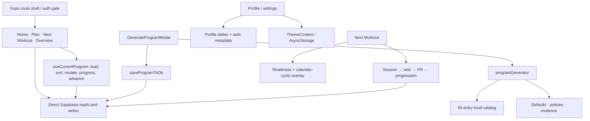
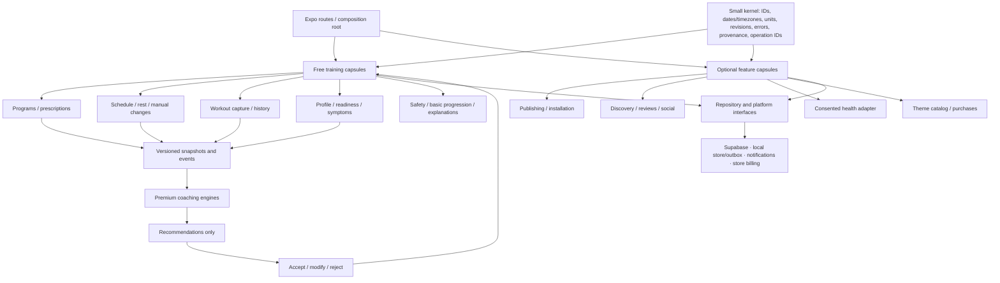
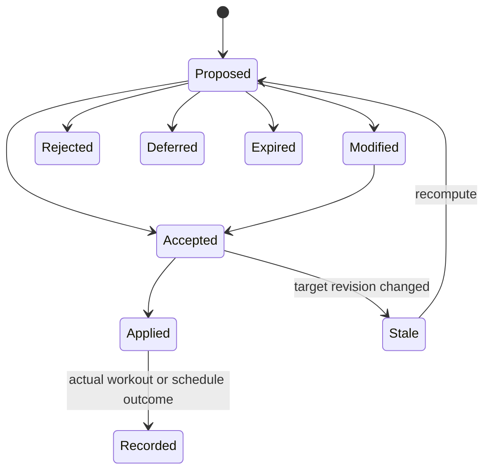
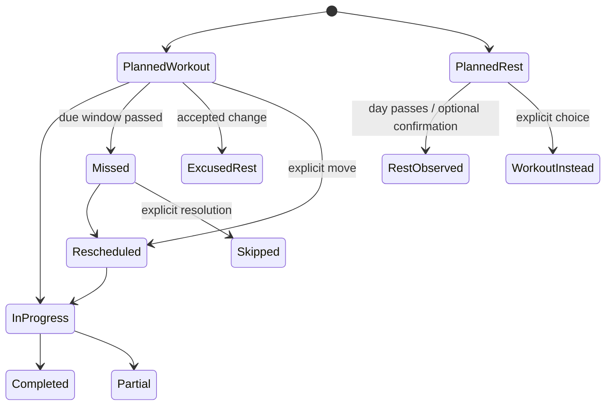

**My recommendation is to preserve Expo and Supabase, rebuild the training domain around explicit schedules and durable workout records, and make coaching, publishing, community, health integrations, and purchases independent modules.** The most urgent work is restoring user agency and trustworthy persistence. Those foundations will support the proposed features without turning FABLE-5’s delivery stages into software dependencies.

This is the first-pass decision packet. **No application files, migrations, canonical plans, or database policies were changed.** The eight pre-existing modified files remain intact on `refactor-1`, at commit `f716247`. I read the complete research report, reviewed the requested planning sources, used three parallel reviews, and inspected live Supabase metadata read-only.

Throughout the proposal:

- **E — Evidence-backed:** a research-supported principle, with its limits.
- **P — Product decision:** a recommended behavior or architecture choice.
- **H — Transparent heuristic:** an operational rule requiring testing and calibration.
- **U — Unresolved:** a decision or validation requirement that remains open.

All proposed architecture, ownership, privacy, entitlement, and workflow rules below are **P** unless explicitly labeled otherwise. These labels distinguish proposals from the observed implementation facts.

---

**The executive decisions I recommend are as follows.**

| Decision | Recommendation |
|---|---|
| Product foundation | A complete free training product: create/install a plan, schedule workouts and rest, train, log, progress, inspect history, and change the schedule manually. |
| Premium boundary | Charge for richer interpretation and automated coaching proposals, including schedule recovery—not ownership of schedules, programs, or observations. |
| Program identity | Separate reusable templates, immutable published versions, private installed instances, prescription revisions, and dated schedule occurrences. |
| Adaptive authority | Engines produce proposals. User acceptance or an explicitly authorized progression policy determines what becomes the prescription. |
| Scheduling | Preserve original dates and program-day identities. Record changes instead of rewriting `start_date`. |
| Consistency | Use weekly training-target adherence with planned rest respected; avoid daily workout streaks. |
| Sharing | Start with unlisted links/codes, immutable versions, web previews, and private installation. Add discovery separately. |
| Published updates | Installed copies remain pinned. Initially offer a separate installation of a newer version; defer selective merging. |
| HealthKit | Display-first, explicitly consented, optional. No readiness influence in the first integration release. |
| Themes | First-party, declarative token packages initially. Ownership and billing remain independent from coaching subscriptions. |
| Architecture | An incrementally extracted modular monolith, with narrowly privileged backend operations. No wholesale rewrite or microservice migration. |

**Current product and implementation status.** The execution register remains at **F5-S0 complete, F5-S1 active, F5-S2–S8 pending**. Historical August 3 verification covered live schema/RLS and authenticated compatibility operations. Actual mobile UI and missing-schema compatibility gates remain open. The master plan’s older “live RLS unverified” language is stale relative to those records. See the [execution register](C:/workout-app/AdaptivPush/dev-doc/plans/active/FABLE-5-EXECUTION-REGISTER.md:103) and [current state](C:/workout-app/AdaptivPush/dev-doc/main/CURRENT-STATE.md).

“Working” below means an implemented code path, not newly verified production or device behavior.

| Existing scope | Observed state | Revised disposition |
|---|---|---|
| Landing, signup, signin, signout, route gating | Working baseline | Retain; verify expired sessions, interrupted onboarding, offline startup, and links. |
| Password recovery | Form without completed reset flow | Retain requirement; implement real reset and callback independently of coaching. |
| Onboarding | Demographics/profile seeding plus generator | Replace critical path with goal, availability, experience, equipment, and time. Keep sensitive demographic inputs optional. |
| Profile and preferences | Split across profile, preference tables, auth metadata | Consolidate through compatibility adapters; controls must change actual behavior. |
| Essential/Guided/Advanced | Types/defaults exist; meaningful presentation incomplete | Retain as presentation depth, independently selectable from payment. |
| Program generation | Working multiweek generator | Retain foundation; separate structure, exercise selection, prescriptions, and installation. |
| Goal-specific prescriptions | Goal changes sets/reps/RPE/loading | Expand: goals must also affect frequency, priorities, volume allocation, rest, stability, and progression. |
| Exercise catalog | Generator uses 55 local exercises; larger remote catalog | Establish stable identifiers, metadata, catalog versioning, synchronization, and image/instruction coverage. |
| Optional program naming | Existing retained scope | Preserve. |
| Manual program editor | Working separate creation path | Preserve as a free explicit manual path; consolidate persistence. |
| Program save/replacement | Context-failure compensation improved in dirty tree | Preserve fix; close failures before and after the protected context-write section. |
| Plan and overview | Working lists and actions | Add rationale, weekly targets, explicit rest, version context, and safe editing. |
| Archive/restore/restart | Week checkpoint only | Preserve compatibility; add explicit schedule/prescription checkpoint before promising exact resume. |
| Workout execution | Logging, elapsed workout timer, swaps, PRs | Add durable drafts, idempotent finalization, accurate partial completion, and frozen prescriptions. |
| Exercise substitutions | Working but overly broad mutation behavior | Separate temporary substitutions from future-program revisions; preserve actual history. |
| Readiness capture | Legacy weighted score | Retain data; add neutral one-tap/deep capture and distinct safety signals. |
| Day-of adaptation | Hidden load/RPE overlays | Replace with shared, explicit recommendation and decision state. |
| Progression | Multiple partial implementations | Consolidate around comparable completed sets and actual equipment increments. |
| Plateau interpretation | Missing complete lifecycle | Add contextual review, not automatic “failure” labels. |
| Deloads | Every-fourth-week generation plus unused richer table | Reactive suggestions by default; scheduled deloads remain explicit options. |
| Cycle support | Calendar-based reductions; symptom table unused | Symptom-first, opt-in, private; calendar context cannot independently alter training. |
| History, exercise history, PRs | Working baseline with fallback problems | Preserve raw data; reconcile mixed legacy/new history and add provenance. |
| Analytics | Basic aggregates; richer interpretation missing | Separate free descriptive metrics from optional premium interpretation. |
| Evidence registry | Implemented foundation; no complete live consumer | Retain keys; add verified sources, caveats, rule labels, and shared explanation UI. |
| FAQ and Recovery Library | Static content | Retain routes; unify content with evidence registry and actual behavior. |
| Notifications | Local notifications; hardcoded daily time | Make schedule/rest/permission/time/quiet-hour aware. Email/SMS remain unavailable until real delivery exists. |
| Themes and palettes | Dark/light/system and five palettes | Preserve and validate accessibility; separate marketplace infrastructure. |
| Avatar and haptics | Existing capabilities | Preserve; disclose public avatar delivery and honor haptic preference. |
| Rest timer | Not the existing workout-duration timer | Optional later enhancement; do not call implemented. |
| Export, deletion, support | Metadata request markers | Replace with actual workflows and truthful status. |
| HealthKit | Placeholder settings, no working adapter | Hide unsupported claims; implement only through an optional integration slice. |
| Feature flags | Missing | Add deterministic rollout controls, separate from entitlements and consent. |
| Shared UI, accessibility, release identity | Partial or missing | Continuous requirements for every slice. |
| Automated application tests | Missing | Start with pure domain tests and critical persistence integration tests. |

The new scope adds public publishing/install/versioning, discovery and separate social modules, reviews, activity display, explicit schedules/rest, consistency, schedule recovery, and cosmetic purchases. It does **not** imply that these already exist or were included in the original FABLE-5 completion boundary.

---

**The code audit exposes several concrete problems that the new plan should address first.**

| Finding | Consequence | Proposed treatment |
|---|---|---|
| Home’s apply action reaches a compatibility no-op; dismissal only closes the popup. Next Workout independently applies readiness. | Rejecting a suggestion does not reject the adjustment. | One recommendation ID and persisted decision shared by both screens. |
| High readiness increases load/RPE automatically. | Violates the requested explicit-choice behavior. | Remove high-readiness escalation from automatic overlays. |
| Home selects the first unfinished workout in the current week. | A programmed rest day can become an invitation to train the next workout. | Resolve today’s dated occurrence first. |
| A stale/invalid workout route falls back to another workout. | The user may open something other than the requested session. | Show unavailable/stale target and let the user choose another occurrence. |
| A session row can exist before its sets are successfully saved. | Incomplete persistence can mark a workout completed. | Finalized session state plus atomic/idempotent completion. |
| Progression evaluates all *logged* sets without requiring all prescribed sets. | One successful set out of four may qualify for increased load. | Compare actual completion against the accepted prescription. |
| Progression writes next-week loads without a deload guard. | Normal progression can overwrite lighter deload prescriptions. | Phase-aware proposed targets; deload prescriptions take precedence. |
| Cycle adjustments occur during generation, future progression, and day-of display. | The same context can influence multiple layers, including future weeks. | One symptom-aware decision boundary; no blanket calendar multiplier. |
| Temporary substitution retains old loads and entered sets; persistent swaps rewrite all matching weeks. | Exercise identity, loading, and historical meaning become unreliable. | Freeze completed data; create scoped replacement slots/revisions. |
| Local fallback exercise IDs can be slugs while persistence expects catalog UUIDs. | Offline substitutions can fail to synchronize. | One canonical catalog identity mapping. |
| Program replacement deactivates old programs before all new writes succeed. | Failures can leave partial replacements or no usable active program. | Validate first, then commit replacement atomically. |
| History fallback chooses legacy or new data rather than reconciling both. | Existing history can disappear after the first new-format session. | Explicit union/migration with deduplication. |

Evidence includes [Home](C:/workout-app/AdaptivPush/app/(tabs)/home.tsx:660), [Next Workout](C:/workout-app/AdaptivPush/app/next-workout.tsx:177), [current-program orchestration](C:/workout-app/AdaptivPush/hooks/useCurrentProgram.ts:251), [substitution handling](C:/workout-app/AdaptivPush/hooks/useCurrentProgram.ts:474), [program saving](C:/workout-app/AdaptivPush/utils/saveProgramToDb.ts:245), and [history](C:/workout-app/AdaptivPush/app/(tabs)/history.tsx:439).

The dirty-tree save fix is valuable and should be retained. It addresses required context preparation/insertion failure; it does not make the entire multi-table operation atomic.

---

**The current architecture concentrates decisions, reads, and writes in screens and one large hook.**

**Exact interaction and extraction seams are these.**

| File or surface | Current interaction | Proposed owner |
|---|---|---|
| [useCurrentProgram](C:/workout-app/AdaptivPush/hooks/useCurrentProgram.ts) | Loads active program; calculates week; reads completion; swaps, archives, advances, progresses | Compatibility facade over program repository, schedule selectors, and explicit commands. Reads must stop causing progression writes. |
| [Home](C:/workout-app/AdaptivPush/app/(tabs)/home.tsx) | Readiness capture, program selection, reminders, cycle advice, next action | Today view model composed from schedule, capture, and recommendation APIs. |
| [Next Workout](C:/workout-app/AdaptivPush/app/next-workout.tsx) | Prescription selection, adaptation, draft state, writes, PRs, progression | Workout execution capsule; frozen accepted prescription and durable draft. |
| [Plan](C:/workout-app/AdaptivPush/app/(tabs)/plan.tsx) | Program hub, generator/editor/swap navigation | Program and schedule capsule UI. |
| [History](C:/workout-app/AdaptivPush/app/(tabs)/history.tsx) | Direct queries, fallback, aggregates | History repository plus independent descriptive/interpretive selectors. |
| [GenerateProgramModal](C:/workout-app/AdaptivPush/components/GenerateProgramModal.tsx) | Profile lookup → generation → immediate save | Preview-oriented generation coordinator; installation is a separate command. |
| [programGenerator](C:/workout-app/AdaptivPush/utils/programGenerator.ts) | Fixed split mapping, random selection, prescriptions, future load increases | Pure structure pipeline with injected catalog, clock context, policy version, and deterministic tie-breaking. |
| [saveProgramToDb](C:/workout-app/AdaptivPush/utils/saveProgramToDb.ts) | Replacement orchestration, catalog resolution by name, context, child writes | Atomic program installer/replacement repository. |
| [profilePreferences](C:/workout-app/AdaptivPush/utils/profilePreferences.ts) | Compatibility across tables and metadata | Single profile/preference boundary with explicit precedence and missing-schema handling. |
| [ThemeContext](C:/workout-app/AdaptivPush/contexts/ThemeContext.tsx) | Device appearance/palette persistence | Theme runtime; separate catalog, download, ownership, and purchase clients. |
| [notifications](C:/workout-app/AdaptivPush/utils/notifications.ts) | Hardcoded local reminder and event notifications | Adapter consuming schedule revisions and user notification preferences. |
| [database types](C:/workout-app/AdaptivPush/types/database.ts) | Profile and Phase 2 interfaces; incomplete core coverage | Generated database types plus separate validated domain contracts. |

Shared IDs currently have ambiguous meanings: a prescription row ID, an exercise ID, and a local catalog identifier are not interchangeable. Resolving that ambiguity precedes reliable swaps, comparisons, or synchronization.

**The proposed architecture keeps the shared kernel small.**

Capsules own their domain contracts and export narrow interfaces. They do not all import a growing central `types.ts`. Pure engines do not import React, Supabase, notification APIs, subscription state, or global randomness.

Server operations remain appropriate for atomic installation/finalization, publication validation, moderation, entitlement verification, and privacy fulfillment. This does not require a second backend platform.

**The stable contracts should contain the following information.**

| Contract | Essential content and invariant |
|---|---|
| `ProfileSnapshot` | Owner, revision, as-of time, units/timezone, experience, availability, equipment, preferences and movement considerations, with source provenance. Unknown differs from false. |
| `TrainingGoalProfile` | Primary/secondary goals, ordered focus priorities, horizon, success measures and constraints. Mixed goals are explicit. |
| `ProgramTemplate` | Reusable workout roles, relative workout/rest pattern, progression policies, instructions and rationale. No private history, readiness, health data, or personal training maxes. |
| `PublishedProgramVersion` | Template ID, immutable version/content hash, attribution/license, schema/catalog versions and sanitized content. Visibility/moderation state is separate from content immutability. |
| `UserProgramInstance` | Private owner, origin, pinned source version, active prescription revision, schedule, progression state, lifecycle and checkpoint. |
| `ProgramSchedule` | Instance, timezone, recurrence, effective interval, revision and exceptions. Original schedule remains reconstructable. |
| `ScheduledDay` | Stable occurrence ID, original/current local date, program-cycle identity, kind, prescription reference, status and outcome links. |
| `RestDay` | `kind=rest`, programmed/recovery/illness/travel reason, optional activities, and adherence treatment. Not an empty workout. |
| `WorkoutPrescription` | Immutable revision; stable slots; actual exercise IDs; ordered sets, reps, loading semantics, RPE/RIR, rest, optionality, warm-ups, phase and progression policy. |
| `CompletedWorkout` | Operation ID, occurrence/prescription references, actual exercises and stable set IDs, timestamps, partial/full outcome and recommendation links. |
| `ExerciseSelectionContext` | Slot purpose, movement/muscles, equipment/increments, skill/stability/fatigue metadata, preferences, exposure/history, phase, time and exclusions. |
| `ReadinessSnapshot` | Raw responses, explicit pain/illness context, freshness, source, consent, missingness and optional derived summary. |
| `Recommendation` | Producer/policy version, base revision, input references, proposed diff, alternatives, reason, evidence, confidence, expiry and decision state. |
| `ScheduleDeviation` | Original occurrence, actual change/completion, actor, reason, one-time/recurring scope and old/new revisions. |
| `ScheduleRecoveryProposal` | Fixed completed work, proposed future moves/rest, conflicts, unplaced work, assumptions, availability and base schedule revision. |
| `AdaptationEvent` | Before, proposed, accepted and actual references; actor/time; decision; policy/evidence versions. |
| `HealthActivitySnapshot` | Source record/version, type, interval, values/units, attribution, duplicate group, freshness and display/interpretation eligibility. |
| `Entitlement` | Account, capability or cosmetic asset, verified source/status, effective/expiry/grace/revocation times and verification freshness. |
| `Insight` | Metric or interpretation, source window, coverage, confidence, policy version and supporting records. Never the only representation of the underlying data. |

---

**Every major feature inherits the following behavior contract.** The feature-specific rules that follow extend it.

| Dimension | Required behavior |
|---|---|
| Inputs and preconditions | Validate contract/schema versions, ownership, units, target revision, required fields, and available catalog references. |
| Decisions | Deterministic for the same inputs and policy version. Record which inputs mattered and which were unavailable. |
| State transitions | Explicit states; no “applied” state merely because a modal closed or a request was sent. |
| Outputs | A validated artifact, observation, or proposed diff with a structured result/error. |
| Explanations | State what changed, why, expected practical effect, available alternatives and confidence. |
| Overrides | Accept, edit, reject, or choose manual control where relevant. Rejection persists and is not penalized. |
| Persistence | Preserve original, recommended, accepted and actual values. Use operation IDs and revisions. |
| Missing data | Use declared conservative defaults or ask for the minimum missing input; never invent observations. |
| Conflicting data | Preserve both sources. Resolve according to feature-specific authority; disclose meaningful uncertainty. |
| Offline | Cached plans, logging, basic progression and manual scheduling remain usable. Queue supported private writes with visible pending status. |
| Error recovery | Retry the same operation ID; retain draft/context. Optional service failures cannot invalidate a completed workout. |
| Entitlements | Check capability access separately from flags, consent, and presentation depth. |
| Downgrade | Keep saved programs, accepted prescriptions, schedules, history, manual control and prior explanations. |
| Edge cases | Handle stale revisions, duplicate requests, partial completion, deleted references, timezone changes and account changes. |
| Acceptance criteria | Verify both successful outcomes and rejection/failure/retry behavior, not only screen rendering. |

A recommendation follows:

Starting a workout freezes its accepted prescription. Later check-ins or background responses cannot overwrite entered sets. New information can produce an explicitly presented amendment.

---

**Program generation should use a fourteen-stage pipeline.**

| Stage | Inputs and decision rules | Output and user control |
|---|---|---|
| 1. Interpret goals/constraints | **P:** separate desired outcomes from hard constraints and preferences. Unknown equipment or availability requires clarification/default confirmation. | `TrainingGoalProfile` and constraint summary. |
| 2. Recommend frequency | **E:** choose sustainable exposure and practice; frequency also distributes work. **H:** generally offer 2–3 days for a beginner; never exceed availability. | Recommended number of sessions plus alternatives. |
| 3. Recommend split family | **E:** equivalent-volume splits are often comparable; logistics and specificity matter. **H:** 2 days full body; 3 full body or upper/lower/full; 4 upper/lower; 5 hybrid; 6 optional PPL twice. | Ranked feasible splits with reasons; user can choose another feasible split. |
| 4. Allocate weekly muscle volume | **E:** volume matters, with diminishing returns. **H:** start at a recoverable lower range and allocate focus volume within the time budget. | Per-muscle direct sets, estimated indirect exposure, target range and unmet targets. |
| 5. Structure workout days | **E:** priority/skill-demanding work usually comes early. **P:** distinguish required and optional slots. | Workout roles and ordered slots before specific exercises are chosen. |
| 6. Select categories/patterns | **P:** satisfy movement and muscle coverage, avoiding redundant slots. | Squat/knee-dominant, hinge, horizontal/vertical push/pull, isolation and trunk roles as appropriate. |
| 7. Select specific exercises | **H:** hard constraints first, then continuity, goal fit, comfort, preference, fatigue and time. | Catalog-backed candidates and selection reasons. |
| 8. Prescribe training | **E:** goal-sensitive load/effort/rest. **H:** exact set/rep ranges and progression thresholds. | Sets, reps, RPE/RIR, loading method, rest, warm-ups and progression policy. |
| 9. Place rest days | **P:** explicit dated/rest pattern from availability. **H:** spread demanding overlapping sessions where feasible. | Relative schedule including rest; no silent next-workout advancement. |
| 10. Trim duration | **H:** estimate warm-up, set execution, inter-set rest and equipment transitions. Remove optional/redundant work first. | Estimated duration and a list of compromises. |
| 11. Apply stability/variation | **E:** preserve enough continuity to assess progress. **H:** review primary lifts around 6–12 weeks and accessories around 2–6 weeks; these are review windows, not mandatory swaps. | Stable exercise slots and optional review dates. |
| 12. Explain confidence | **P:** expose input coverage and constraint conflicts separately from evidence strength. | “Good fit for your stated schedule; loading will be calibrated in the first sessions.” |
| 13. Apply overrides | **P:** recompute affected stages only. Revalidate downstream time, volume, equipment and recovery implications. | Updated preview with the user’s choices preserved. |
| 14. Persist/version | **P:** save exact inputs, policy/catalog/evidence versions, structure and prescriptions; activate only after complete validation. | Private instance and schedule. Failure leaves prior active program usable. |

**Generation operations must remain distinct.**

| Operation | What changes | What remains attached |
|---|---|---|
| Generate structure | Split, workout roles, volume allocation, relative schedule | User goals and constraints |
| Select exercises | Concrete exercises filling existing slots | Structure and slot purpose |
| Substitute during generation | Candidate exercise before installation | No historical progression has yet been created |
| One-session substitution | One upcoming or active slot | Original prescription and completed sets |
| Future-program exercise replacement | Explicit future revisions | Historical exercise identity and performance |
| Equipment/comfort replacement | Affected slots and loading calibration | Goal and movement intent where feasible |
| Schedule change | Occurrence dates/order | Exercise histories and program-day identities |
| Full regeneration | New program artifact/instance | Old instance and history; no destructive replacement |

**Personalization should have visible consequences.**

| Input | Affects | Must not automatically do |
|---|---|---|
| Strength goal | Lift specificity/frequency, primary order, heavier practice, longer rest, conservative load progression | Make every exercise low-rep or maximal |
| Hypertrophy goal | Muscle-set allocation, broader rep ranges, local stimulus, accessories, optional set progression | Maximize volume regardless of recovery |
| General fitness | Simpler full-body coverage, modest volume, manageable effort | Require complex periodization |
| Mixed goals | Heavy priority practice plus muscle-volume work | Pretend both objectives can be maximized under any time cap |
| Focus muscles | Earlier placement and redistribution of sets | Eliminate non-focus coverage |
| Experience | Complexity, starting volume, loading calibration, progression cadence | Assume advanced means recoverable high volume |
| Available days | Feasible frequency and split | Schedule outside availability |
| Session duration | Exercise count, optional work, pairings, volume tradeoffs | Compress necessary rest to manufacture a shorter estimate |
| Equipment/increments | Candidate selection and progression steps | Transfer kilograms/pounds directly between machines or variants |
| Preferences | Ranking among suitable candidates; adherence fit | Override explicit safety constraints |
| Injury/movement considerations | Exclusions, tolerated ROM/stability, confidence | Diagnose injury or prescribe rehabilitation |
| Recovery capacity | Initial volume, optional work, spacing, deload sensitivity | Assign a fixed physiological “MRV” |
| Goal horizon | Review dates and strength-specific block structure when appropriate | Promise a guaranteed result by a date |
| RPE familiarity | Explanation format and confidence in effort reports | Treat a missing RPE as a successful effort check |
| Adherence history | Practical frequency, essential/optional allocation, schedule flexibility | Punish missed workouts with added work |
| Performance history | Initial loads, progression baselines, exercise continuity | Use unrelated exercises as interchangeable strength tests |
| Optional age/body/physiology context | Relevant individual constraints and symptoms | Derive split or ability from sex/body-size stereotypes |

**Goal-specific defaults are starting proposals, not universal prescriptions.** The numerical ranges below are **H** informed by research report sections D–G. The broader goal distinctions are **E**.

| Goal | Frequency and allocation | Prescription and order | Progression, variation and recovery |
|---|---|---|---|
| Strength | Usually 2–4 useful exposures to priority lifts/patterns when feasible; moderate accessory volume | Trained users: primary work often 3–6 reps, approximately RPE 7–9, 3–5 min rest; specific lift first | Preserve primary lifts; small load increases after repeated success; organized blocks for trained users |
| Hypertrophy | Usually 2–4 exposures per muscle to distribute work; start around 8–12 direct/estimated-equivalent sets for major targets when appropriate | Compounds often 6–12 reps; smaller work 10–20; mostly 1–3 RIR; 2–3 min compound rest, 1–2 min smaller work | Double progression; add volume only when useful and recoverable; avoid frequent exercise churn |
| General fitness | Usually 2–3 full-body sessions; modest whole-body coverage | Often 1–3 working sets, 6–15 reps, RPE 6–8; simple movements and practical rest | Simple rep/load progression; few unnecessary planned deloads |
| Mixed strength/hypertrophy | Typically full-body or upper/lower; explicit priority order | Heavy primary practice followed by moderate-rep volume work | Track lift progress and muscle coverage separately; trim lower-priority accessories when time is short |
| Focus-muscle hypertrophy | Redistribute a bounded portion of weekly work toward selected muscles | Focus work earlier; use complementary functions, such as hinge plus knee flexion for hamstrings | **H:** initially add roughly 2 sets/week to a recovering focus muscle rather than multiplying total program volume |
| Beginner confidence | Usually 2–3 repeatable sessions; low starting volume | Often 1–2 working sets per slot, manageable loads, RPE 6–8; no required 1RM test | Repeated practice and small progressions; technique/effort calibration before aggressive loading |
| Fat loss/recomposition | Preserve useful resistance training within recovery/time constraints | Maintain meaningful loading; reduce unnecessary fatigue when energy is constrained | Performance retention can be success; no nutrition-treatment or calorie-burn promises |
| Endurance/power/sport-specific | Distinct optional advanced templates requiring sufficient metadata | Endurance can use higher reps/density; power uses low-fatigue fast intent and adequate rest | Defer specialized automated prescriptions until separately validated; do not approximate by renaming hypertrophy plans |

The report’s muscle-specific ranges should guide candidate targets, not be summed indiscriminately. For example, pressing contributes to chest, anterior delts and triceps, but those exposures are not identical. Display **direct sets and estimated indirect contribution separately**. A fractional indirect-set model is a useful **H**, supported as a population-level modeling approach—not a precise individual dose measurement. [Pelland et al.](https://pubmed.ncbi.nlm.nih.gov/41343037/)

Concrete differences for otherwise similar users:

- **Three days, 45 minutes, beginner, general fitness:** full-body A/B/C; simple repeated movements; two working sets for major slots; modest optional work.
- **Same schedule, experienced strength goal:** repeated practice of the selected priority lifts, longer rests, fewer accessories, explicit “some muscle-volume work omitted to protect strength practice” explanation.
- **Same schedule, hypertrophy goal:** more moderate-rep muscle work, stable machine/cable options where available, noncompeting accessory pairings, and visible weekly coverage.
- **Same hypertrophy user, dumbbells with large jumps:** rep progression and supported unilateral variants; no forced weekly load increase.
- **Same user, 25-minute sessions:** reduced essential scope and visible unmet volume targets; offer another day or longer sessions rather than claiming the original plan still fits.
- **Four days with glute emphasis:** redistribute work toward thrust/bridge, squat/lunge and hinge categories while preserving upper-body coverage; do not simply add glute exercises to an already full program.

Generation acceptance requires deterministic fixtures across goals, experience, 2–6 days, short/long sessions, equipment restrictions, focus choices and sparse history. Tests must prove that changing a meaningful input changes the relevant output without violating hard constraints.

---

**Readiness should be a contextual state machine, not a score-to-weight multiplier.**

Inputs are today’s one-tap state or deeper responses, recent comparable performance, recent check-ins, local soreness/limitations, pain/illness details, schedule phase and optional consented enrichment.

**P:** one-tap states remain low, normal/moderate and high. Legacy numerical scores can be displayed with their original scale and provenance, but must not be silently reinterpreted as a new score.

**H:** if a new normalized 0–100 display score is retained, 0–39 can summarize low, 40–79 ordinary and 80–100 high readiness. These bands select a conversation branch only. They do not establish safety or prescribe a percentage load change. A score alone cannot trigger severe adaptation.

| Situation | Proposed decision and effect | Explanation and options |
|---|---|---|
| No check-in | **P:** use planned prescription; no hidden readiness adjustment | “No check-in today. Your planned workout is available.” Check in, start, or manually adjust. |
| Normal/moderate | **P:** proceed as planned unless explicit safety information conflicts | No unnecessary changes. |
| Low one-tap, no other concerns | **H:** offer removing optional work and approximately 20–25% of accessory sets; preserve primary practice/load initially | “A shorter session is available.” Accept, edit, or train as planned. |
| High | **P:** normal prescription remains default | Optional challenge only if eligible; never silently increase load, sets or RPE. |
| One mildly poor night, otherwise normal | **E/P:** normal training or small optional trim; reassess warm-up performance | Avoid declaring the user unready from sleep alone. |
| Repeated poor sleep plus high stress/flat performance | **H:** offer 25–40% fewer working sets; remove demanding optional work; lower effort ceiling if needed | Explain the corroborating signals and uncertainty. |
| Mild soreness without movement limitation | **E/P:** usually preserve planned training; no automatic cancellation | User can trim affected optional work. |
| Severe local soreness limiting ROM/technique | **E/P:** reduce or replace affected local work; consider another region or rest | Do not reduce unrelated muscles indiscriminately. |
| High stress/life load alone | **H:** offer shorter, simpler session with normal or longer rest | Preserve habit and choice; do not infer a medical condition. |
| Several low-readiness days | **H:** initiate a recovery review, considering performance and adherence | Offer additional rest/light work; premium may provide deeper longitudinal interpretation. |
| Low subjective readiness, good recent performance | **P:** subjective state guides today’s volume/complexity; good performance prevents an automatic long-term regression | Preserve both observations. |
| High subjective readiness, repeated performance decline | **P:** withhold push option; offer planned or reduced work and review | “You feel good today, but recent targets have been harder to complete.” |
| Health data conflicts with user input | **P:** imported data remains context; it cannot override reported pain, illness, or the user’s current experience | Show source/time and permit exclusion. |
| Deload already scheduled | **P:** keep the accepted deload prescription; no high-readiness challenge or duplicate routine reduction | Offer further adjustment only for new material symptoms. |
| Recovery session already scheduled | **P:** no escalation into a full workout because of a score | User may manually change plans through the schedule flow. |
| Pain signal | **E/P:** ask location, character, worsening/function limitations; numeric severity alone is insufficient | Avoid provoking movement; offer stop or appropriate alternatives. |
| Illness signal | **P:** clarify systemic symptoms and exercise tolerance; do not treat a boolean as a universal light-workout prescription | Rest remains available; no automatic catch-up debt. |
| Fever, chest symptoms, dizziness, unusual weakness or concerning pain/function loss | **E/P:** do not recommend hard training or a challenge | Clear non-diagnostic stop/rest and professional-evaluation guidance; urgent symptoms warrant urgent care. |

Illness return-to-training needs more than the simplistic “above the neck” rule. The product should use reviewed symptom questions and graded return guidance, with clinical review before release. [IOC respiratory-illness consensus](https://doi.org/10.1136/bjsports-2022-105759)

**The adjustment order remains volume → complexity → load, with safety and actual performance allowed to override that order.**

| Prescription dimension | Low/moderate concern | Greater corroborated concern |
|---|---|---|
| Optional exercises | Remove first | Remove |
| Total working sets | Trim accessories first | Reduce total sets while preserving useful practice |
| Complexity | Usually preserve | Replace demanding setup/skill with a tolerated simpler variant |
| Exercise selection | Preserve continuity | Change only affected or unsuitable slots |
| Load | Hold initially if appropriate | Reduce when effort/technique or symptoms justify it |
| Rep targets | Remain in range; do not force top end | Use lower end or revised range to respect effort ceiling |
| RPE target | No increase | **H:** reduce by about 0.5–1, with load adjusted if required |
| Rest | Preserve | Allow longer rest; avoid forcing density |
| Workout ordering | Preserve priorities | Offer another region/day only through an explicit schedule proposal |
| Recovery alternatives | Optional | Rest, light movement or a tolerated reduced session as appropriate |

For set trimming, use deterministic rounding and list the actual removed sets. Never trim a required slot into an unexplained zero-set exercise. A time-critical or symptom-limited case may remove an entire slot, but that must be stated.

**H: optional high-readiness challenge eligibility** requires no pain/illness concern, no deload/recovery phase, sufficient comparable history, previous successful target completion, suitable equipment increments and user opt-in. Offer **one** bounded change—such as one additional rep within the existing range or the smallest justified load increment—not simultaneous increases in sets, load and effort.

Freshness is also a heuristic: use today’s check-in for a new session; an older check-in is historical context. A long delay or meaningful symptom change invites reconfirmation. A new check-in supersedes the current summary without rewriting the snapshot used by an earlier workout.

Acceptance scenarios include rejection on Home followed by opening Next Workout, failed check-in persistence, high readiness during deload, missing pain responses, a late readiness response during logging, and conflicting wearable/user signals.

---

**Exercise selection and substitution should use constraints before preferences or variety.**

| Selection stage | Rule |
|---|---|
| Hard eligibility | **P:** available equipment, catalog identity, permitted movement/ROM, required accessibility and load support. Exclude explicitly unsuitable choices. |
| Functional fit | **E/P:** preserve the slot’s movement intent and targeted muscles, accounting for secondary involvement. |
| Goal fit | **E:** prioritize specificity for strength; useful local loading and recoverable volume for hypertrophy. |
| Skill/stability | **H:** use explicit metadata rather than inferring “compound” from dumbbells/barbells or position. |
| Fatigue/time | **H:** prefer lower unnecessary systemic/setup cost when alternatives meet the goal. SFR is a coaching concept, not a measured biological score. |
| Continuity | **E/P:** prefer the current tolerated exercise and comparable progression history. |
| Preferences | **P:** rank acceptable choices by enjoyment, familiarity and user exclusions. |
| Tie-breaking | **P:** deterministic ranking; seeded variation only among equivalently suitable candidates. |
| Missing metadata | **P:** lower confidence, use validated known candidates or request manual selection; never guess injury suitability. |

Substitution reasons produce different behaviors:

- **Equipment unavailable today:** replace one occurrence; return to the original next time unless the user chooses otherwise.
- **Permanent equipment change:** revise selected future slots and recalibrate loading.
- **Discomfort:** avoid the provoking movement; do not assume a mechanically similar exercise is automatically tolerated.
- **Preference:** offer comparable options and explain the new baseline.
- **Plateau:** audit adherence, technique, rest and recovery before recommending replacement.
- **Time limit:** remove optional work before replacing priority exercises merely for novelty.
- **Program-phase change:** consider a planned variation at a review point, preserving historical comparability labels.

If sets have already been logged, those sets retain the original exercise identity. Remaining work can become a new replacement slot. **Never relabel completed sets or copy a barbell load into a machine/dumbbell prescription without calibration.**

Offline substitutions use cached catalog IDs. Unknown custom exercises remain private drafts until assigned a stable identity; they must not be inserted into the shared catalog through general client write permissions.

---

**Progression should evaluate completed work against the accepted prescription.**

**E:** overload can come from reps, load, sets or improved execution/ROM. No single progression speed fits everyone. **P:** double progression is the default product policy, not a scientifically proven universal winner.

A comparable exposure requires the same exercise/variant, compatible equipment/loading semantics, known prescription, stable set identity and a meaningful outcome. Deloads, deliberate technique resets, substantially shortened sessions and substitutions are tagged so they do not masquerade as ordinary progression tests.

| Situation | Proposed rule |
|---|---|
| Sparse/no history | **P:** calibration session; conservative user-selected starting load, effort guidance and no fabricated performance baseline |
| Reps below top of range, appropriate effort | **H:** hold load and aim for a small rep improvement within the range |
| All required working sets at top range, acceptable effort/technique | **H:** primary/secondary compounds generally require two comparable successes before a load increase |
| Accessories/isolation reach top range | **H:** one or two successes depending on increment size and confidence |
| Missing RPE | **P:** ask a simpler effort question or gather more comparable performance; never treat null as automatically acceptable |
| Large minimum load jump | **H:** continue rep progression within a declared range, use microloading if supported, or offer another progression method |
| Optional set omitted | **P:** does not automatically invalidate success on completed required work |
| Required sets incomplete because of time/interruption | **P:** no full-success progression; retain partial data and reason |
| Targets missed once | **P:** generally hold and inspect context |
| Repeated misses at excessive effort | **H:** propose a small load/volume reduction or recovery review, not automatic escalation |
| Low adherence | **P:** do not add catch-up volume or label normal sparse progress a plateau |
| New exercise/variant | **P:** new baseline; preserve prior history as context, not a converted equivalent max |
| Deload | **P:** suppress ordinary load/set increases; compare return sessions with pre-deload normal exposures |
| Execution/ROM improvement | **P:** record the standard change; compare performance within the same standard |
| Set progression | **H:** add at most one set to a selected slot at a review point when recovery, time and goal justify it; do not add sets by default whenever load stalls |

The report’s cited ACSM progression guidance supports small increases after repeated overachievement; specific pound increments remain equipment- and person-dependent.

| Exercise/equipment class | Preferred progression behavior |
|---|---|
| Primary compound | Stable lift, repeated comparable completion, small available load increase; protect technique and rest |
| Secondary compound | Rep-first or conservative load progression; consider fatigue from primary work |
| Accessory/isolation | Rep-first; smaller increments; avoid oversized percentage jumps |
| Barbell | Store total external load and available plate increments |
| Dumbbell | Store per-hand versus combined semantics; progress according to available pairs |
| Machine | Track machine identity/settings where practical; stack values are not interchangeable across machines |
| Cable | Track stack increment and configuration; no universal comparison between pulley systems |
| Bodyweight | Track variant, assistance/additional load, reps and ROM; zero external load is valid, not missing |
| Large-jump equipment | Rep range extension within goal, supported microloading, or a carefully chosen variant; no forced jump |
| Unilateral exercise | Record side and asymmetry if captured; do not silently double or average incompatible values |

**H: plateau review trigger.** Use at least three comparable normal exposures spanning roughly 2–4 weeks, adequate completion of planned work, and no meaningful rep/load improvement **plus** evidence of difficulty, repeated misses or expressed frustration. This is a review flag, not a diagnosis. Advanced users progressing slowly may not be plateaued.

Review in this order:

1. Comparability, technique, logging completeness and changed exercise standards.
2. Adherence, available time, rest periods and load increments.
3. Sleep, stress, soreness, illness/pain and other life context.
4. Whether fatigue is too high or stimulus is insufficient.
5. A small targeted change.
6. Only then broader volume changes, substitution, or deload.

Estimated 1RM is supplementary and must identify its formula and limitations. High-rep, bodyweight, machine and inconsistent-effort records should not be combined into false precision.

**Deload behavior** should use an explicit lifecycle: proposed → accepted/modified/deferred/rejected → active → completed → reassessed.

- **P:** reactive suggestions are the default; users can manually schedule lighter weeks for free.
- **H:** consider a suggestion when two independent fatigue/performance signal families persist across roughly 10–14 days. Avoid counting stress, low readiness and low motivation as three independent findings from one underlying event.
- **H:** a starting proposal may reduce working sets approximately 40%, retain familiar movements and lower effort. Load reduction is conditional, not an automatic simultaneous 10% cut.
- **P:** pain or illness requiring attention takes the safety pathway rather than being hidden inside a deload score.
- **P:** deferred proposals are reevaluated, not blindly applied one week later.
- **P:** return does not automatically restore every prior set or award a load increase.
- **P:** accepted deloads remain usable after downgrade.

The report correctly treats deload evidence as limited. The Coleman study tested a week of training cessation; it does not establish that all reduced-volume deloads are harmful or unnecessary. [Coleman et al.](https://pubmed.ncbi.nlm.nih.gov/38274324/)

---

**Scheduling needs two separate identities: the program’s training sequence and its calendar placement.**

A workout remains “Cycle 2, Pull A” when moved from Wednesday to Friday. Its occurrence ID, prescription and progression context remain attached. Calendar-week reporting can change; its program-cycle identity does not change simply because midnight Sunday passed.

**P:** completed work and original schedule records are fixed. Future occurrences can move through explicit revisions. Program `start_date` is historical information, not an advancement control.

“Missed” means scheduled work has not been recorded by the relevant window. It is not proof of inactivity or noncompliance. “Rest observed” is an adherence classification with provenance, not a claim that the app measured rest.

| Case | Fixed versus movable | Week/rest/duplicate behavior | User options and persistence |
|---|---|---|---|
| Scheduled workout completed | Prescription and occurrence remain fixed | Complete exactly that occurrence; no extra advancement mutation | Record actual outcome and original schedule |
| Planned rest followed | Rest occurrence remains | No next workout automatically moves into today | Optional recovery actions; no check-in requirement |
| Workout early | Preserve original date and workout identity; current date changes | Resolve its later occurrence as already fulfilled; protect new recovery spacing | “Move this workout to today” or log additional separate activity |
| Workout late | Preserve missed original placement; attach completion to selected occurrence | Keep cycle identity; cancel duplicate catch-up placement | Complete late, reschedule other work, or leave future plan |
| Different program day completed | Actual performed day is fixed | Original day remains unresolved; performed day cannot be counted twice | Choose swap, move original day, or skip it |
| One workout skipped | Original remains recorded as skipped | No automatic backlog or doubled next session | Skip, move, or replace with rest |
| Multiple missed workouts | Completed work remains fixed | Review priorities and available capacity; do not compress all missed volume | Resume next priority, extend cycle, reduce temporary scope |
| Rest converted to workout | Original rest is retained in audit | Reassess adjacent demanding work; no automatic bonus streak credit | Move an existing occurrence or log extra activity |
| Workout converted to rest | Original workout remains in audit | Rest becomes accepted outcome; workout is explicitly moved or skipped | Recovery, illness, travel or unspecified personal reason |
| Permanent reordering | Past and current locked work fixed | New recurrence effective from selected date/cycle; future rest regenerated | Preview recurring pattern and affected occurrences |
| One-time swap | Recurrence fixed | Exchange only named occurrences; check surrounding spacing | One transaction with both moves |
| End-of-week change | Completed work/cycle labels fixed | May cross calendar weeks; do not reset load or duplicate next cycle | Carry selected work or explicitly skip |
| Recovery overlap conflict | Completed work and constraints fixed | No automated “safe” label for infeasible placement | Delay, lower scope, choose another region, rest, or manual override |
| Deload-week change | Deload phase and accepted prescription fixed | Moving a day cannot restore normal loading | Move within phase, extend, or explicitly revise deload |
| Travel/reduced availability | Past fixed; future temporary interval editable | Temporary pattern expires explicitly; no accumulated debt | Reduced plan, pause, or resume from a checkpoint |

**H: automated recovery uses a bounded scheduling search, not a fixed universal recovery timer.**

Inputs include original and current schedule, actual completed work, movement/muscle overlap, recent workload, effort, novel/eccentric exposures where known, availability, readiness, deload state and program priorities.

The decision order should be:

1. Preserve completed and in-progress work.
2. Respect unavailable dates and explicit safety restrictions.
3. Avoid duplicate occurrence fulfillment.
4. Protect recovery using overlap and workload context.
5. Preserve priority work and planned rest where feasible.
6. Minimize disruption and unnecessary movement of other days.
7. State unplaced or intentionally skipped work.

A starting **H** can flag demanding overlapping sessions placed less than approximately 48 hours apart. This is a review threshold—not a universal physiological minimum or guarantee of recovery. Planned repeated exposures, session intensity, training adaptation and individual tolerance require context. Unknown overlap metadata lowers confidence.

If no reasonable arrangement exists, the correct output is an explanation and alternatives. The engine must not manufacture feasibility by silently compressing volume, deleting rest or scheduling outside availability.

Representative cases:

- **Push performed on planned Pull day:** record Push against its occurrence; Pull remains unresolved. Offer a one-time exchange if surrounding work fits, otherwise move Pull to the next suitable opening.
- **Leg day one day early:** preserve Leg identity. Check adjacent hinges, lower-body work and demanding outside activity; move affected future work only after acceptance.
- **Two missed workouts:** offer the next priority session and a reduced/extended cycle. Do not append two full sessions to the weekend automatically.
- **Three-day plan compressed into two available days:** offer two priorities or a deliberately reduced temporary full-body variant. Do not combine three full prescriptions unchanged.
- **Recurring weekday order changed:** create a new recurrence effective next cycle or selected date; completed history is untouched.
- **Readiness invalidates catch-up proposal:** expire the old proposal and generate a lighter or later alternative. Rejection remains available without penalty.

Acceptance requires tests for all table rows, Sunday/Monday transitions, DST/timezone changes, two devices editing concurrently, partial workouts, repeated completion requests, and stale recovery proposals.

---

**Consistency should support the schedule rather than create pressure to exercise daily.**

| Model | Assessment |
|---|---|
| Daily workout streak | Reject as default: conflicts with programmed rest and varied frequency |
| Daily check-in streak | Optional habit only; never a training-success measure |
| Weekly target streak | Useful and understandable; must support pauses and revised targets |
| Scheduled adherence | Best fit for distinguishing planned rest, missed work and intentional changes |
| Composite consistency score | Defer as primary metric; weighting can obscure what happened |

**P:** default to a weekly card showing completed planned training, planned rest respected, and accepted schedule adjustments. An optional “weeks on plan” streak sits beneath it.

**H:** calculate training-target adherence from eligible workout occurrences completed or fulfilled by an accepted reduced variant, divided by eligible planned workout occurrences. Planned rest is recognized separately; it is not added as five easy “workouts” to inflate a two-day program’s score.

- Accepted illness/recovery/travel pauses preserve the streak without increasing it.
- A whole rest/deload week can be successful adherence without being presented as a new training-volume achievement.
- Partial work remains visible; its fulfillment classification is explicit.
- Retrospective changes retain the original schedule and modification time.
- Unknown/offline activity is pending, not failure.
- Users can hide streaks.
- No social ranking or rewards tied to medical exemptions.
- Calculation is free, local-capable and independent of premium engines.

---

**Publishing should expose an intentionally sanitized program artifact.**

Inputs are a reusable draft, author attribution, visibility, license/terms, catalog references and schedule/progression instructions. Publication requires a complete preview showing exactly what leaves the private account.

**P: initial lifecycle:** private draft → validated preview → published unlisted version → optional public listing later → unpublished/removed.

| Concern | Recommendation |
|---|---|
| Link and code | HTTPS share URL plus an opaque, rate-limited lookup code; neither contains user health identifiers |
| Installed app | Verified universal/app link routes to the exact public version |
| App absent | Public web preview, platform download links, and reusable code/link |
| Post-install continuation | Preserve intent across auth where possible; provide “reopen link or enter code.” Do not promise automatic deferred linking without a selected implementation |
| Public content | Exercises, schedule/rest, relative prescriptions, progression model, instructions, rationale and attribution |
| Excluded content | Author’s personal loads/maxes, workout history, readiness, health, cycle data, private notes and generation input snapshot |
| Installation | Private pinned copy; recipient selects availability/start date and calibrates loads |
| Updates | Notify that a newer version exists; initially install separately or explicitly replace future planning through preview |
| Selective merging | Deferred until stable slot IDs and conflict semantics are proven |
| Unpublishing | Stop new discovery/resolution/installations; existing private copies remain trainable |
| Author deletion | Remove public profile/private data; handle retained licensed artifact attribution through an approved anonymization/retention policy |
| Dangerous or infringing content | Quarantine distribution and notify affected users; no silent rewriting of their training history |
| Offline | Previously installed programs work; new publication/resolution requires connectivity |
| Failed install | Same operation ID retries; existing program remains active until complete installation |

Universal links require an app–website association; Android App Links likewise establish a verified domain relationship. A package dependency alone does not supply this behavior. [Apple universal links](https://developer.apple.com/videos/play/wwdc2020/10098/), [Android App Links](https://developer.android.com/training/app-links)

**U:** publication license, attribution after account deletion, takedown obligations and redistribution rights require explicit product/legal decisions before public launch.

---

**Community features should remain separately releasable modules.**

| Module | Behavior and privacy default | Acceptance case |
|---|---|---|
| Public profile | Opt-in public projection with selected display name/bio/avatar; private profile stays separate | Publishing does not expose DOB, health settings or email |
| Discovery | Only eligible published versions; useful filters for goals/equipment/time | Unpublished/quarantined versions disappear from results |
| Follows | Explicit relationship; private-account requests if offered | Blocking prevents new follows and restricted interactions |
| Feed | Shows authorized public/activity projections only | Private workout completion creates no feed item |
| Workout sharing | User selects which fields to publish | Default excludes precise times/location, readiness, symptoms and private notes |
| Milestones/PRs | Separate share artifact from source record | Deleting a public post does not delete the private PR |
| Reactions | Rate-limited, one chosen reaction per actor/target according to policy | Replay does not increase counts |
| Saves | Private bookmarks by default | Saved-program list is not publicly enumerable |
| Comments | Separate flag and moderation burden | Parent visibility/removal/block rules are enforced server-side |
| Reporting/blocking | Available wherever public content/interactions exist | Reporter identity is not disclosed to reported user |
| Moderation | Queue, decisions, reason, audit and appeal/contact path | Moderation actions cannot be executed by ordinary client claims |

Apple’s user-generated-content requirements include reporting, blocking, filtering and timely handling; these are operational prerequisites to releasing public interaction modules. [App Review Guidelines](https://developer.apple.com/app-store/review/guidelines/)

**Ratings and reviews** should not be required to install or train.

- **P:** one active review per user per program identity, recording the reviewed version. Users can edit or delete it.
- **H:** initial eligibility requires installation plus at least two completed prescribed sessions on separate days and seven elapsed days. This is a manipulation-resistance proposal, not proof of expertise or outcomes.
- **P:** verified-use indicator reflects only that criterion; it does not certify effectiveness or safety.
- **P:** authors cannot rate their own programs. Author responses are a separate optional module.
- **P:** public display includes count, distribution and version context. A ranking score may be confidence-adjusted; do not hide the raw distribution.
- **P:** aggregates are server-derived from eligible visible reviews. Edited/deleted/moderated reviews trigger recomputation.
- **P:** abuse controls include rate limits, account/relationship checks and suspicious-pattern review. Avoid claiming manipulation can be eliminated.
- **P:** offline edits are drafts until server eligibility/moderation checks succeed.

---

**Health and activity display should start with neutral observations.**

**P:** request steps, relevant distance types and workout summaries only when the user enables the feature. Store source, units, time interval, last successful read, duplicate identifiers and consent purpose.

| Situation | Behavior |
|---|---|
| No adapter/device/permission | Hide unavailable integration; full manual training remains |
| Data available | Show attributed steps, distance and workout summaries |
| Missing/stale data | Display unavailable/stale and last successful update; do not show zero as a substitute |
| Watch and phone overlap | Use source-aware aggregation/deduplication; never blindly sum duplicate samples |
| Imported workout resembles an app workout | Link/deduplicate if reliable; ask when ambiguous |
| Imported strength workout | Do not invent exercise sets or progression success |
| User reports fatigue but device looks positive | User context governs the day-of discussion |
| In-app disconnect | Stop future reads and interpretation; offer clear deletion of imported cached/cloud data |
| OS permission changes | Handle unavailable/partial reads without falsely asserting exact read-permission status |
| Offline | Show cached values with freshness; manual logging continues |
| Subscription downgrade | Display remains governed by consent/integration availability, not coaching payment |

HealthKit intentionally limits an app’s ability to distinguish denied read access from unavailable data. A successful permission request is not proof that every requested type is readable. [Apple HealthKit authorization](https://developer.apple.com/documentation/HealthKit/authorizing-access-to-health-data?changes=_2)

**P:** initial steps, distance and imported workout summaries are display-only. Later, separately validated workload or sleep trends may enrich coaching with explicit consent. Steps are not a direct muscle-recovery measure, and an imported activity cannot override pain/illness guidance.

**U:** decide whether imported summaries stay device-local or synchronize under separate cloud-storage consent. The proposed database tables below support optional synchronization; they do not imply automatic upload.

---

**Theme purchases should operate entirely outside training logic.**

**P:** theme packages contain validated semantic tokens and approved assets, not executable code or arbitrary remote styling behavior.

Lifecycle: preview → purchase pending → store verified → owned → downloaded/validated → applied. Pending, refunded and revoked are distinct states.

- Accessible default light/dark/system themes always remain available.
- Preview does not change the saved theme until Apply.
- Validate contrast, font scaling, missing tokens and package/app compatibility.
- Restore purchases through store/account verification.
- Cross-device ownership derives from verified account entitlements.
- Cached compatible owned themes work offline.
- Unknown verification state does not interrupt an active workout.
- Confirmed revocation/refund can remove future access and fall back to a default theme at a calm transition.
- Theme updates preserve a compatible cached version until the replacement passes validation.
- Coaching cancellation does not remove cosmetic ownership.
- Third-party authoring and creator payouts are deferred; executable themes are out of scope.

Digital cosmetic purchases generally fall under platform billing rules, with region/program-specific exceptions. Use native billing as the initial design assumption and review applicable storefront rules before release. [Apple purchase guidelines](https://developer.apple.com/app-store/review/guidelines/), [Google Play payments policy](https://support.google.com/googleplay/android-developer/answer/9858738?hl=en)

---

**The nine end-to-end experiences should work as follows.**

| User | Complete experience |
|---|---|
| New user | Sign up → practical constraints/goals → explained structure preview → exercise/prescription preview → overrides → atomic installation → Today shows workout or rest → durable logging → understandable next targets. |
| Established free user | Existing program loads through compatibility adapter → train/log/history continue → manual swaps/rest/reordering and basic progression → optional richer setup without forced regeneration or upgrade. |
| Premium coaching user | Same core → opt into coaching → neutral signals become explained proposals → accept/edit/reject → applied prescription and actual outcomes retained → longitudinal review when enough data exists. |
| Author/publisher | Prepare reusable draft → remove private context → validate/public preview → publish immutable version → share/manage visibility → respond to reports through supported operations. |
| Shared-program recipient | Open link/code in app or web → inspect author/version/equipment/time/rest/progression → sign in if installing → private pinned copy → schedule and calibrate → train without social participation. |
| User changes workout order | Select occurrence → choose one-time move/swap or recurring change → review affected days/rest/conflicts → apply revision → notifications and Today update → history stays attached correctly. |
| User misses workouts | Unrecorded/missed work is visible → choose manual recovery or premium proposal → preserve priorities and recovery → skip/extend/reduce as appropriate → no automatic punishment or backlog. |
| HealthKit user | Enable scoped integration → read attributed/deduplicated summaries → see stale/missing states → manually train normally → optional later interpretation consent. |
| User cancels/downgrades | See effective date → retain current program, all history, accepted schedules/deloads, basic progression and prior reasoning → future premium proposals stop → manual alternatives remain → cosmetics and health follow independent rules. |

---

**Database readiness is mixed: a useful private training foundation exists, but the new scope needs additive structures and stronger invariants.**

The [schema reference](C:/workout-app/AdaptivPush/lib/adaptivpush_database_schema.md) documents 16 public tables. Live UI inspection during this pass showed those tables, RLS enabled, and four authenticated policies for each of the seven Phase 2 tables.

The boundaries of verification matter:

| Evidence level | Finding |
|---|---|
| Current live UI | The 16 tables and policy/index inventory are visible. |
| Current live policy detail | `exercises_insert` is permissive `TO public WITH CHECK (true)`; update/delete are permissive `TO public USING (true)`. |
| Not verified this pass | Effective SQL grants and end-to-end anonymous/authenticated catalog mutation. No write probe was performed. |
| Current live migration UI | Still shows “Run your first migration”; managed migration history is not established in that UI. |
| Historical August 3 audit | Two-user Phase 2 isolation tests passed; avatar policy/bucket remediation and catalog-ID repair were recorded. |
| Historical, not recounted today | 1,369 catalog rows, 1,318 external IDs, avatar object counts and backup posture. |
| Local code/migration inspection | Types, constraints, foreign keys, policy definitions and application use were inspected. |

**The catalog policy finding is a release-priority security issue to resolve after approval.** RLS currently does not restrict catalog writes. Effective exposure depends on grants, but the intended boundary should be public/authorized catalog reads with trusted catalog administration. Existing client-side catalog upserts must be replaced or constrained as part of that change.

The [August audit](C:/workout-app/AdaptivPush/dev-doc/reports/FABLE-5-LIVE-SUPABASE-AUDIT-2026-08-03.md) remains useful historical evidence; it should not be treated as proof of every current policy or future public boundary.

**Existing-schema gaps are specific.**

| Existing surface | Readiness and gap |
|---|---|
| `user_profile` | Useful defaults; needs versioned goal/availability/equipment semantics and honest consent separation |
| `user_adaptation_preferences` | Useful behavioral settings; actual consumers incomplete |
| `evidence_display_preferences` | Good separation; material safety/uncertainty cannot become inaccessible through a preference |
| `programs` | Private mutable root today; not an immutable public version |
| `program_days` | Already has `is_rest_day` and `is_deload_week`; save/load paths omit them, and no dated occurrence model exists |
| `program_day_exercises` | Useful prescriptions; lacks stable role/revision/loading semantics required for comparisons |
| `program_generation_context` | One-per-program snapshot; current `volume_targets` is not full per-muscle targeting and explanation snapshots are incomplete |
| `workout_sessions` | Needs finalization status, operation ID, occurrence/prescription links and distinct partial outcome |
| `workout_exercise_sets` | Needs stable slot/set identity, zero-load semantics and execution/loading metadata |
| `readiness_logs` | Active legacy data; preserve during compatibility |
| `readiness_checkins` | Richer fields but unused; one-per-user/date constraint needs revision history or snapshot semantics for multiple daily check-ins |
| `cycle_symptom_logs` | Useful optional capture; same date/revision issue; symptom numeric validation needs strengthening |
| `adaptation_events` | Useful foundation; mutable CRUD and before/after alone do not provide a complete proposal/decision audit |
| `deload_recommendations` | Status enum lacks the full defer/active/completed lifecycle; factors need bounds and target revision |
| `personal_records` | Existing `exercise_id` is text; requires mapping/validation against stable exercise identities |
| Storage | Public avatar delivery is intentional; private health/export assets must never share that public access model |

The existing `workout_sessions.checkin_id` references **legacy `readiness_logs`**. Add a separately named v2 link rather than repurposing it.

Migration 015 checks linked-record ownership, but same ownership does not prove that a referenced day/session belongs to the specified program. Add relational consistency constraints or transaction validation. [Migration 015](C:/workout-app/AdaptivPush/reports/migrations/015_phase2_rls_policies.sql:137)

Live indexes include program/day/prescription lookup keys, session history, readiness date keys and adaptation history. The index inventory also shows multiple readiness indexes on the same column pair; assess redundancy after comparing definitions. Do not remove them during this planning pass.

**The additive schema proposal is below.** Table names are proposed, not canonical.

Common policies used in the table:

- **Private:** authenticated owner-only reads and writes, with parent ownership checked. User deletion cascades through private data; program deletion can preserve workout snapshots through nullable links.
- **Append:** owner can submit through a validated command; normal clients cannot rewrite accepted history. Corrections append superseding records. Erasure remains supported.
- **Published:** public reads only through approved visibility/moderation projections. Authors manage drafts; trusted publication commands freeze versions.
- **Service:** no client writes. Scoped backend service verifies commands or provider events.
- **Moderated:** author controls eligible content; visibility/block/moderation predicates apply server-side. Moderator authority comes from trusted roles.
- Every table receives primary keys, timestamp/revision metadata as appropriate, indexed foreign keys used in ownership checks, and idempotency for replayable writes.

| Proposed table | Purpose, ownership, visibility and authority | Foreign keys and important constraints | Indexes, deletion/retention, sensitivity and offline role |
|---|---|---|---|
| `program_revisions` | Immutable private structure/prescription snapshots; owner, Append | `program_id→programs`; unique program/revision; schema/catalog versions and content hash | Program/revision; retain for history/checkpoints until user erasure; sensitive; cached; **foundational** |
| `program_schedules` | Private recurrence/timezone/revision and effective interval; owner commands | Program FK; valid effective dates; one current schedule per instance | Program/current; retain prior versions; sensitive availability; local edits with revision checks; **foundational** |
| `scheduled_days` | Explicit workout/rest occurrences; Private through schedule commands | Schedule/program/revision FKs; kind-specific checks; stable occurrence identity; workout requires prescription, rest does not | Owner/date/status, schedule/date, fulfillment key; preserve original placement and tombstones; sensitive; offline-capable; **foundational** |
| `schedule_deviations` | Original/change/actual record including swaps; Append | Occurrence, old/new schedule revisions, optional session/recommendation FKs; unique operation ID | Owner/time, occurrence; retain with private history; sensitive; queued; **foundational** |
| `recommendations` | Common proposal and resolution envelope; private owner reads, validated producer/decision commands | Program/occurrence/prescription references; base revision, expiry, producer/policy; legal state transitions | Owner/status/time, target; retain prior decisions until erasure; sensitive; cached proposals require revalidation; **foundational to coaching** |
| `schedule_recovery_proposals` | Recovery-specific candidate changes and unplaced work; owner, Append/Service producer | Unique recommendation FK; base schedule revision; typed candidate schema | Recommendation and schedule; same private retention; sensitive; optional offline local engine later; **optional premium** |
| `program_templates` | Reusable author draft and publication identity; private draft, approved public projection | Author account FK; visibility/status; title/description limits | Author/status, public search fields; unpublish/tombstone then retention policy; public content may contain user text; draft offline; **publishing foundation** |
| `published_program_versions` | Frozen sanitized content, attribution/license and compatibility | Template FK; unique template/version; hash; validated schema; no private-instance FK in public payload | Template/version, public status; retain installed provenance, quarantine distribution independently; cached immutable content; **publishing foundation** |
| `program_installations` | Private source/version provenance | Owner, private program and published-version FKs; unique install operation; distinguish repeat installation intentionally | Owner/program, source version; source link may become tombstone while installed snapshot survives; sensitive usage; install synchronization; **publishing foundation** |
| `program_share_links` | Revocable link/code resolution | Template/version FK; unique token hash/code; expiry/revocation; no private data payload | Token lookup, template/status; remove/revoke on unpublish; capability tokens sensitive; resolution online; **optional sharing infrastructure** |
| `public_profiles` | Deliberately public identity projection | Account FK; unique normalized handle; field allow-list and visibility | Handle, visibility; delete/anonymize on request; public personal data; edits queued then moderated; **optional community** |
| `social_relationships` | Follow/request/block/mute relationships | Actor/target accounts; unique actor/target/kind; no self-link; valid transition | Actor/kind, target/kind; cascade on account deletion; social graph sensitive; private relationship commands queue; **optional community** |
| `activity_items` | Explicit completed-workout/milestone share projection | Author; optional private source link retained only privately; typed sanitized payload and audience | Author/time, audience/time; remove public projection independently of private record; public/personal; draft offline, publish online; **optional community** |
| `program_saves` | Private program bookmarks | Owner/template; unique pair | Owner/time, template; delete by owner/cascade; preference-sensitive; idempotent queue; **optional discovery** |
| `program_reviews` | Rating/text/version and eligibility snapshot | Reviewer/template/version; one active review per reviewer/template; rating bounds; author exclusion; verified-use server-owned | Template/status/time, reviewer; edit/delete/moderate; public text plus private eligibility evidence; offline drafts; **optional reviews** |
| `program_rating_aggregates` | Recomputable counts/distribution/ranking input | Template and optional version; unique aggregation scope; nonnegative counts | Scope PK; rebuild after source changes/deletion; no private usage details; cached stale label; **optional reviews** |
| `activity_reactions` | Reactions to visible activity | Actor/activity; unique actor/activity under selected reaction policy; valid reaction type | Activity/type, actor; cascade/remove with parent; interaction-sensitive; idempotent queue; **optional social** |
| `content_comments` | Comments on permitted program/activity/review targets | Author plus typed target FKs; exactly one target; bounded length/depth; same-parent reply consistency | Target/time, author, moderation state; tombstone thread text on deletion; public/private by parent; drafts offline; **optional social** |
| `content_reports` | Confidential abuse/safety/IP reports | Reporter and validated target; controlled reason/status; bounded duplicate reports | Queue status/time, target; reporter/moderator reads only; restricted retention; highly sensitive; receipt requires server acknowledgment; **optional-public-content prerequisite** |
| `moderation_actions` | Audited content/account action and appeal linkage | Report/target/moderator references; service-only actor authority | Target/time, case; restricted retention; sensitive; online only; **optional-public-content prerequisite** |
| `health_consents` | App consent purposes, data types, local/cloud choice and revocation | Owner; purpose/version/time; do not encode unknown OS read authorization as granted | Owner/purpose/current; retain minimal consent evidence; sensitive; local revocation immediate; **integration foundation** |
| `health_activity_snapshots` | Optional synchronized attributed observations | Owner/consent; unique source/record/version; type/unit/time validity; duplicate group | Owner/type/time, source ID; purge on selected disconnect/erasure; highly sensitive; encrypted cache and queued sync only with consent; **optional integration** |
| `consistency_periods` | Recomputable weekly adherence projection | Owner/schedule; unique period/policy; source revision/watermark; no manual client score writes | Owner/period; rebuild after corrections; private sensitive behavior; calculate locally then reconcile; **free consistency** |
| `theme_catalog` | Theme identity, listing, compatibility summary | Trusted publisher; product identifiers; visible listing status | Slug/status; unlist without erasing ownership; nonsensitive catalog; cached; **optional cosmetics** |
| `theme_versions` | Immutable token package/manifest/hash | Theme FK; unique version; supported schema; validated asset paths | Theme/version; retain compatible owned versions; no executable payload; offline package cache; **optional cosmetics** |
| `purchase_events` | Verified store transaction/refund/revocation ledger | Account where linked; provider transaction/event IDs unique; immutable provider evidence references | Provider/event, account/time; service-only writes and restricted financial retention; sensitive; no client-finalized offline purchase; **commerce prerequisite** |
| `entitlements` | Coaching capability or theme ownership | Account; optional theme FK; verified source purchase; effective/expiry/revocation constraints | Account/capability/status, purchase; backend writes, owner reads; retention linked to commerce obligations; signed cache; **commerce prerequisite** |
| `account_requests` | Export/deletion/support request, state and fulfillment | Owner; type/status; idempotency key; restricted staff/service processing | Owner/time, queue/status; scoped retention, export expiration, deletion workflow; sensitive; offline drafts only; **production foundation** |

Additional existing-table changes are necessary:

- `programs`: current revision/schedule references, lifecycle and installation origin; retain legacy columns during transition.
- `workout_sessions`: operation ID, finalized/partial state, occurrence/prescription references, v2 readiness link and actual outcome.
- `workout_exercise_sets`: stable slot/set identifier, explicit load type/unit/side, valid numeric ranges.
- `adaptation_events`: recommendation link and explicit decision/application/actual references; append semantics for new-format events.
- `readiness_checkins` and symptoms: validated scales, source/version and revision snapshots.
- `deload_recommendations`: expanded lifecycle, defer-until, target revision and bounded factors.
- `exercises`: stable source identity and versioned movement/skill/stability metadata; trusted catalog writes. Private custom exercises need a distinct owned model if retained.

Storage should separate public catalog/approved-theme assets from private exports or user-sensitive attachments. Private export downloads need short-lived authorization and server ownership checks. Public bucket selection must never be the default for new sensitive domains.

**Migration compatibility should be additive and explicit.**

1. Establish a supported migration baseline; do not deploy superseded migration 001 against the absent legacy table.
2. Introduce new nullable links and schema-version markers.
3. Adapt existing rows without fabricating original schedules, readiness decisions or rationale.
4. Preserve legacy readers/writers during a bounded, observable compatibility period.
5. Backfill only facts recoverable from existing data; mark inferred schedule placement.
6. Reconcile mixed legacy/new history by stable identity.
7. Keep old clients from mutating new-format public or immutable entities.
8. Cut over by capability and schema version, with rollback to safe behavior—not destructive schema reversal.
9. Verify backup and restore readiness before production migrations.
10. Keep exact resume unavailable for legacy rows until a valid checkpoint is created.

---

**Research traceability should become an executable product contract.**

The source report was read completely, including sections A–L and all 78 listed references. Its opaque citation markers are not durable source links. Before production evidence UI, references need verified bibliographic records, URLs/DOIs, claim scope and review dates.

One concrete correction: its split-versus-full-body reference is attributed to Kassiano, while the matching 2024 review is by **Ramos-Campo and colleagues**. The conclusion remains useful, but the attribution should be corrected after approval. [Published review](https://pubmed.ncbi.nlm.nih.gov/38595233/)

The report’s 2026 ACSM foundation is verifiable. It emphasizes consistency, individualized programming, goal-specific load/volume and effective non-gym training. It does not validate the app’s exact algorithmic cutoffs. [ACSM 2026 guidance](https://acsm.org/resistance-training-guidelines-update-2026/)

In the matrix, source letters refer to sections of the [full research report](C:/workout-app/AdaptivPush/research/deep-research-report.md).

| Claim/source | Strength and caveat | Product behavior and role | Owner, copy implication and validation |
|---|---|---|---|
| Progressive overload — B/C/G, refs 3–5 | Strong principle; optimal speed varies | **E:** gradual progression; **H:** exact success thresholds | Progression; “next suggested step”; repeated-success/miss tests |
| Strength specificity — B/D, refs 3–5 | Strong; exercise-specific | **E:** stable priority lifts and heavier practice where appropriate | Generation/progression; no universal exercise equivalence |
| Broad hypertrophy loading range — C/D, refs 14–15 | Strong; effort and practicality matter | **E:** several useful rep ranges; **H:** moderate default | Prescription; test goal-specific outputs |
| Weekly volume/diminishing returns — B/C/D/F, refs 6–8 | Strong trend; individual ceiling unknown | Target ranges, gradual additions, visible time compromises | Volume planner; never “your exact MRV” |
| Frequency — B/C/E, refs 9–11 | Strong/moderate; strength practice and volume distribution differ | Goal-sensitive exposure, no magical split frequency | Split planner; 2-/3-day examples |
| Split versus full body — E, ref 17 | Moderate–strong; equal-volume context; attribution correction needed | Preference/logistics-driven selection | Split planner; equivalent constraints produce feasible alternatives |
| Machines/free weights/bands — B/F, refs 18–20 | Moderate–strong; specificity differs | Equipment-neutral goal fulfillment; distinct loading baselines | Catalog; equipment removal/substitution tests |
| Compound plus isolation — F, ref 21 | Moderate; muscles/functions differ | Efficient base plus targeted slots | Selection; hamstring hinge/curl and shoulder-volume tests |
| Exercise order — F/G, ref 22 | Moderate–strong; priority-dependent | Priority work early | Structure; changing focus changes order |
| Supersets — F, ref 23 | Context-dependent | Optional noncompeting pairings to save time | Duration planner; no forced short rest for heavy priorities |
| Exercise stability — B/F | Moderate; exact weeks are coaching practice | Preserve exercises; review windows labeled **H** | Selection; no random churn on repeated generation |
| RPE/RIR — C/G, refs 24–29 | Moderate; novice accuracy limited | Effort education, simple alternatives, lower confidence | Capture/progression; missing or inaccurate RPE scenarios |
| Failure not universally necessary — B/C, ref 13 | Moderate–strong | Avoid compulsory failure; maintain recoverable effort | Prescription; no high-readiness forced failure |
| Minimum effective dose — B/G, refs 30–31 | Direct but population-specific | Useful short-session alternatives | Generation; small plans remain legitimate |
| MEV/MRV/SFR — B/K | Emerging/consensus; not fixed thresholds | Heuristic labels and ranges | Planner/insights; reject biological-certainty copy |
| Periodization — B/C/D, ref 16 | Moderate; clearer for trained strength | Optional structured blocks, not mandatory complexity | Advanced planning; simple beginner path remains |
| Deloads — G/K, refs 32–34 | Emerging; studies differ in cessation versus reduced training | Purposeful reactive/optional scheduled decisions | Deload; lifecycle and no-unnecessary-deload tests |
| Tapering — G, refs 35–36 | Better support in performance contexts | Separate taper from generic deload | Advanced sport capsule; deferred validation |
| Subjective readiness — H, ref 50 | Moderate; not an exact prescription calculator | Trends plus performance and context | Readiness; single-score perturbation cannot cause severe change |
| Sleep/stress/mental fatigue — H, refs 46–49 | Moderate–strong; effects vary | Offer volume/time reductions when corroborated | Readiness; poor sleep alone versus sustained cluster |
| Soreness versus pain — H/K | Acute effects/safety principles; no diagnostic app inference | Local assessment and distinct safety branch | Safety; normal DOMS versus altered function |
| Menstrual phase — I, refs 41–45 | Mixed, methodological limitations | No phase-only adjustment; symptom-first opt-in | Symptoms; asymptomatic phase change produces no prescription change |
| Age/sex/body size — H, refs 37–40 | Individual context matters | Avoid demographic stereotypes; calibrate ability | Profile/generation; same constraints do not diverge solely by sex |
| Warm-up — J, refs 58–60 | Moderate; exact routine varies | General/specific preparation, not random filler | Recovery/prescription; warm-up included in duration |
| Cooldown/stretching — H/J, refs 56–57 | Limited recovery benefit | Optional comfort/mobility framing | Education; no required cooldown for progress |
| Foam rolling — H, ref 55 | Modest effects | Optional comfort/ROM tool | Recovery; no guaranteed performance claims |
| Cold-water immersion — H | Goal/context-sensitive | Do not make routine immediate post-lift cold immersion a growth default | Education; caveats and optionality |
| Protein/hydration — H, refs 51–54 | Strong broad principles, individual needs vary | Lightweight recovery education only | Education; no automated nutrition treatment |
| Muscle specialization — F/K, refs 64–68 | Uneven by muscle/outcome | Function-aware targeting; ranges are provisional | Selection/volume; no EMG-to-growth certainty |
| Wearable readiness — A/C/K | Monitoring context; not validated replacement for judgment | Optional secondary enrichment | Health; conflicting/missing signals tests |
| Autonomy/adherence — B/K | Moderate–strong broad support | Reject/modify, rest-respecting consistency, no shame | All modules; rejection never secretly applies |

The readiness synthesis is consistent with research supporting subjective monitoring while noting that objective and subjective measures need not agree. [Saw et al.](https://pubmed.ncbi.nlm.nih.gov/26423706/?dopt=Abstract) Phase-based universal changes are not justified by current review evidence. [Colenso-Semple et al.](https://pubmed.ncbi.nlm.nih.gov/37033884/)

**Conflicts should remain in a decision record, not disappear during rewriting.**

| Conflict | Practical impact | Recommended resolution |
|---|---|---|
| Fixed 2-day upper/lower and 3-day PPL mapping versus report’s lower-frequency defaults | Poor fit for some beginners and limited schedules | Recommend full-body/hybrid alternatives; retain informed override |
| Precomputed weekly load increases versus performance-based overload | Future load rises without demonstrated readiness/performance | Treat future loads as provisional; progress from comparable actual work |
| Every-fourth-week deload versus reactive-default research interpretation | Unnecessary reductions and inconsistent later progression | Explicit phase policy; purposeful suggestions |
| Calendar-based cycle reductions versus symptom-first report | Stereotyping and repeated adjustment | Calendar is context only |
| “Evidence-backed” labels on one-tap UI, double-progression default or Advanced-only settings | Product choices appear scientifically mandated | Relabel P; label exact thresholds H |
| Additive readiness severity score versus correlated inputs | Stress/life load/sleep can be counted repeatedly | Use signal families and contextual branches |
| `programs` called immutable while code mutates it | Public sharing could expose mutable private state | Distinct public versions and private revisions/instances |
| Existing schema described as enough for the full product | New public/schedule/commerce needs omitted | Replace conclusion for expanded scope |
| Old answer rejected planned-versus-completed analytics | Conflicts with deviations, adherence and recovery | Retain supportive planned/actual comparison |
| Old answer rejected uncertainty notes | Conflicts with confidence and transparent heuristics | Concise actionable confidence plus expandable caveats |
| Depth previously affected adaptive logic | Can hide aggressiveness or create tier confusion | Separate depth, aggressiveness, authority, consent and entitlement |
| Social/community previously excluded | Scope now explicitly under evaluation | Introduce optional capsules without changing core dependencies |

---

**The entitlement recommendation separates access from presentation and data ownership.**

| Class | Included |
|---|---|
| Free core | Practical setup; basic goal/constraint generation; manual authoring; install/train/log/history/PRs; explicit rest/schedules; manual swaps/reordering; equipment-aware basic progression; neutral readiness/symptom capture; safety; descriptive consistency; prior explanations; export/deletion; accessible themes |
| Premium coaching | Longitudinal optimization, richer fatigue/plateau interpretation, automated schedule-recovery proposals, advanced adaptive planning and interpreted insights |
| Cosmetic purchase | Verified theme ownership and compatible packages |
| Optional integration | Health display and separately consented enrichment; platform availability is independent |
| Social/community | Publishing/discovery/profile/feed/interactions/reviews under separate rollout and moderation gates |
| Deferred | Selective published-version merging, creator marketplace, third-party theme commerce, black-box ML, nutrition coaching, HealthKit write-back and specialized sport automation |

An existing saved program must remain trainable without the engine that created it. A premium-produced recovery schedule becomes the user’s schedule once accepted. A downgrade cannot revoke the explanation of a decision already applied.

---

**The dependency matrix distinguishes genuine dependencies from optional enrichment.** “Core offline” means cached training/manual operations plus durable synchronization; it is proposed behavior, not a current implementation claim.

| Feature | Required contracts / database | UI and true dependencies | Optional inputs | Access, downgrade, offline and failure fallback | Privacy and required tests |
|---|---|---|---|---|---|
| Account/profile | ProfileSnapshot; profile/preferences | Auth/setup/Profile; identity | Richer context | Free; cached defaults; failed save retains draft | Sensitive; legacy/expired-session tests |
| Program structure | Goals, Template; context/revisions | Generator preview; catalog semantics | History/adherence | Free baseline; saved output retained; cached engine or manual path | Private; goal/constraint matrix |
| Specific selection | SelectionContext, catalog IDs | Generator/swap UI; structural slots | Exposure/preferences | Free; cached validated candidates; manual choice on insufficiency | Private preferences; no-invalid-ID tests |
| Installation/manual editor | Template/Instance/Revision; programs/installations | Plan/editor; atomic persistence | Published source | Free; operation retry; old active plan survives failure | Owner isolation; injected failure at every step |
| Workout capture | Prescription/CompletedWorkout; sessions/sets | Next Workout; local draft and finalization | Readiness/coaching | Free; core offline; retry same ID | Highly sensitive; restart/partial/duplicate tests |
| History/PRs | CompletedWorkout; sessions/sets/PRs | History/detail; finalized records | Insights | Free data; cached history; error distinct from empty | Sensitive; mixed legacy/new history |
| Rest/calendar | Schedule/ScheduledDay; schedules/days | Home/Plan; occurrence identity | Readiness | Free; core offline; preserved prior schedule on conflict | Sensitive availability; DST/rest tests |
| Manual swaps/reorder | ScheduleDeviation/revisions | Plan/day actions; calendar | Recovery warnings | Free; core offline; conflict preview | Sensitive; two-device/one-time/recurring tests |
| Basic progression | Comparable completions/load semantics | Workout/Plan; stable exercise/slot identity | Readiness | Free; cached policy; hold/request data on uncertainty | Sensitive; incomplete sets/increment tests |
| Readiness capture | ReadinessSnapshot; check-ins | Home/Workout; private capture | Health | Free; offline queue; no fabricated success | Highly sensitive; missing/failed-save tests |
| Day-of coaching | Recommendation/Prescription; events | Home/Workout; capture and proposal protocol | Trends/symptoms | Basic safety free, richer coaching premium; accepted output retained; planned/manual fallback | Sensitive; rejection persists, no automatic push |
| Plateau/deload | Insight/Recommendation; events/deload | Home/History; comparable observations | Readiness/life context | Interpretation premium; manual rest/lightening free; accepted deload survives | Sensitive; sparse/phase/lifecycle tests |
| Schedule recovery | RecoveryProposal; schedule/deviation data | Schedule preview; actual work and availability | Readiness/health | Premium producer; manual alternative always; stale proposal expires | Sensitive; infeasible/overlap/missed-week tests |
| Consistency | Schedule/outcomes; aggregate | Home/History; explicit schedule | Goals | Free; local recomputation; pending rather than failure | Private; rest/pause/correction tests |
| Evidence/education | Rule/evidence metadata | Why/FAQ/Recovery; registry | Personalized context | Free foundational/prior explanations; cached content | Avoid sensitive source exposure; broken-key tests |
| Publishing/install links | PublicVersion; templates/links/installations | Public preview/Plan; publication validator and link resolver | Discovery | Independent sharing; existing installs survive outage/removal | Public/private boundary; serializer/deep-link tests |
| Discovery/saves | PublicVersion; search/bookmarks | Discovery; visible publications/moderation | Follows | Social optional; training unaffected; cached results labeled | Preference privacy; visibility/pagination tests |
| Reviews/ratings | PublicVersion/use evidence; reviews/aggregates | Program preview; eligibility/moderation | Social identity | Optional; no install gate; drafts offline | Public text/private usage; duplicate/manipulation tests |
| Profiles/follows/feed | Public projections; social tables | Optional community UI; audience/block enforcement | Milestones | Optional; failure hides enrichment | Social graph; cross-audience/block tests |
| Comments/reactions/reports | Typed content IDs; interaction/moderation tables | Content detail; parent visibility | None required | Independent flags; server acknowledgment for submission | Abuse/privacy; removal/replay tests |
| Health display | HealthSnapshot/consent | Optional activity/Profile; native adapter | None | Integration optional; cached attributed data; manual parity | Highly sensitive; dedup/stale/revocation tests |
| Health interpretation | Consented observations/recommendations | Coaching UI; separately validated policy | Health trends | Optional enrichment; manual signals suffice | Highly sensitive; conflict/no-data tests |
| Base themes | Theme manifest/tokens | Appearance/all screens | None | Free; local; default fallback | Low sensitivity; accessibility/system-mode tests |
| Paid themes | Entitlement/theme version; purchase ledger | Appearance/catalog; verified billing | Catalog recommendations | Cosmetic; coaching downgrade irrelevant; cached owned package | Financial; restore/refund/replay/compatibility tests |
| Notifications | Schedule events/preferences | Profile/OS; device permission | Accepted coaching events | Free basic; local schedule; no fake delivery | Lock-screen privacy; rest/time/quiet-hour tests |
| Export/deletion/support | Account request contract | Profile; real fulfillment service | None | Never paywalled; draft offline, truthful server status | Highly sensitive; end-to-end fulfillment tests |

Examples of **accidental coupling to remove** are readiness waiting for generator-v2, workout completion depending on progression success, manual scheduling depending on paid recovery, evidence browsing depending on analytics, and theme ownership depending on training subscriptions.

---

**The revised execution structure should release small vertical slices.** These identifiers are proposed packet labels only; the canonical register is unchanged.

| Slice | Independently reviewable/releasable result | True prerequisites | FABLE-5/new scope |
|---|---|---|---|
| K-01 | Close current compatibility evidence; inspect/fix catalog authority; establish migration/backup process | Existing baseline and approved execution | S1 |
| K-02 | Distinct IDs, dates/timezones, units, result types, revisions, operation IDs; minimal pure test runner | K-01 for deployment, not for isolated design | S2/S6 foundation |
| K-03 | Workout draft survives restart; completion is atomic/idempotent | Stable completion identity and owner policies | S6 durability |
| K-04 | Program save/install is atomic and preserves prior active plan on failure | Stable catalog IDs/revisions | S4/S6 |
| C-01 | Honest profile/onboarding preferences and resumable practical setup | Profile compatibility adapter | S3 |
| C-02 | Real password reset, support and privacy request flows | Auth/backend operations | Independent S8 |
| T-01 | Working concise Why UI and keyed evidence route on existing surfaces | Existing registry plus verified source schema | S0 remainder/S7 |
| S-01 | Today distinguishes workout, rest, missing activity and program completion | Schedule occurrences plus finalized workouts | New rest/S6 |
| S-02 | One-time moves/swaps with audit and correct history | S-01/revision commands | New schedule control |
| S-03 | Recurring reorder, temporary availability and exact new-format checkpoints | S-02 | New scheduling/archive |
| N-01 | Schedule-aware reminders with selected time/quiet hours | S-01 and preferences | S8 notifications |
| G-01 | Goal/split/volume/structure preview before exercise selection | Goals/catalog metadata | S4 |
| G-02 | Equipment-aware selection, substitutions and calibrated prescriptions | G-01 contract and K-04 | S4 |
| R-01 | Neutral one-tap/deep capture; symptoms and safety distinctions | Private capture contracts | S5 |
| R-02 | Explicit day-of suggestions shared by Home/Workout; rejection honored | R-01, frozen prescription, recommendation lifecycle | S5 |
| P-01 | One equipment-aware basic progression engine | K-03/comparable prescriptions | S6 |
| P-02 | Plateau/deload proposals and historical explanations | P-01/event lifecycle | Premium S6/S7 |
| A-01 | Accessible descriptive history and free consistency | Finalized observations; S-01 for adherence | S7/new consistency |
| A-02 | Premium interpreted trends with confidence | Neutral observations and insight contracts | S7 |
| SR-01 | Automated recovery preview/accept/edit/reject | S-03, workload metadata; readiness optional | Premium new scope |
| PUB-01 | Sanitized immutable version, unlisted link/code, web preview and private install | K-04/public boundary/link identity/moderation basics | New publishing |
| PUB-02 | Discovery and private saves | PUB-01 and operational moderation | Optional community |
| REV-01 | Eligible editable reviews and aggregates | Published identity/use evidence/moderation | Optional reviews |
| SOC-* | Profiles, follows, activity sharing, feed, reactions and comments as separate releases | Relevant audience/moderation contracts | Optional social |
| H-01 | Native compatibility spike and consented display-only health summaries | Manual parity/platform build | Optional integration |
| TH-01 | Validated accessible theme package preview/apply | Existing theme runtime | Cosmetic foundation |
| TH-02 | Verified theme purchase/restore/refund/offline ownership | TH-01 and commerce backend | Cosmetic purchase |
| X-* | Accessibility, device, privacy, release identity and operational validation within every slice | Per-slice contracts | Continuous S8 |

Evidence UI, account fixes and basic theme work can proceed independently of generator/adaptive engines. Publishing can proceed after a stable installation/public-version boundary; it need not wait for premium coaching. HealthKit and community are not prerequisites for a complete training release.

Each slice should include flags where appropriate, compatibility fixtures, owner-isolation checks, realistic failure states and a rollback path. The user-visible result and its tests belong in the slice; avoid a long architecture-only phase.

---

**The material risks and unresolved decisions are these.**

| Risk | Priority | Required resolution |
|---|---|---|
| Permissive shared-catalog write policies | Critical | Inspect grants, define trusted catalog writer, remove client dependency on unrestricted catalog mutation, verify effective denial |
| Partial/duplicate workout and program writes | Critical | Atomic commands, durable drafts, idempotency, reconciliation |
| Rejected adjustments still applying | Critical | Persisted decision authority and frozen prescription |
| Public serialization exposing private context | Critical | Allow-list projection, separate entities, adversarial boundary tests |
| Algorithmic overreaction and false safety confidence | High | Conservative defaults, explicit uncertainty, contextual rules and clinical review of safety wording |
| Schedule concurrency/timezone errors | High | Stable occurrence IDs, local-date semantics, revision checks and cross-device tests |
| Immutable versions versus deletion/privacy | High | License, attribution, takedown and erasure policy approved before publishing |
| Moderation/spam/manipulation | High | Operational ownership, reports/blocking, rate limits, response expectations and appeals |
| Entitlement fraud/replay and refunds | High | Backend provider verification and unique event ledger; never trust editable metadata |
| Health permission/source/dedup errors | High | Optional adapter, attribution, unknown permission states, freshness and separate consent purposes |
| Offline data loss or misleading saved status | High | Local durability, queued/confirmed distinction and restart/retry tests |
| Misleading fitness/evidence claims | High | Verified bibliography, claim-level caveats, evidence strength separate from recommendation confidence |
| Public links and auth routing | High | Signed-out preview route, preserved intent, invalid/revoked/version-missing states |
| Backups/migration provenance | High | Baseline normalization and tested restoration before production changes |
| Public avatar/privacy expectations | Medium–high | Explicit disclosure and separate private asset storage |
| Theme compatibility/accessibility | Medium | Token validation, preview, compatible cache and accessible fallback |
| Support burden | High for public launch | Actual ownership of privacy fulfillment, billing restoration and moderation queues |

**The prioritized product questions for your review are:**

1. **Free/premium boundary:** approve basic generation, progression, manual schedule control and neutral capture as free, with longitudinal optimization and automated recovery premium?
2. **Schedule semantics:** approve calendar occurrences with preserved program-cycle identity, explicit skipped/carried work, and no automatic catch-up debt?
3. **Publishing:** approve unlisted links/codes first, pinned installations and separate installation of updates, with selective merging deferred?
4. **Consistency:** approve weekly target/adherence reporting, planned rest respected, and pauses preserving rather than incrementing the streak?
5. **Readiness:** approve replacing score-driven load multipliers with explicit contextual proposals and persistent rejection?
6. **Health:** approve display-only steps/distance/workout summaries first, and decide device-local versus separately consented cloud synchronization?
7. **Reviews:** approve the proposed meaningful-use eligibility rule for testing, or prefer a different exposure requirement?
8. **Themes:** approve first-party token-only packages initially, with third-party creation/commerce deferred?
9. **Public operations:** who owns moderation, takedowns, support and purchase-restoration handling, and what public-content license should apply?
10. **Validation:** approve treating the numerical readiness, plateau, deload and recovery-spacing rules as provisional heuristics requiring fixtures, user testing and appropriate expert review?

The proposed restructuring retains the useful FABLE-5 scope, revises its problematic coupling and evidence labels, and adds the requested capabilities through independent modules. **I’m stopping at this decision packet as requested. Canonical-plan replacement, archival, documentation updates and implementation remain pending your review and approval.**